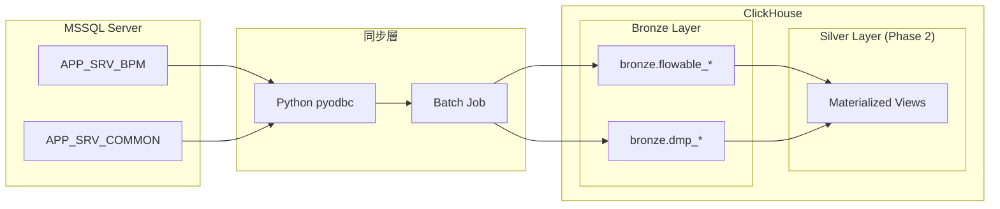
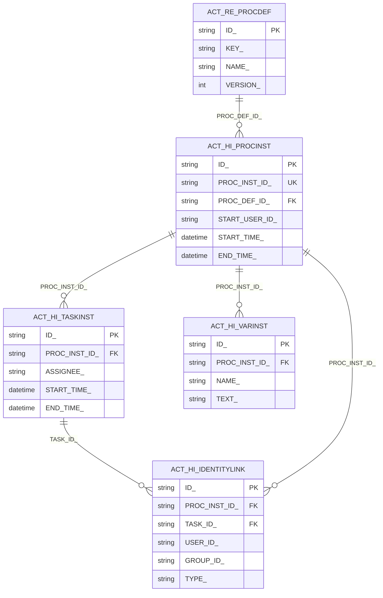
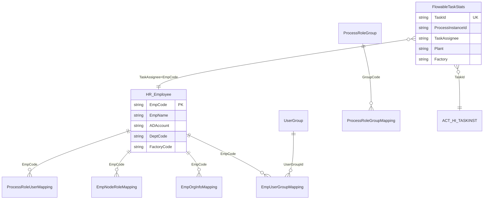
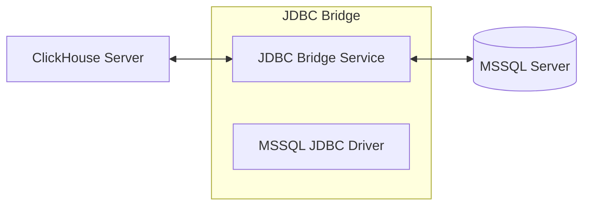
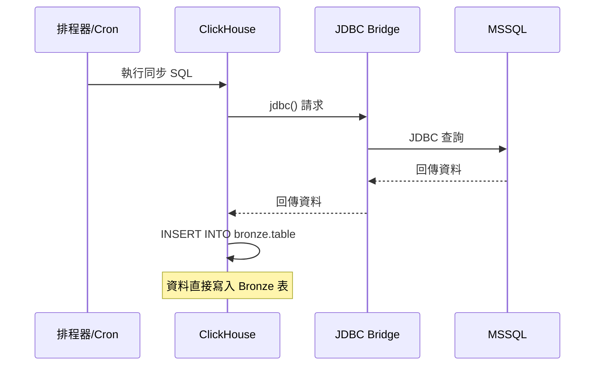

# Design Document: MSSQL → ClickHouse Bronze 層同步架構

## Overview

本設計文件描述如何將 MSSQL 中的 Flowable BPM 與 DMP 資料同步到 ClickHouse Bronze 層，作為後續 Silver 層分析的基礎。

### 資料來源摘要

| Database | Table | Rows | 類型 | 時間欄位 |
|----------|-------|------|------|----------|
| APP_SRV_BPM | ACT_HI_IDENTITYLINK | 516,771 | 事件表 | CREATE_TIME_ |
| APP_SRV_BPM | ACT_HI_PROCINST | 15,625 | 主表 | START_TIME_, END_TIME_ |
| APP_SRV_BPM | ACT_HI_TASKINST | 46,922 | 事件表 | START_TIME_, END_TIME_, LAST_UPDATED_TIME_ |
| APP_SRV_BPM | ACT_HI_VARINST | 610,916 | 事件表 | CREATE_TIME_, LAST_UPDATED_TIME_ |
| APP_SRV_BPM | ACT_RE_PROCDEF | 7,074 | 設定表 | - |
| APP_SRV_COMMON | FlowableTaskStats | 730,973 | 彙總表 | TaskCreateTime, SyncTime, LastUpdatedTime |
| APP_SRV_COMMON | HR_Employee | 182,280 | 維度表 | ModifyDate |
| APP_SRV_COMMON | ProcessRoleUserMapping | 12,714 | 關聯表 | UpdateDatetime |
| APP_SRV_COMMON | EmpNodeRoleMapping | 2,746 | 關聯表 | UpdateTime |
| APP_SRV_COMMON | EmpOrgInfoMapping | 1,129 | 關聯表 | UpdateTime |
| APP_SRV_COMMON | EmpUserGroupMapping | 1,217 | 關聯表 | UpdateTime |
| APP_SRV_COMMON | ProcessRoleGroupMapping | 690 | 關聯表 | UpdateDatetime |
| APP_SRV_COMMON | DMPFunctionConfig | 184 | 設定表 | UpdateDatetime |
| APP_SRV_COMMON | DMPFunctionClientMapping | 57 | 設定表 | UpdateDatetime |
| APP_SRV_COMMON | ProcessRoleGroup | 19 | 設定表 | UpdateDatetime |
| APP_SRV_COMMON | UserGroup | 9 | 設定表 | UpdateTime |

---

## Architecture

### 整體架構圖



### 同步策略

| 同步模式 | 適用場景 | 資料表 |
|----------|----------|--------|
| **Full Load** | 小表、設定表、無時間戳 | ACT_RE_PROCDEF, ProcessRoleGroup, UserGroup, DMPFunctionConfig, DMPFunctionClientMapping |
| **Incremental Load** | 大表、有時間戳 | ACT_HI_*, FlowableTaskStats, HR_Employee, *Mapping 表 |

---

## Components and Interfaces

### 1. 資料表分類與用途說明

#### APP_SRV_BPM（Flowable 流程資料）

| Table | 用途 | 類型 | 說明 |
|-------|------|------|------|
| **ACT_HI_PROCINST** | 流程實例歷史 | 主表 | 每筆流程的起訖時間、發起人、狀態。是 Flowable 分析的核心表。 |
| **ACT_HI_TASKINST** | 任務實例歷史 | 事件表 | 每個任務（關卡）的執行紀錄，包含 assignee、耗時。 |
| **ACT_HI_IDENTITYLINK** | 任務參與者歷史 | 關聯表 | 記錄任務的候選人、候選群組、實際處理人。 |
| **ACT_HI_VARINST** | 流程變數歷史 | 事件表 | 流程中的變數值（表單欄位、業務資料）。 |
| **ACT_RE_PROCDEF** | 流程定義 | 設定表 | 流程圖的版本清單，用於關聯流程名稱。 |

#### APP_SRV_COMMON（DMP 維度資料）

| Table | 用途 | 類型 | 說明 |
|-------|------|------|------|
| **FlowableTaskStats** | 任務統計彙總 | 彙總表 | 已整合的任務統計資料，包含業務欄位（Plant, Factory, MO 等）。**最重要的分析表**。 |
| **HR_Employee** | 員工主檔 | 維度表 | 員工基本資料（姓名、部門、組織、主管）。 |
| **ProcessRoleUserMapping** | 角色-員工對應 | 關聯表 | 哪個員工在哪個廠區擔任什麼角色。 |
| **ProcessRoleGroup** | 角色群組定義 | 設定表 | 角色群組的名稱定義。 |
| **ProcessRoleGroupMapping** | 角色群組對應 | 關聯表 | 角色群組與角色的對應關係。 |
| **EmpNodeRoleMapping** | 員工-節點角色 | 關聯表 | 員工在流程節點的角色。 |
| **EmpOrgInfoMapping** | 員工-組織對應 | 關聯表 | 員工與廠區/工廠的對應。 |
| **EmpUserGroupMapping** | 員工-群組對應 | 關聯表 | 員工所屬的使用者群組。 |
| **UserGroup** | 使用者群組定義 | 設定表 | 群組名稱定義。 |
| **DMPFunctionConfig** | 功能設定 | 設定表 | DMP 功能的廠區設定。 |
| **DMPFunctionClientMapping** | 客戶端對應 | 設定表 | Region/Plant 與 Logsys 的對應。 |

---

### 2. 資料表關聯分析

#### Flowable 表之間的關聯



#### DMP 表與 Flowable 的關聯



#### 主要 Join Key 整理

| Join 場景 | 左表 | 右表 | Join Key |
|-----------|------|------|----------|
| 流程 → 任務 | ACT_HI_PROCINST | ACT_HI_TASKINST | PROC_INST_ID_ |
| 流程 → 變數 | ACT_HI_PROCINST | ACT_HI_VARINST | PROC_INST_ID_ |
| 任務 → 參與者 | ACT_HI_TASKINST | ACT_HI_IDENTITYLINK | TASK_ID_ |
| 流程 → 定義 | ACT_HI_PROCINST | ACT_RE_PROCDEF | PROC_DEF_ID_ = ID_ |
| 任務統計 → 員工 | FlowableTaskStats | HR_Employee | TaskAssignee = EmpCode |
| 員工 → 角色 | HR_Employee | ProcessRoleUserMapping | EmpCode |
| 員工 → 組織 | HR_Employee | EmpOrgInfoMapping | EmpCode |


---

## Data Models

### Bronze 層資料表設計（ClickHouse）

#### 命名規範

- Database: `bronze`
- Table 命名: `{source_db}_{original_table_name}`
  - 例: `bronze.bpm_act_hi_procinst`
  - 例: `bronze.common_hr_employee`

#### 通用欄位（所有 Bronze 表都需新增）

| 欄位 | 型別 | 說明 |
|------|------|------|
| `_sync_time` | DateTime64(3) | 同步時間戳 |
| `_source_db` | LowCardinality(String) | 來源資料庫名稱 |
| `_batch_id` | String | 同步批次 ID |

#### ClickHouse Table Engine 選擇

| 資料特性 | 推薦 Engine | 說明 |
|----------|-------------|------|
| 歷史資料（只增不改） | MergeTree | ACT_HI_* 表，按時間分區 |
| 會更新的資料 | ReplacingMergeTree | HR_Employee, *Mapping 表 |
| 設定表（小量） | MergeTree | 全量覆蓋即可 |

### Bronze 表 DDL 範例

#### 1. ACT_HI_PROCINST（流程實例歷史）

```sql
CREATE TABLE bronze.bpm_act_hi_procinst
(
    ID_ String,
    REV_ Nullable(Int32),
    PROC_INST_ID_ String,
    BUSINESS_KEY_ Nullable(String),
    PROC_DEF_ID_ String,
    START_TIME_ DateTime,
    END_TIME_ Nullable(DateTime),
    DURATION_ Nullable(Decimal(38, 0)),
    START_USER_ID_ Nullable(String),
    START_ACT_ID_ Nullable(String),
    END_ACT_ID_ Nullable(String),
    SUPER_PROCESS_INSTANCE_ID_ Nullable(String),
    DELETE_REASON_ Nullable(String),
    TENANT_ID_ Nullable(String),
    NAME_ Nullable(String),
    CALLBACK_ID_ Nullable(String),
    CALLBACK_TYPE_ Nullable(String),
    REFERENCE_ID_ Nullable(String),
    REFERENCE_TYPE_ Nullable(String),
    PROPAGATED_STAGE_INST_ID_ Nullable(String),
    BUSINESS_STATUS_ Nullable(String),
    -- 同步 metadata
    _sync_time DateTime64(3) DEFAULT now64(3),
    _source_db LowCardinality(String) DEFAULT 'APP_SRV_BPM',
    _batch_id String
)
ENGINE = MergeTree()
PARTITION BY toYYYYMM(START_TIME_)
ORDER BY (PROC_DEF_ID_, START_TIME_, ID_)
SETTINGS index_granularity = 8192;
```

#### 2. ACT_HI_TASKINST（任務實例歷史）

```sql
CREATE TABLE bronze.bpm_act_hi_taskinst
(
    ID_ String,
    REV_ Nullable(Int32),
    PROC_DEF_ID_ Nullable(String),
    TASK_DEF_ID_ Nullable(String),
    TASK_DEF_KEY_ Nullable(String),
    PROC_INST_ID_ Nullable(String),
    EXECUTION_ID_ Nullable(String),
    SCOPE_ID_ Nullable(String),
    SUB_SCOPE_ID_ Nullable(String),
    SCOPE_TYPE_ Nullable(String),
    SCOPE_DEFINITION_ID_ Nullable(String),
    PROPAGATED_STAGE_INST_ID_ Nullable(String),
    NAME_ Nullable(String),
    PARENT_TASK_ID_ Nullable(String),
    DESCRIPTION_ Nullable(String),
    OWNER_ Nullable(String),
    ASSIGNEE_ Nullable(String),
    START_TIME_ DateTime,
    CLAIM_TIME_ Nullable(DateTime),
    END_TIME_ Nullable(DateTime),
    DURATION_ Nullable(Decimal(38, 0)),
    DELETE_REASON_ Nullable(String),
    PRIORITY_ Nullable(Int32),
    DUE_DATE_ Nullable(DateTime),
    FORM_KEY_ Nullable(String),
    CATEGORY_ Nullable(String),
    TENANT_ID_ Nullable(String),
    LAST_UPDATED_TIME_ Nullable(DateTime64(7)),
    -- 同步 metadata
    _sync_time DateTime64(3) DEFAULT now64(3),
    _source_db LowCardinality(String) DEFAULT 'APP_SRV_BPM',
    _batch_id String
)
ENGINE = MergeTree()
PARTITION BY toYYYYMM(START_TIME_)
ORDER BY (PROC_INST_ID_, START_TIME_, ID_)
SETTINGS index_granularity = 8192;
```

#### 3. FlowableTaskStats（任務統計彙總）

```sql
CREATE TABLE bronze.common_flowable_task_stats
(
    Id Decimal(38, 0),
    ProcessInstanceId Nullable(String),
    ProcessDefinitionKey Nullable(String),
    ProcessDefinitionName Nullable(String),
    ProcessTeam Nullable(String),
    Plant Nullable(String),
    Factory Nullable(String),
    ProductionArea Nullable(String),
    Line Nullable(String),
    ModelName Nullable(String),
    DeliveryArea Nullable(String),
    ScheduleNumber Nullable(String),
    MoNumber Nullable(String),
    SapPlant Nullable(String),
    SapProductGroup Nullable(String),
    Pallet Nullable(String),
    TransferNo Nullable(String),
    QBlockEventId Nullable(String),
    DefectSn Nullable(String),
    Time_ Nullable(String),
    TaskId Nullable(String),
    TaskDefinitionKey Nullable(String),
    TaskName Nullable(String),
    TaskStatus Nullable(String),
    TaskBypass Nullable(String),
    TaskAssignee Nullable(String),
    TaskAssigneeAccount Nullable(String),
    TaskAssigneeName Nullable(String),
    TaskCreateTime Nullable(DateTime64(7)),
    TaskClaimTime Nullable(DateTime64(7)),
    TaskEndTime Nullable(DateTime64(7)),
    TaskDurationMinutes Nullable(Float64),
    TaskWorkMinutes Nullable(Float64),
    DeleteReason Nullable(String),
    SyncTime Nullable(DateTime64(7)),
    LastUpdatedTime Nullable(DateTime64(7)),
    TaskCreateDate Nullable(Date),
    TaskClaimDate Nullable(Date),
    TaskEndDate Nullable(Date),
    -- 同步 metadata
    _sync_time DateTime64(3) DEFAULT now64(3),
    _source_db LowCardinality(String) DEFAULT 'APP_SRV_COMMON',
    _batch_id String
)
ENGINE = ReplacingMergeTree(_sync_time)
PARTITION BY toYYYYMM(TaskCreateDate)
ORDER BY (TaskId)
SETTINGS index_granularity = 8192;
```

#### 4. HR_Employee（員工主檔）

```sql
CREATE TABLE bronze.common_hr_employee
(
    EmpCode String,
    EmpName Nullable(String),
    DisplayName Nullable(String),
    UnicodeName Nullable(String),
    EnglishName Nullable(String),
    FirstName Nullable(String),
    MiddleName Nullable(String),
    LastName Nullable(String),
    ADAccount Nullable(String),
    ADDomain Nullable(String),
    TerminateDate Nullable(DateTime),
    Email Nullable(String),
    ExtNo Nullable(String),
    DeptCode Nullable(String),
    DeptCodeLname Nullable(String),
    DeptCodeEname Nullable(String),
    CostCenterCode Nullable(String),
    CostCenterLname Nullable(String),
    SuperiorDeptCode Nullable(String),
    SuperiorDeptLname Nullable(String),
    SuperiorDeptEname Nullable(String),
    Supervisor Nullable(String),
    FactoryCode Nullable(String),
    FactoryLname Nullable(String),
    FactoryEname Nullable(String),
    BGID Nullable(Int32),
    BGShortName Nullable(String),
    BUID Nullable(Int32),
    BUShortName Nullable(String),
    CompanyCode Nullable(String),
    CompanyLname Nullable(String),
    CompanyEname Nullable(String),
    SAPCompanyCode Nullable(String),
    AreaID Nullable(String),
    AreaLname Nullable(String),
    AreaEname Nullable(String),
    GenderID Nullable(UInt8),
    GenderLname Nullable(String),
    GenderEname Nullable(String),
    Shift Nullable(String),
    OrgUnitCode Nullable(String),
    OrgUnitLname Nullable(String),
    OrgUnitEname Nullable(String),
    OrgUnitMgrEmpNo Nullable(String),
    JobFamilyCode Nullable(String),
    JobFamilyName Nullable(String),
    JobFamilyEName Nullable(String),
    DeptEmpCode Nullable(String),
    DeptEmpName Nullable(String),
    CostCenterEname Nullable(String),
    ModifyDate Nullable(DateTime),
    JobCode Nullable(String),
    -- 同步 metadata
    _sync_time DateTime64(3) DEFAULT now64(3),
    _source_db LowCardinality(String) DEFAULT 'APP_SRV_COMMON',
    _batch_id String
)
ENGINE = ReplacingMergeTree(_sync_time)
ORDER BY (EmpCode)
SETTINGS index_granularity = 8192;
```

---

## Error Handling

### 同步錯誤處理策略

| 錯誤類型 | 處理方式 |
|----------|----------|
| MSSQL 連線失敗 | 重試 3 次，間隔 30 秒，失敗後發送告警 |
| ClickHouse 寫入失敗 | 記錄失敗批次，下次同步時重試 |
| 資料型別轉換錯誤 | 記錄錯誤資料到 error log，繼續處理其他資料 |
| 增量同步時間戳遺失 | 回退到 Full Load |

### 同步狀態追蹤表

```sql
CREATE TABLE bronze._sync_log
(
    batch_id String,
    source_db String,
    table_name String,
    sync_type Enum8('full' = 1, 'incremental' = 2),
    start_time DateTime64(3),
    end_time Nullable(DateTime64(3)),
    status Enum8('running' = 1, 'success' = 2, 'failed' = 3),
    rows_read UInt64 DEFAULT 0,
    rows_written UInt64 DEFAULT 0,
    error_message Nullable(String),
    last_sync_value Nullable(String)  -- 增量同步的最後時間戳
)
ENGINE = MergeTree()
ORDER BY (source_db, table_name, start_time);
```

---

## Testing Strategy

### 第一階段驗收標準

#### 1. 連線驗證
- [ ] Python pyodbc 可成功連線 MSSQL
- [ ] 可查詢所有 16 張目標資料表

#### 2. 資料完整性驗證

| 驗證項目 | 方法 | 通過標準 |
|----------|------|----------|
| Row Count | 比對 MSSQL vs ClickHouse | 差異 < 0.1% |
| Primary Key 唯一性 | COUNT(DISTINCT pk) = COUNT(*) | 100% |
| 非空欄位 | 檢查 NOT NULL 欄位 | 無 NULL 值 |
| 時間欄位範圍 | MIN/MAX 比對 | 完全一致 |

#### 3. 資料品質檢查

```sql
-- Row count 比對
SELECT 
    'bpm_act_hi_procinst' as table_name,
    count(*) as clickhouse_count,
    -- 與 MSSQL 的 15625 比對
    15625 as mssql_count,
    count(*) - 15625 as diff
FROM bronze.bpm_act_hi_procinst;

-- Primary Key 唯一性
SELECT 
    count(*) as total,
    count(distinct ID_) as unique_ids,
    count(*) - count(distinct ID_) as duplicates
FROM bronze.bpm_act_hi_procinst;
```

#### 4. 效能基準

| 指標 | 目標 |
|------|------|
| Full Load 時間（最大表 73 萬筆） | < 5 分鐘 |
| Incremental Load 時間（1 萬筆） | < 30 秒 |
| 同步延遲（從 MSSQL 更新到可查詢） | < 15 分鐘 |

---

## 同步方案：MSSQL → ClickHouse（原生方案）

### 方案選擇

第一階段採用 **ClickHouse JDBC Bridge** 方案（官方推薦的外部資料源連接方式）：

| 方案 | 優點 | 缺點 | 適用性 |
|------|------|------|--------|
| **ClickHouse JDBC Bridge** | 官方推薦、支援多種資料庫、跨平台 | 需部署 jdbc-bridge 服務 | ✅ 第一階段首選 |
| ClickHouse ODBC Table Function | 原生支援 | Linux ODBC 設定複雜 | 備選 |
| Python pyodbc + clickhouse-driver | 簡單、可控 | 需自行處理邏輯 | 備選 |
| Kafka CDC | 即時同步 | 架構複雜 | Phase 2 |

### ClickHouse JDBC Bridge 架構

JDBC Bridge 是一個獨立的 Java 服務，作為 ClickHouse 與外部 JDBC 資料源的橋樑：



### JDBC Bridge 部署方式

#### 方式 1：Docker 部署（推薦）

```yaml
# docker-compose.yml
version: '3'
services:
  clickhouse-jdbc-bridge:
    image: clickhouse/jdbc-bridge:latest
    ports:
      - "9019:9019"
    volumes:
      - ./jdbc-bridge/config:/app/config
      - ./jdbc-bridge/drivers:/app/drivers
    environment:
      - JDBC_BRIDGE_CONFIG=/app/config
```

#### 方式 2：獨立 JAR 執行

```bash
# 下載 jdbc-bridge
wget https://github.com/ClickHouse/clickhouse-jdbc-bridge/releases/download/v2.1.0/clickhouse-jdbc-bridge-2.1.0-shaded.jar

# 執行
java -jar clickhouse-jdbc-bridge-2.1.0-shaded.jar
```

### JDBC Bridge 設定

#### 1. 資料源設定（datasources/mssql_bpm.json）

```json
{
  "mssql_bpm": {
    "driverUrls": [
      "/app/drivers/mssql-jdbc-12.4.2.jre11.jar"
    ],
    "driverClassName": "com.microsoft.sqlserver.jdbc.SQLServerDriver",
    "jdbcUrl": "jdbc:sqlserver://twtpesqldv2.delta.corp:1433;databaseName=APP_SRV_BPM;encrypt=false;trustServerCertificate=true",
    "username": "DMP_APP_SRV",
    "password": "APP@DB#01",
    "maximumPoolSize": 5
  }
}
```

#### 2. 資料源設定（datasources/mssql_common.json）

```json
{
  "mssql_common": {
    "driverUrls": [
      "/app/drivers/mssql-jdbc-12.4.2.jre11.jar"
    ],
    "driverClassName": "com.microsoft.sqlserver.jdbc.SQLServerDriver",
    "jdbcUrl": "jdbc:sqlserver://twtpesqldv2.delta.corp:1433;databaseName=APP_SRV_COMMON;encrypt=false;trustServerCertificate=true",
    "username": "DMP_APP_SRV",
    "password": "APP@DB#01",
    "maximumPoolSize": 5
  }
}
```

### ClickHouse 使用 JDBC Bridge

#### 查詢語法

```sql
-- 使用 jdbc() table function 查詢 MSSQL
SELECT * FROM jdbc(
    'mssql_bpm',                    -- datasource 名稱
    'SELECT * FROM ACT_HI_PROCINST' -- SQL 查詢
);

-- 或使用 schema.table 格式
SELECT * FROM jdbc('mssql_bpm', 'dbo', 'ACT_HI_PROCINST');
```

#### 建立 JDBC Table Engine（可選）

```sql
-- 建立永久的 JDBC 表（類似 View）
CREATE TABLE mssql.act_hi_procinst
(
    ID_ String,
    PROC_INST_ID_ String,
    PROC_DEF_ID_ String,
    START_TIME_ DateTime,
    END_TIME_ Nullable(DateTime),
    START_USER_ID_ Nullable(String)
    -- ... 其他欄位
)
ENGINE = JDBC('mssql_bpm', 'dbo', 'ACT_HI_PROCINST');

-- 之後可直接查詢
SELECT * FROM mssql.act_hi_procinst WHERE START_TIME_ > '2024-01-01';
```

### 同步流程（JDBC Bridge）



### Full Load 同步 SQL 範例

```sql
-- 1. 清空目標表（或使用 TRUNCATE）
TRUNCATE TABLE bronze.bpm_act_hi_procinst;

-- 2. 從 MSSQL 同步資料（透過 JDBC Bridge）
INSERT INTO bronze.bpm_act_hi_procinst
SELECT 
    ID_,
    REV_,
    PROC_INST_ID_,
    BUSINESS_KEY_,
    PROC_DEF_ID_,
    START_TIME_,
    END_TIME_,
    DURATION_,
    START_USER_ID_,
    START_ACT_ID_,
    END_ACT_ID_,
    SUPER_PROCESS_INSTANCE_ID_,
    DELETE_REASON_,
    TENANT_ID_,
    NAME_,
    CALLBACK_ID_,
    CALLBACK_TYPE_,
    REFERENCE_ID_,
    REFERENCE_TYPE_,
    PROPAGATED_STAGE_INST_ID_,
    BUSINESS_STATUS_,
    now64(3) as _sync_time,
    'APP_SRV_BPM' as _source_db,
    toString(generateUUIDv4()) as _batch_id
FROM jdbc('mssql_bpm', 'SELECT * FROM ACT_HI_PROCINST');
```

### Incremental Load 同步 SQL 範例

```sql
-- 增量同步：只同步上次同步後更新的資料
INSERT INTO bronze.bpm_act_hi_taskinst
SELECT 
    ID_,
    REV_,
    PROC_DEF_ID_,
    TASK_DEF_ID_,
    TASK_DEF_KEY_,
    PROC_INST_ID_,
    EXECUTION_ID_,
    SCOPE_ID_,
    SUB_SCOPE_ID_,
    SCOPE_TYPE_,
    SCOPE_DEFINITION_ID_,
    PROPAGATED_STAGE_INST_ID_,
    NAME_,
    PARENT_TASK_ID_,
    DESCRIPTION_,
    OWNER_,
    ASSIGNEE_,
    START_TIME_,
    CLAIM_TIME_,
    END_TIME_,
    DURATION_,
    DELETE_REASON_,
    PRIORITY_,
    DUE_DATE_,
    FORM_KEY_,
    CATEGORY_,
    TENANT_ID_,
    LAST_UPDATED_TIME_,
    now64(3) as _sync_time,
    'APP_SRV_BPM' as _source_db,
    toString(generateUUIDv4()) as _batch_id
FROM jdbc(
    'mssql_bpm', 
    'SELECT * FROM ACT_HI_TASKINST WHERE LAST_UPDATED_TIME_ > ''2024-01-01 00:00:00'''
);
```

### 使用 Dictionary 優化維度表查詢（可選）

對於 HR_Employee 這類維度表，可建立 Dictionary 加速 JOIN：

```sql
CREATE DICTIONARY bronze.dict_hr_employee
(
    EmpCode String,
    EmpName String,
    DisplayName String,
    ADAccount String,
    DeptCode String,
    DeptCodeLname String,
    FactoryCode String,
    FactoryLname String
)
PRIMARY KEY EmpCode
SOURCE(CLICKHOUSE(
    HOST 'localhost'
    PORT 9000
    USER 'default'
    TABLE 'common_hr_employee'
    DB 'bronze'
))
LIFETIME(MIN 3600 MAX 7200)
LAYOUT(HASHED());

-- 使用 Dictionary 查詢
SELECT 
    t.TaskId,
    t.TaskAssignee,
    dictGet('bronze.dict_hr_employee', 'EmpName', t.TaskAssignee) as AssigneeName,
    dictGet('bronze.dict_hr_employee', 'DeptCodeLname', t.TaskAssignee) as DeptName
FROM bronze.common_flowable_task_stats t;
```

### 排程設定建議

| 資料表類型 | 同步頻率 | 同步方式 |
|------------|----------|----------|
| 設定表（小表） | 每日 1 次 | Full Load |
| 歷史表（ACT_HI_*） | 每小時 | Incremental |
| FlowableTaskStats | 每 15 分鐘 | Incremental |
| HR_Employee | 每日 1 次 | Full Load |
