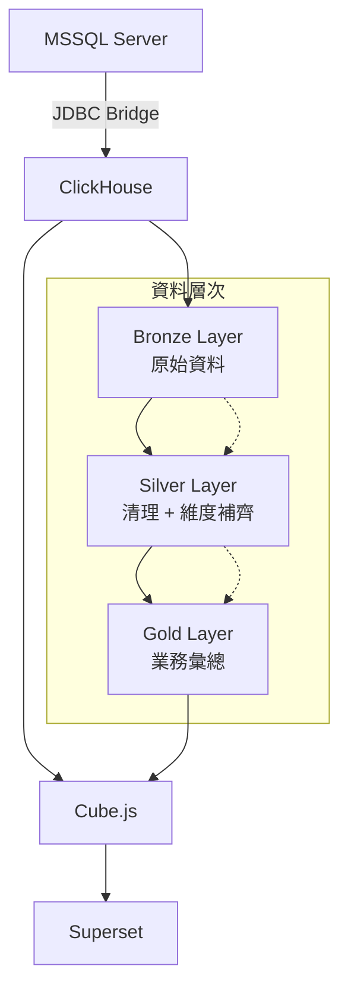
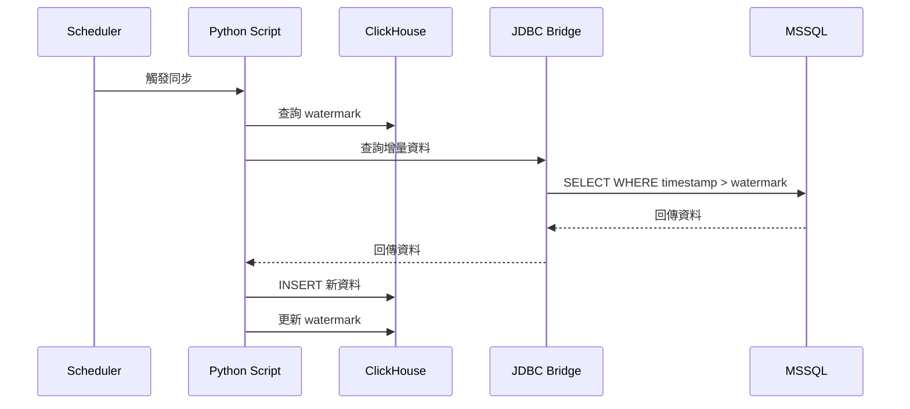

# 系統架構說明

**版本**: 1.0  
**更新日期**: 2026-01-28  
**維護者**: DMP Team

---

## 🏗️ 整體架構

### 資料流向圖



### 技術堆疊

| 層級 | 技術 | 用途 | 版本 |
|------|------|------|------|
| **資料來源** | MSSQL Server | 業務系統資料庫 | 2019+ |
| **資料橋接** | JDBC Bridge | 跨資料庫查詢 | 2.1.0 |
| **資料倉儲** | ClickHouse | 分析型資料庫 | 24.3+ |
| **語意層** | Cube.js | 資料模型 + API | 0.35+ |
| **視覺化** | Superset | 儀表板 | 3.0+ |
| **容器化** | Docker | 服務部署 | 20.10+ |

---

## 📊 資料架構

### Bronze Layer (原始資料層)
**目的**: 儲存從 MSSQL 同步的原始資料

**特點**:
- 1:1 對應 MSSQL 表結構
- 使用 ReplacingMergeTree 引擎去重
- 保留 `_sync_time` 追蹤同步時間
- 支援增量和全量同步

**主要表格**:
```
bronze.bpm_act_hi_procinst      # 流程實例歷史
bronze.bmp_act_hi_taskinst      # 任務實例歷史  
bronze.bmp_act_hi_varinst       # 變數實例歷史
bronze.common_flowable_task_stats # 任務統計
bronze.common_mdm_*             # MDM 主檔資料
```

### Silver Layer (清理資料層)
**目的**: 資料清理、維度補齊、業務邏輯處理

**特點**:
- 使用 Materialized View 提升查詢效能
- VARINST 優先，MDM 補齊的維度邏輯
- ISO Week 時間邏輯處理
- V1/V3 歸屬規則實作

**核心邏輯**:
```sql
-- 維度補齊邏輯範例
CASE 
    WHEN varinst.plant IS NOT NULL THEN varinst.plant
    WHEN mdm.plant IS NOT NULL THEN mdm.plant  
    ELSE 'UNKNOWN'
END as plant_final
```

### Gold Layer (業務彙總層)
**目的**: 業務指標計算、預聚合資料

**特點**:
- 面向業務需求的資料模型
- L5 任務完成率核心指標
- 支援多維度分析 (時間、地點、產品線)
- 最佳化查詢效能

---

## 🔧 核心元件

### 1. JDBC Bridge
**角色**: MSSQL 與 ClickHouse 之間的資料橋樑

**配置檔案**:
```
docker/jdbc-bridge/config/datasources/mssql_master.json
```

**使用方式**:
```sql
-- 在 ClickHouse 中查詢 MSSQL
SELECT * FROM jdbc('mssql_master', 'SELECT * FROM APP_SRV_BPM.dbo.ACT_HI_PROCINST')
```

### 2. ClickHouse
**角色**: 高效能分析型資料庫

**關鍵設定**:
- 使用 MergeTree 系列引擎
- 針對時間序列資料最佳化
- 支援 Materialized View 增量更新

### 3. Cube.js
**角色**: 語意層，提供統一的資料 API

**資料模型**:
```javascript
// cube/model/cubes/cube_gold_l5_task_completion.js
cube('L5TaskCompletion', {
  sql: 'SELECT * FROM gold.l5_task_completion',
  
  measures: {
    completionRate: {
      type: 'number',
      sql: 'completion_rate'
    }
  },
  
  dimensions: {
    plant: {
      type: 'string',
      sql: 'plant'
    }
  }
});
```

---

## 🔄 資料同步機制

### 同步策略

| 表類型 | 同步方式 | 頻率 | 追蹤欄位 |
|--------|----------|------|----------|
| **大表** | 增量同步 | 每小時 | LAST_UPDATED_TIME_ |
| **小表** | 全量同步 | 每日 | - |
| **MDM** | 全量同步 | 每日 | - |

### 增量同步流程



### Watermark 管理
```sql
-- watermark 表結構
CREATE TABLE bronze._sync_watermark (
    table_name String,
    last_sync_time DateTime64(3),
    sync_time DateTime64(3),
    row_count UInt64
) ENGINE = ReplacingMergeTree(sync_time)
ORDER BY (table_name);
```

---

## 📈 效能最佳化

### ClickHouse 最佳化
1. **分割鍵設計**: 使用時間欄位作為主要分割鍵
2. **索引策略**: 針對常用查詢欄位建立索引
3. **壓縮設定**: 使用 LZ4 壓縮節省儲存空間
4. **Materialized View**: 預計算常用聚合

### 查詢最佳化
1. **時間範圍限制**: 避免全表掃描
2. **適當的 GROUP BY**: 利用 ClickHouse 的向量化執行
3. **PREWHERE 子句**: 提早過濾資料

---

## 🔒 安全性考量

### 資料存取控制
- MSSQL 使用專用服務帳號 `DMP_APP_SRV`
- ClickHouse 設定適當的使用者權限
- JDBC Bridge 連線加密設定

### 網路安全
- 內網環境部署
- 防火牆規則限制存取
- VPN 連線要求

---

## 📊 監控與告警

### 關鍵指標
1. **資料同步延遲**: 監控 watermark 更新時間
2. **資料品質**: 比較 MSSQL vs ClickHouse 筆數
3. **查詢效能**: 監控慢查詢
4. **系統資源**: CPU、記憶體、磁碟使用率

### 告警設定
```sql
-- 資料延遲告警 (超過 2 小時)
SELECT table_name, 
       now() - last_sync_time as delay_hours
FROM bronze._sync_watermark FINAL
WHERE delay_hours > 2;
```

---

## 🔧 維護指南

### 日常維護
1. **檢查同步狀態**: 每日檢查 watermark 更新
2. **資料品質驗證**: 定期執行對帳腳本
3. **效能監控**: 關注慢查詢和資源使用

### 定期維護
1. **日誌清理**: 清理過期的同步日誌
2. **統計資訊更新**: 更新 ClickHouse 統計資訊
3. **備份驗證**: 確認備份完整性

---

## 📚 相關文件

- `GETTING_STARTED.md` - 新人快速開始
- `REBUILD_GUIDE.md` - 完整重建指南
- `docs/user-guides/` - 使用者指南
- `docs/troubleshooting/` - 故障排除

---

**最後更新**: 2026-01-28  
**版本**: 1.0