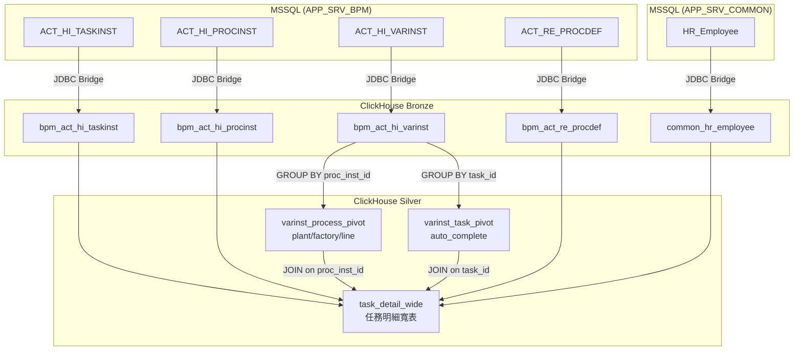

# 資料流程指南：Task-based Flow 指標

## 資料流說明

### Bronze 層（原始資料）

資料透過 JDBC Bridge 從 MSSQL 同步至 ClickHouse，保持原始結構不做轉換。

**來源表**：
| 表 | 來源 | 用途 |
|---|---|---|
| `bronze.bpm_act_hi_taskinst` | APP_SRV_BPM | 任務實例歷史（主表） |
| `bronze.bpm_act_hi_procinst` | APP_SRV_BPM | 流程實例歷史 |
| `bronze.bpm_act_hi_varinst` | APP_SRV_BPM | 流程/任務變數（EAV 格式） |
| `bronze.bpm_act_re_procdef` | APP_SRV_BPM | 流程定義 |
| `bronze.common_hr_employee` | APP_SRV_COMMON | 員工資料 |

**同步方式**：`sync/sync_to_clickhouse.py` 執行 Full Load

---

### Silver 層（轉換邏輯）

Silver 層做三件事：
1. **變數展開**：將 EAV 格式的 `varinst` 轉為寬表
2. **JOIN 組裝**：將任務、流程、變數、員工資料組合成一張寬表
3. **狀態判斷**：計算 `task_status` 和 `task_bypass`

**轉換順序**：
```
bronze.bpm_act_hi_varinst
    │
    ├─► silver.varinst_process_pivot  (流程變數寬表，Grain: proc_inst_id)
    │       展開: plant, factory, line_name, region...
    │
    └─► silver.varinst_task_pivot     (任務變數寬表，Grain: task_id)
            展開: auto_complete
    
bronze.bpm_act_hi_taskinst + procinst + procdef + employee + 上述兩表
    │
    └─► silver.task_detail_wide       (任務明細寬表，Grain: task_id)
```

**關鍵 JOIN 邏輯**：
- `plant/factory/line` 來自 `varinst_process_pivot`，JOIN Key 是 `PROC_INST_ID_`
- `task_bypass` 來自 `varinst_task_pivot`，JOIN Key 是 `TASK_ID_`（不是 `PROC_INST_ID_`）

**轉換腳本**：`scripts/transform_silver_task_detail.py`

---

### Gold 層（查詢入口）

Gold 層是 Silver 層的快照，用於：
- 固定時間點的指標查詢
- 對帳驗證的基準

目前直接查詢 `silver.task_detail_wide` 即可，Gold 快照為選用。

---

## 流程圖



---

## 欄位語意對照

### 時間欄位

| 欄位 | 來源 | 說明 |
|------|------|------|
| `task_create_time` | `taskinst.START_TIME_` | 任務建立時間（DateTime） |
| `task_create_date` | `toDate(task_create_time)` | 任務建立日期（Date，用於分區與篩選） |
| `task_claim_time` | `taskinst.CLAIM_TIME_` | 任務認領時間 |
| `task_end_time` | `taskinst.END_TIME_` | 任務完成時間 |

### 狀態欄位

| 欄位 | 值 | 判斷邏輯 |
|------|-----|----------|
| `task_status` | `TODO` | `ASSIGNEE_ IS NULL AND END_TIME_ IS NULL` |
| | `DOING` | `ASSIGNEE_ IS NOT NULL AND END_TIME_ IS NULL` |
| | `DONE` | `END_TIME_ IS NOT NULL` |
| `task_bypass` | `Y` | `varinst.LONG_ = 1`（變數名稱 `autoComplete`，JOIN Key 是 `TASK_ID_`） |
| | `N` | 其他情況 |

### 維度欄位

| 欄位 | 來源 | JOIN Key | 說明 |
|------|------|----------|------|
| `plant` | `varinst.TEXT_` (NAME_='plant') | `PROC_INST_ID_` | 廠區代碼 |
| `line` | `varinst.TEXT_` (NAME_='lineName') | `PROC_INST_ID_` | 產線代碼 |
| `factory` | `varinst.TEXT_` (NAME_='factory') | `PROC_INST_ID_` | 工廠代碼 |
| `region` | `varinst.TEXT_` (NAME_='region') | `PROC_INST_ID_` | 區域代碼 |

**注意**：`plant/factory/line/region` 都是流程層級變數，作用範圍是整個流程實例（同一 `proc_inst_id` 下所有任務共用）。

---

## 驗證流程說明

### Reference Case

驗證條件：
```
task_create_date = '2025-12-31'
task_bypass = 'N'
plant = 'WJ2'
line = 'E5'
```

預期結果：
- 總筆數：12 筆
- 狀態分布：TODO=8, DOING=2, DONE=2

### 驗證方式

1. **執行 MSSQL Reference SQL**：直接在 MSSQL 執行等價查詢
2. **執行 ClickHouse 查詢**：查詢 `silver.task_detail_wide`
3. **比對結果**：
   - 筆數是否一致
   - TaskId 集合是否一致
   - 狀態分布是否一致

**驗證腳本**：`scripts/verify_clickhouse_vs_mssql.py`

### 驗證其他條件

同一套邏輯可用於驗證其他日期/廠別/線別，只需修改 WHERE 條件：

```sql
-- ClickHouse
SELECT task_id, task_status, task_bypass, plant, line
FROM silver.task_detail_wide FINAL
WHERE task_create_date = '{日期}'
  AND task_bypass = '{Y/N}'
  AND plant = '{廠區}'
  AND line = '{產線}'
ORDER BY task_id
```

```sql
-- MSSQL（對照用）
SELECT * FROM (
  SELECT
    hti.ID_ AS taskId,
    CASE WHEN hti.END_TIME_ IS NOT NULL THEN 'DONE'
         WHEN hti.ASSIGNEE_ IS NOT NULL THEN 'DOING'
         ELSE 'TODO' END AS taskStatus,
    CASE WHEN var_bypass.LONG_ = 1 THEN 'Y' ELSE 'N' END AS taskBypass,
    var_plant.TEXT_ AS plant,
    var_lineName.TEXT_ AS line,
    CONVERT(VARCHAR, hti.START_TIME_, 120) AS taskCreateTime
  FROM ACT_HI_PROCINST hi
  INNER JOIN ACT_HI_TASKINST hti ON hi.PROC_INST_ID_ = hti.PROC_INST_ID_
  LEFT JOIN ACT_HI_VARINST var_plant ON hi.PROC_INST_ID_ = var_plant.PROC_INST_ID_ AND var_plant.NAME_ = 'plant'
  LEFT JOIN ACT_HI_VARINST var_lineName ON hi.PROC_INST_ID_ = var_lineName.PROC_INST_ID_ AND var_lineName.NAME_ = 'lineName'
  LEFT JOIN ACT_HI_VARINST var_bypass ON hti.ID_ = var_bypass.TASK_ID_ AND var_bypass.NAME_ = 'autoComplete'
) AS t
WHERE t.taskCreateTime BETWEEN '{日期} 00:00:00' AND '{日期} 23:59:59'
  AND taskBypass = '{Y/N}'
  AND plant = '{廠區}'
  AND line = '{產線}'
```

---

## 相關檔案

| 檔案 | 用途 |
|------|------|
| `sql/10_create_silver_task_detail.sql` | Silver 層 DDL |
| `scripts/transform_silver_task_detail.py` | Silver 層 ETL |
| `scripts/verify_clickhouse_vs_mssql.py` | 對帳驗證 |
| `scripts/verify_reference_sql.py` | Reference SQL 驗證 |
