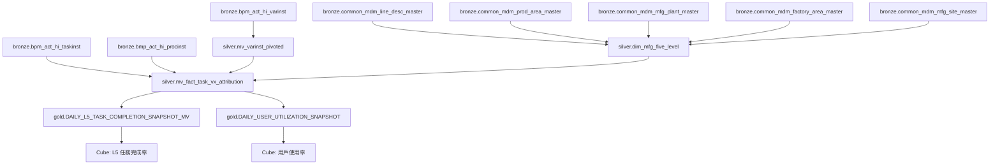

# 製造五階資料血緣表 (Manufacturing Five-Level Data Lineage)

**版本：** 1.0  
**建立日期：** 2026-01-23  
**適用範圍：** DMP Flowable 流程分析系統

---

## 📊 製造五階定義

**製造五階層級：** Region → Vx → Plant → Factory → Line

| 層級 | 英文名稱 | 中文名稱 | 說明 |
|------|---------|---------|------|
| 1 | Region | 區域 | 製造基地/地理區域 |
| 2 | Vx | 流程類型 | V1/V2/V3 業務流程分類 |
| 3 | Plant | 廠區 | 製造廠區 |
| 4 | Factory | 工廠 | 具體工廠/生產區域 |
| 5 | Line | 產線 | 生產線 |

---

## 🗂️ 資料血緣追溯表

### 1. Region (區域)

| 欄位名稱 | 資料來源表 | 來源欄位 | 串接邏輯 | 覆蓋率 |
|---------|-----------|---------|---------|--------|
| region_code | bronze.common_mdm_factory_area_master | MFG_SITE | 透過 FACTORY 串接 | 95%+ |
| region_name | bronze.common_mdm_mfg_site_master | MFG_SITE_DESC | 透過 MFG_SITE 串接 | 95%+ |

**串接路徑：**
```
Line → Factory → bronze.common_mdm_factory_area_master.MFG_SITE → bronze.common_mdm_mfg_site_master.MFG_SITE_DESC
```

### 2. Vx (流程類型)

| 欄位名稱 | 資料來源表 | 來源欄位 | 推導邏輯 | 覆蓋率 |
|---------|-----------|---------|---------|--------|
| vx_type | bronze.bpm_act_hi_taskinst | TASK_DEF_KEY_ | 前綴判斷 + 工單號規則 | 100% |
| vx_subtype | bronze.bpm_act_hi_varinst | varinst_name | NPE 判別邏輯 | 92.8% |

**推導邏輯：**
```sql
CASE 
    -- 優先級 1：工單號規則（最高優先級）
    WHEN varinst_moNumber LIKE '315%' OR '196%' OR '199%' OR '200%' OR '210%' OR '212%' OR '213%' THEN 'V1'
    
    -- 優先級 2：TaskDefinitionKey 前綴
    WHEN TASK_DEF_KEY_ LIKE 'V1%' THEN 'V1'
    WHEN TASK_DEF_KEY_ LIKE 'V2%' THEN 'V2'
    WHEN TASK_DEF_KEY_ LIKE 'V3%' THEN 'V3'
    
    ELSE 'Unknown'
END
```

**V1 子類型邏輯：**
```sql
CASE 
    WHEN vx_type = 'V1' AND varinst_name LIKE '%NPE%' THEN 'V1_NPE'
    WHEN vx_type = 'V1' THEN 'V1_MFG'
    ELSE NULL
END
```

### 3. Plant (廠區)

| 欄位名稱 | 資料來源表 | 來源欄位 | 串接邏輯 | 覆蓋率 |
|---------|-----------|---------|---------|--------|
| plant_code | bronze.common_mdm_mfg_plant_master | MFG_PLANT_CODE | 透過 FACTORY 串接 | 95%+ |
| plant_name | bronze.common_mdm_mfg_plant_master | MFG_PLANT_DESC | 透過 FACTORY 串接 | 95%+ |

**串接路徑：**
```
Line → Factory → bronze.common_mdm_mfg_plant_master (FACTORY = MFG_PLANT_CODE)
```

**Flowable 來源（備用）：**
- 來源表：`bronze.bpm_act_hi_varinst`
- 來源欄位：`TEXT_` (WHERE NAME_ = 'plant')
- 轉置表：`silver.mv_varinst_pivoted.varinst_plant`

### 4. Factory (工廠)

| 欄位名稱 | 資料來源表 | 來源欄位 | 串接邏輯 | 覆蓋率 |
|---------|-----------|---------|---------|--------|
| factory_code | bronze.common_mdm_prod_area_master | FACTORY | 透過 PROD_AREA_ID 串接 | 95%+ |
| factory_name | bronze.common_mdm_prod_area_master | PROD_AREA_DESC | 透過 PROD_AREA_ID 串接 | 95%+ |

**串接路徑：**
```
Line → bronze.common_mdm_line_desc_master.PROD_AREA_ID → bronze.common_mdm_prod_area_master.FACTORY
```

**Flowable 來源（備用）：**
- 來源表：`bronze.bmp_act_hi_varinst`
- 來源欄位：`TEXT_` (WHERE NAME_ = 'factory')
- 轉置表：`silver.mv_varinst_pivoted.varinst_factory`

### 5. Line (產線)

| 欄位名稱 | 資料來源表 | 來源欄位 | 串接邏輯 | 覆蓋率 |
|---------|-----------|---------|---------|--------|
| line_name | bronze.common_mdm_line_desc_master | LINE_NAME | 直接對應 | 100% |
| line_desc | bronze.common_mdm_line_desc_master | LINE_DESC | 直接對應 | 100% |

**Flowable 來源（備用）：**
- 來源表：`bronze.bmp_act_hi_varinst`
- 來源欄位：`TEXT_` (WHERE NAME_ = 'lineName')
- 轉置表：`silver.mv_varinst_pivoted.varinst_lineName`

---

## 🏗️ 資料架構層級

### Bronze 層 (原生資料)

#### MDM 主檔表
| 表名 | 用途 | 關鍵欄位 |
|------|------|---------|
| bronze.common_mdm_line_desc_master | 產線主檔 | LINE_NAME, PROD_AREA_ID |
| bronze.common_mdm_prod_area_master | 生產區域主檔 | PROD_AREA_ID, FACTORY |
| bronze.common_mdm_mfg_plant_master | 製造廠區主檔 | FACTORY, MFG_PLANT_CODE |
| bronze.common_mdm_factory_area_master | 廠區主檔 | FACTORY, MFG_SITE |
| bronze.common_mdm_mfg_site_master | 製造基地主檔 | MFG_SITE, MFG_SITE_DESC |

#### Flowable 原生表
| 表名 | 用途 | 關鍵欄位 |
|------|------|---------|
| bronze.bpm_act_hi_taskinst | 任務實例 | TASK_DEF_KEY_, PROC_INST_ID_ |
| bronze.bmp_act_hi_varinst | 流程變數 | NAME_, TEXT_, PROC_INST_ID_ |
| bronze.bmp_act_hi_procinst | 流程實例 | PROC_INST_ID_, BUSINESS_KEY_ |

### Silver 層 (轉換聚合)

#### 第一層 MVIEW
| 表名 | 用途 | 關鍵欄位 |
|------|------|---------|
| silver.mv_varinst_pivoted | EAV 轉置表 | varinst_plant, varinst_factory, varinst_lineName |
| silver.dim_mfg_five_level | 製造五階維度表 | region_code, plant_code, factory_code, line_name |

#### 第二層 MVIEW
| 表名 | 用途 | 關鍵欄位 |
|------|------|---------|
| silver.mv_fact_task_vx_attribution | 任務事實表 | vx_type, plant, factory, line |

### Gold 層 (業務指標)

| 表名 | 用途 | 關鍵欄位 |
|------|------|---------|
| gold.DAILY_L5_TASK_COMPLETION_SNAPSHOT_MV | L5 任務完成率 | vx_type, plant, factory, line |
| gold.DAILY_USER_UTILIZATION_SNAPSHOT | 用戶使用率 | vx_type, plant, factory, line |

---

## 🔄 資料流向圖



---

## 📋 資料品質檢查

### 完整性檢查

| 檢查項目 | 檢查邏輯 | 預期覆蓋率 |
|---------|---------|-----------|
| Line → Factory | PROD_AREA_ID 不為空 | 95%+ |
| Factory → Plant | FACTORY 能串接到 MFG_PLANT_CODE | 95%+ |
| Factory → Region | FACTORY 能串接到 MFG_SITE | 95%+ |
| Flowable Plant | varinst_plant 不為空 | 99.9% |
| Flowable Factory | varinst_factory 不為空 | 99.9% |
| Flowable Line | varinst_lineName 不為空 | 99.9% |

### 一致性檢查

| 檢查項目 | 檢查邏輯 | 說明 |
|---------|---------|------|
| MDM vs Flowable | 比較 MDM 和 Flowable 的維度值 | 識別不一致的資料 |
| Vx 歸屬邏輯 | 驗證工單號規則優先級 | 確保 315% 工單正確歸 V1 |
| NPE 判別 | 檢查 varinst_name 包含 NPE | 確保 V1_NPE 正確分類 |

---

## 🚨 重要注意事項

### 資料來源優先級

1. **MDM 主檔優先**：製造五階維度優先使用 MDM 主檔表
2. **Flowable 作為備用**：當 MDM 資料缺失時，使用 Flowable 變數
3. **業務邏輯補強**：Vx 類型由業務邏輯決定，不依賴 MDM

### 限制與約束

1. **V1 流程限制**：只有 V1 流程會寫入 ACT_HI_VARINST，其他流程無變數資料
2. **NPE 判別限制**：NPE 判別依賴 varinst_name，覆蓋率 92.8%
3. **時間一致性**：所有時間篩選使用 OR 條件邏輯

### 資料更新機制

1. **MVIEW 自動更新**：Silver 層 MVIEW 自動更新，延遲 < 15 小時
2. **Gold 層快照**：每日快照，支援歷史趨勢分析
3. **即時查詢**：Cube 層支援即時查詢，資料一致性保證

---

## 📝 相關檔案

### SQL 檔案
- `sql/11_create_silver_mviews_layer1.sql` - 第一層 MVIEW（包含 varinst_pivoted）
- `sql/12_create_silver_mviews_layer2.sql` - 第二層 MVIEW（事實表）
- `sql/create_silver_dim_mfg_five_level.sql` - 製造五階維度表

### 驗證腳本
- `scripts/validate_field_mapping.py` - 欄位映射驗證
- `scripts/test_gold_silver_data_completeness.py` - 資料完整性測試

### 文檔
- `docs/metric_definitions.md` - 指標定義文件
- `docs/data_pipeline_diagram.md` - 資料管道圖

---

**文件結束**