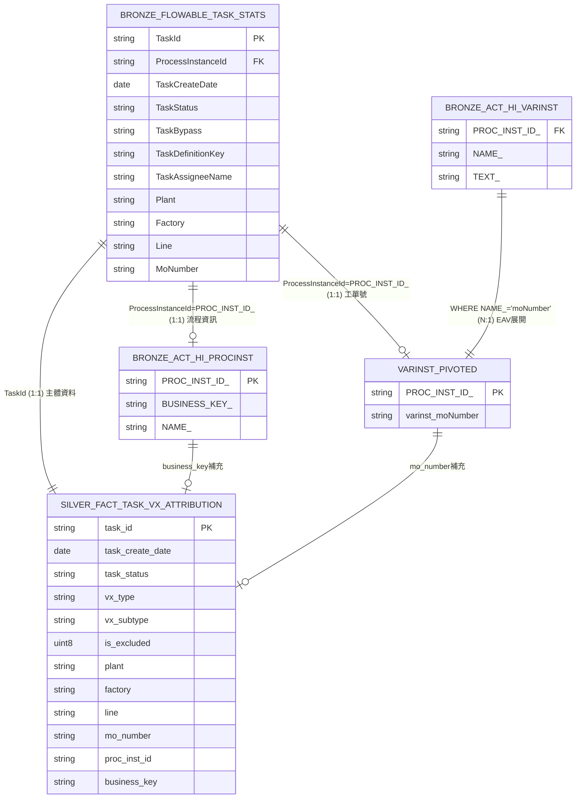

# L5 任務執行完成率指標定義

## 指標概述

**指標名稱**: L5 任務執行完成率 (L5 Task Completion Rate)  
**指標類型**: 業務效率指標  
**更新頻率**: 每日快照  
**資料來源**: Flowable BPM 系統  

## 業務定義

### 指標意義
衡量各廠區、產線在特定時間區間內任務執行的完成情況，用於評估生產效率與流程執行狀況。

### 計算公式
```
完成率 = 已完成任務數 / 總任務數 × 100%
進行中率 = (進行中任務數 + 已完成任務數) / 總任務數 × 100%
```

### 維度分析
- **時間維度**: 日、週、月
- **組織維度**: Plant (廠區)、Factory (工廠)、Line (產線)
- **流程維度**: Vx Type (V1/V2/V3)、Vx Subtype (V1_NPE/V1_MFG)

## 資料血緣與計算架構

### 資料分層結構

**MSSQL 原始表**:
- `APP_SRV_COMMON.dbo.FlowableTaskStats` - **主表**，任務基本資訊與狀態
- `APP_SRV_BPM.dbo.ACT_HI_PROCINST` - **維度補充**，流程實例資訊
- `APP_SRV_BPM.dbo.ACT_HI_VARINST` - **屬性補充**，EAV 格式流程變數

**ClickHouse Bronze 層**:
- `bronze.common_flowable_task_stats`
- `bronze.bmp_act_hi_procinst`  
- `bronze.bmp_act_hi_varinst`

**Silver 事實表**:
- `silver.FACT_TASK_VX_ATTRIBUTION` - 核心事實表

**Gold 聚合表**:
- `gold.DAILY_L5_TASK_COMPLETION_SNAPSHOT` - 最終指標表

### Silver 表組裝架構 (ER-like)



### 欄位血緣 Mapping

| Silver 欄位 | 來源表 | 來源欄位 | JOIN 方式 | 轉換邏輯 |
|------------|-------|---------|----------|---------|
| **task_id** | FlowableTaskStats | TaskId | 主表 | 直接對應 (主鍵) |
| **task_create_date** | FlowableTaskStats | TaskCreateDate | 主表 | COALESCE 處理 NULL |
| **task_status** | FlowableTaskStats | TaskStatus | 主表 | 直接對應 |
| **task_bypass** | FlowableTaskStats | TaskBypass | 主表 | COALESCE 預設 'N' |
| **task_definition_key** | FlowableTaskStats | TaskDefinitionKey | 主表 | 直接對應 |
| **task_assignee_name** | FlowableTaskStats | TaskAssigneeName | 主表 | 直接對應 |
| **plant** | FlowableTaskStats | Plant | 主表 | 直接對應 |
| **factory** | FlowableTaskStats | Factory | 主表 | 直接對應 |
| **line** | FlowableTaskStats | Line | 主表 | 直接對應 |
| **proc_inst_id** | FlowableTaskStats | ProcessInstanceId | 主表 | 直接對應 |
| **business_key** | ACT_HI_PROCINST | BUSINESS_KEY_ | LEFT JOIN | ProcessInstanceId = PROC_INST_ID_ |
| **proc_name** | ACT_HI_PROCINST | NAME_ | LEFT JOIN | ProcessInstanceId = PROC_INST_ID_ |
| **mo_number** | varinst_pivoted | varinst_moNumber | LEFT JOIN | ProcessInstanceId = PROC_INST_ID_ |
| **vx_type** | 計算欄位 | 規則推導 | - | 工單號規則 + TaskDefinitionKey |
| **vx_subtype** | 計算欄位 | 規則推導 | - | V1 + business_key 含 NPE |
| **is_special_v1_rule** | 計算欄位 | 規則推導 | - | 工單號 196/199/200/210/212/213/315 |
| **is_excluded** | 計算欄位 | 規則推導 | - | bypass + TaskDefinitionKey + moNumber |
| **exclude_reason** | 計算欄位 | 規則推導 | - | 排除原因分類 |

## 轉換邏輯詳解

### EAV 展開邏輯
```sql
varinst_pivoted AS (
    SELECT 
        PROC_INST_ID_,
        MAX(CASE WHEN NAME_ = 'moNumber' THEN TEXT_ END) AS varinst_moNumber
    FROM bronze.bmp_act_hi_varinst
    WHERE NAME_ = 'moNumber'
    GROUP BY PROC_INST_ID_
)
```

### Vx 歸屬計算
```sql
vx_type = CASE 
    WHEN COALESCE(v.varinst_moNumber, t.MoNumber) LIKE '196%|199%|200%|210%|212%|213%|315%'
    THEN 'V1'
    ELSE COALESCE(substring(t.TaskDefinitionKey, 1, 2), 'Unknown')
END
```

### 排除邏輯計算
```sql
is_excluded = CASE 
    WHEN t.TaskBypass != 'N' THEN 1
    WHEN t.TaskDefinitionKey LIKE 'E%' OR t.TaskDefinitionKey LIKE 'C%' THEN 1
    WHEN COALESCE(v.varinst_moNumber, t.MoNumber) LIKE 'Q%|R%' THEN 1
    ELSE 0
END
```

### Gold 層聚合邏輯
```sql
-- 聚合條件
WHERE is_excluded = 0
  AND task_create_date BETWEEN start_date AND end_date

-- 聚合指標
total_task_qty = count(*)
todo_qty = countIf(task_status = 'TODO')
doing_qty = countIf(task_status = 'DOING')
done_qty = countIf(task_status = 'DONE')
done_pct = round(done_qty * 100.0 / total_task_qty, 2)
```

## 業務規則

### 任務狀態定義
- **TODO**: 尚未指派或開始的任務
- **DOING**: 已指派但未完成的任務  
- **DONE**: 已完成的任務

### Vx 歸屬規則
- **V1 特殊規則**: 工單號以 196/199/200/210/212/213/315 開頭強制歸類為 V1
- **一般規則**: 使用 TaskDefinitionKey 前兩碼 (V1/V2/V3)
- **V1 子類型**: 
  - V1_NPE: business_key 包含 "NPE"
  - V1_MFG: 其他 V1 任務

### 排除邏輯
以下任務會被排除在指標計算外：
- TaskBypass = 'Y' (略過任務)
- TaskDefinitionKey 以 'E' 或 'C' 開頭
- 工單號以 'Q' 或 'R' 開頭 (測試工單)

## 資料生成核心流程

### Silver 表記錄生成邏輯 (FACT_TASK_VX_ATTRIBUTION)

**設計原則**: Silver 表以「一個 Task 對應一列」為基本粒度，主鍵為 `task_id`，每一筆代表一個歷史任務實例。

**生成流程**:
1. **主體來源**: 以 `FlowableTaskStats.TaskId` 作為主鍵 → 產生一筆 Silver 記錄
2. **流程關聯**: 使用 `ProcessInstanceId` JOIN `ACT_HI_PROCINST.PROC_INST_ID_` 取得流程層級資訊
3. **EAV 變數補充**: 使用 `ProcessInstanceId` JOIN pivot 後的 `ACT_HI_VARINST` 僅提取 `NAME_='moNumber'` 對應的 `TEXT_`
4. **任務狀態計算**: 根據 Task 時間欄位計算 (END_TIME → DONE, ASSIGNEE → DOING, else → TODO)
5. **Vx 歸屬計算**: 優先使用工單號規則判斷是否為 V1 特殊類型，否則使用 `TaskDefinitionKey` 前兩碼
6. **排除標記計算**: 根據 bypass、TaskDefinitionKey、moNumber 開頭規則計算排除標記

### Gold 表記錄生成邏輯 (DAILY_L5_TASK_COMPLETION_SNAPSHOT)

**設計原則**: Gold 表以「每日 × 維度組合」為粒度，每一列代表某一時間區間、某一組織維度下的任務完成率快照。

**生成流程**:
1. **資料篩選**: 僅使用 `WHERE is_excluded = 0 AND task_create_date BETWEEN start_date AND end_date`
2. **聚合粒度**: 在某一 `snapshot_date`，針對某一組 (vx_type, vx_subtype, plant, factory, line, time_period_type, time_period_value) 的任務完成狀況彙總
3. **聚合計算**: total_task_qty、todo_qty、doing_qty、done_qty
4. **百分比計算**: `done_pct = done_qty / total_task_qty * 100`
5. **時間區間支援**: 每次快照會產生多個時間區間的記錄 (月度、週度、日度)

## 執行腳本

### 資料同步
```bash
python sync/sync_incremental.py
```

### Silver 轉換
```bash
python scripts/transform_silver_generic_metrics.py --table task
```

### Gold 聚合
```bash
python scripts/create_gold_generic_metrics_snapshot.py --date 2026-01-19
```

## 驗證案例

### 參考案例
- **日期**: 2025-12-31
- **條件**: WJ2 廠區, E5 產線, bypass=N
- **預期結果**: 12 筆任務

### 驗證腳本
```bash
python scripts/verify_reference_sql.py
python scripts/verify_random_conditions.py
```

## 注意事項

1. **資料新鮮度**: 依賴每日 Bronze 同步完成
2. **時區處理**: 所有時間以系統時區為準
3. **歷史資料**: Gold 層保留 365 天歷史快照
4. **效能考量**: 大量資料查詢建議使用 Gold 層而非 Silver 層