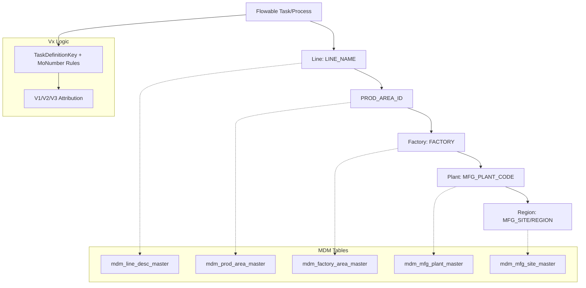

# 製造五階維度設計文件 (MDM-Based Five-Level Manufacturing Dimension)

**版本：** 1.0  
**更新日期：** 2026-01-21  
**適用範圍：** DMP Flowable 流程分析系統 - Silver 層維度設計

---

## 📋 1. 串接設計：MDM 五階維度 Mapping

### 1.1 MDM 表結構分析

基於已同步的 6 張 MDM 主檔表，分析可用的 join key：

| MDM 表 | 主要 Key | 關聯欄位 | 層級對應 |
|--------|----------|----------|----------|
| `mdm_bu_org_type_master` | BUID | BUShortName | **Region** 層級 |
| `mdm_mfg_site_master` | MFG_SITE_ID | MFG_SITE | **Region** 層級補充 |
| `mdm_factory_area_master` | FACTORY | REGION, MFG_SITE | **Factory** 層級 |
| `mdm_mfg_plant_master` | MFG_PLANT_CODE | FACTORY | **Plant** 層級 |
| `mdm_prod_area_master` | PROD_AREA_ID | FACTORY, MFG_PLANT_ID | **Factory** 層級補充 |
| `mdm_line_desc_master` | LINE_NAME | PROD_AREA_ID | **Line** 層級 |

### 1.2 Join 路徑設計



### 1.3 詳細 Join 關係

| 層級 | 來源表 | Join Key | 關係 | 取得欄位 |
|------|--------|----------|------|----------|
| **Line** | `mdm_line_desc_master` | `LINE_NAME` | 1:1 | `LINE_NAME`, `LINE_DESC`, `PROD_AREA_ID` |
| **Factory** | `mdm_prod_area_master` | `PROD_AREA_ID` | N:1 | `FACTORY`, `PROD_AREA_CODE`, `PROD_AREA_DESC` |
| **Plant** | `mdm_mfg_plant_master` | `FACTORY` → `MFG_PLANT_CODE` | N:1 | `MFG_PLANT_CODE`, `MFG_PLANT_DESC` |
| **Region** | `mdm_factory_area_master` | `FACTORY` | 1:1 | `REGION`, `MFG_SITE`, `COUNTRY` |
| **Vx** | **業務邏輯** | TaskDefinitionKey + MoNumber | - | V1/V2/V3 歸屬 |

---

## 📊 2. Silver 層維度表設計

### 2.1 silver.dim_mfg_five_level 表結構

```sql
CREATE TABLE silver.dim_mfg_five_level (
    -- 主鍵
    line_name String,
    
    -- 五階維度 (Region → Vx → Plant → Factory → Line)
    region_code Nullable(String),
    region_name Nullable(String),
    vx_code Nullable(String),        -- 由業務邏輯決定，非 MDM
    vx_name Nullable(String),        -- V1/V2/V3 描述
    plant_code Nullable(String),
    plant_name Nullable(String),
    factory_code Nullable(String),
    factory_name Nullable(String),
    line_code String,                -- 等同於 line_name
    line_desc Nullable(String),
    
    -- 補充維度資訊
    mfg_site Nullable(String),       -- 製造基地
    country Nullable(String),        -- 國家
    prod_area_id Nullable(Int64),    -- 產區 ID
    prod_area_code Nullable(String), -- 產區代碼
    
    -- 資料品質標記
    is_valid UInt8 DEFAULT 1,        -- 是否為有效維度組合
    missing_reason Nullable(String), -- 缺失原因
    data_source Nullable(String),    -- 資料來源標記
    
    -- Metadata
    _create_time DateTime64(3) DEFAULT now64(3),
    _update_time DateTime64(3) DEFAULT now64(3)
    
) ENGINE = ReplacingMergeTree(_update_time)
ORDER BY (line_name)
```

### 2.2 維度表建立 SQL

```sql
-- 建立 silver.dim_mfg_five_level 維度表
INSERT INTO silver.dim_mfg_five_level
WITH 
-- Step 1: 從 LINE 開始，向上串接到 FACTORY
line_to_factory AS (
    SELECT 
        l.LINE_NAME as line_name,
        l.LINE_DESC as line_desc,
        l.PROD_AREA_ID as prod_area_id,
        p.FACTORY as factory_code,
        p.PROD_AREA_CODE as prod_area_code,
        p.PROD_AREA_DESC as factory_name,
        CASE 
            WHEN l.PROD_AREA_ID IS NULL THEN 'LINE_NO_PROD_AREA'
            WHEN p.FACTORY IS NULL THEN 'PROD_AREA_NO_FACTORY'
            ELSE NULL
        END as missing_reason_step1
    FROM bronze.common_mdm_line_desc_master l
    LEFT JOIN bronze.common_mdm_prod_area_master p 
        ON l.PROD_AREA_ID = p.PROD_AREA_ID
    WHERE l.VALID_FLAG = 'Y'
),

-- Step 2: 從 FACTORY 串接到 PLANT
factory_to_plant AS (
    SELECT 
        ltf.*,
        mp.MFG_PLANT_CODE as plant_code,
        mp.MFG_PLANT_DESC as plant_name,
        CASE 
            WHEN ltf.missing_reason_step1 IS NOT NULL THEN ltf.missing_reason_step1
            WHEN mp.MFG_PLANT_CODE IS NULL THEN 'FACTORY_NO_PLANT'
            ELSE NULL
        END as missing_reason_step2
    FROM line_to_factory ltf
    LEFT JOIN bronze.common_mdm_mfg_plant_master mp
        ON ltf.factory_code = mp.FACTORY
        AND mp.VALIDITY = 'Y'
),

-- Step 3: 從 FACTORY 串接到 REGION
factory_to_region AS (
    SELECT 
        ftp.*,
        fa.REGION as region_code,
        fa.FACTORY_DESC as region_name,
        fa.MFG_SITE as mfg_site,
        fa.COUNTRY as country,
        CASE 
            WHEN ftp.missing_reason_step2 IS NOT NULL THEN ftp.missing_reason_step2
            WHEN fa.REGION IS NULL THEN 'FACTORY_NO_REGION'
            ELSE NULL
        END as missing_reason_final
    FROM factory_to_plant ftp
    LEFT JOIN bronze.common_mdm_factory_area_master fa
        ON ftp.factory_code = fa.FACTORY
        AND fa.VALID = '1'
)

SELECT 
    line_name,
    
    -- 五階維度
    region_code,
    region_name,
    NULL as vx_code,        -- Vx 由業務邏輯決定，不在此處計算
    NULL as vx_name,
    plant_code,
    plant_name,
    factory_code,
    factory_name,
    line_name as line_code,
    line_desc,
    
    -- 補充維度
    mfg_site,
    country,
    prod_area_id,
    prod_area_code,
    
    -- 資料品質
    CASE WHEN missing_reason_final IS NULL THEN 1 ELSE 0 END as is_valid,
    missing_reason_final as missing_reason,
    'MDM_MASTER_TABLES' as data_source,
    
    now64(3) as _create_time,
    now64(3) as _update_time
    
FROM factory_to_region
```

---

## 🔗 3. Silver 層事實表 Join 規則

### 3.1 Flowable 任務事實表串接

以 `silver.FACT_TASK_VX_ATTRIBUTION` 為例：

```sql
-- 更新後的 FACT_TASK_VX_ATTRIBUTION 轉換邏輯
INSERT INTO silver.FACT_TASK_VX_ATTRIBUTION
WITH 
-- 從 varinst 轉置取得 moNumber
varinst_pivoted AS (
    SELECT 
        PROC_INST_ID_,
        MAX(CASE WHEN NAME_ = 'moNumber' THEN TEXT_ END) AS varinst_moNumber,
        MAX(CASE WHEN NAME_ = 'plant' THEN TEXT_ END) AS varinst_plant,
        MAX(CASE WHEN NAME_ = 'factory' THEN TEXT_ END) AS varinst_factory,
        MAX(CASE WHEN NAME_ = 'lineName' THEN TEXT_ END) AS varinst_lineName
    FROM bronze.bpm_act_hi_varinst
    WHERE NAME_ IN ('moNumber', 'plant', 'factory', 'lineName')
    GROUP BY PROC_INST_ID_
)

SELECT
    -- 主鍵與基本資訊
    t.TaskId AS task_id,
    t.TaskCreateDate AS task_create_date,
    t.TaskStatus AS task_status,
    t.TaskDefinitionKey AS task_definition_key,
    
    -- 五階維度：優先使用 MDM，Flowable 作為 fallback
    COALESCE(dim.region_code, 
             CASE WHEN COALESCE(v.varinst_plant, t.Plant) = 'WJ2' THEN 'CNS' 
                  WHEN COALESCE(v.varinst_plant, t.Plant) = 'DG3' THEN 'CNS'
                  ELSE NULL END) AS region_code,
    COALESCE(dim.region_name, 'UNKNOWN_REGION') AS region_name,
    
    -- Vx 歸屬邏輯（業務規則）
    CASE 
        WHEN t.TaskDefinitionKey LIKE 'V1%' THEN 'V1'
        WHEN t.TaskDefinitionKey LIKE 'V2%' THEN 'V2'
        WHEN COALESCE(v.varinst_moNumber, t.MoNumber) IN ('3152600035', '3152600036', '3152600037') THEN 'V1'
        WHEN t.TaskDefinitionKey LIKE 'V3%' THEN 'V3'
        WHEN COALESCE(v.varinst_moNumber, t.MoNumber) LIKE '196%' 
             OR COALESCE(v.varinst_moNumber, t.MoNumber) LIKE '199%' 
             OR COALESCE(v.varinst_moNumber, t.MoNumber) LIKE '200%'
             OR COALESCE(v.varinst_moNumber, t.MoNumber) LIKE '210%' 
             OR COALESCE(v.varinst_moNumber, t.MoNumber) LIKE '212%' 
             OR COALESCE(v.varinst_moNumber, t.MoNumber) LIKE '213%'
        THEN 'V1'
        ELSE COALESCE(substring(t.TaskDefinitionKey, 1, 2), 'Unknown')
    END AS vx_code,
    
    COALESCE(dim.plant_code, COALESCE(v.varinst_plant, t.Plant)) AS plant_code,
    COALESCE(dim.plant_name, COALESCE(v.varinst_plant, t.Plant)) AS plant_name,
    COALESCE(dim.factory_code, COALESCE(v.varinst_factory, t.Factory)) AS factory_code,
    COALESCE(dim.factory_name, COALESCE(v.varinst_factory, t.Factory)) AS factory_name,
    COALESCE(dim.line_name, COALESCE(v.varinst_lineName, t.Line)) AS line_code,
    COALESCE(dim.line_desc, COALESCE(v.varinst_lineName, t.Line)) AS line_name,
    
    -- 資料來源標記
    CASE 
        WHEN dim.line_name IS NOT NULL THEN 'MDM_COMPLETE'
        WHEN COALESCE(v.varinst_lineName, t.Line) IS NOT NULL THEN 'MDM_NO_MATCH_USE_FLOWABLE_FALLBACK'
        ELSE 'MDM_AND_FLOWABLE_BOTH_MISSING'
    END AS dimension_source,
    
    -- 其他欄位...
    COALESCE(v.varinst_moNumber, t.MoNumber) AS mo_number,
    now64(3) AS _transform_time

FROM bronze.common_flowable_task_stats t
LEFT JOIN bronze.bpm_act_hi_procinst p 
    ON t.ProcessInstanceId = p.PROC_INST_ID_
LEFT JOIN varinst_pivoted v
    ON t.ProcessInstanceId = v.PROC_INST_ID_
-- 關鍵：優先 JOIN MDM 維度表
LEFT JOIN silver.dim_mfg_five_level dim
    ON COALESCE(v.varinst_lineName, t.Line) = dim.line_name
WHERE t.TaskId IS NOT NULL AND t.TaskId != ''
```

### 3.2 五階補齊優先順序實現

```sql
-- P1: 優先使用 MDM 主檔表推導
COALESCE(dim.region_code, ...)     -- MDM 優先
COALESCE(dim.plant_code, ...)      -- MDM 優先
COALESCE(dim.factory_code, ...)    -- MDM 優先
COALESCE(dim.line_name, ...)       -- MDM 優先

-- P2: MDM 無法取得時，使用 Flowable 欄位/變數
COALESCE(..., v.varinst_plant, t.Plant)      -- varinst 優先於 FlowableTaskStats
COALESCE(..., v.varinst_factory, t.Factory)  -- varinst 優先於 FlowableTaskStats
COALESCE(..., v.varinst_lineName, t.Line)    -- varinst 優先於 FlowableTaskStats

-- P3: 仍無法補齊時，保留 NULL 並標記原因
dimension_source = 'MDM_AND_FLOWABLE_BOTH_MISSING'
```

---

## 🔍 4. Data Quality 檢核

### 4.1 檢核 SQL 範例

```sql
-- 檢核 1: Flowable 任務能成功補齊五階的比例
SELECT 
    dimension_source,
    COUNT(*) as task_count,
    ROUND(COUNT(*) * 100.0 / SUM(COUNT(*)) OVER(), 2) as percentage
FROM silver.FACT_TASK_VX_ATTRIBUTION
GROUP BY dimension_source
ORDER BY task_count DESC;

-- 檢核 2: Join 不到 MDM 的 top N plant/factory/line code
SELECT 
    'PLANT' as dimension_type,
    plant_code as code_value,
    COUNT(*) as task_count
FROM silver.FACT_TASK_VX_ATTRIBUTION
WHERE dimension_source != 'MDM_COMPLETE'
GROUP BY plant_code
ORDER BY task_count DESC
LIMIT 10

UNION ALL

SELECT 
    'FACTORY' as dimension_type,
    factory_code as code_value,
    COUNT(*) as task_count
FROM silver.FACT_TASK_VX_ATTRIBUTION
WHERE dimension_source != 'MDM_COMPLETE'
GROUP BY factory_code
ORDER BY task_count DESC
LIMIT 10

UNION ALL

SELECT 
    'LINE' as dimension_type,
    line_code as code_value,
    COUNT(*) as task_count
FROM silver.FACT_TASK_VX_ATTRIBUTION
WHERE dimension_source != 'MDM_COMPLETE'
GROUP BY line_code
ORDER BY task_count DESC
LIMIT 10;

-- 檢核 3: 同一 line_code 對應多個 factory_code (需 disambiguation)
SELECT 
    line_name,
    COUNT(DISTINCT factory_code) as factory_count,
    groupArray(DISTINCT factory_code) as factory_codes
FROM silver.dim_mfg_five_level
GROUP BY line_name
HAVING factory_count > 1
ORDER BY factory_count DESC;

-- 檢核 4: 各層 orphan rate
WITH orphan_stats AS (
    SELECT 
        COUNT(*) as total_lines,
        SUM(CASE WHEN prod_area_id IS NULL THEN 1 ELSE 0 END) as line_orphan,
        SUM(CASE WHEN factory_code IS NULL THEN 1 ELSE 0 END) as factory_orphan,
        SUM(CASE WHEN plant_code IS NULL THEN 1 ELSE 0 END) as plant_orphan,
        SUM(CASE WHEN region_code IS NULL THEN 1 ELSE 0 END) as region_orphan
    FROM silver.dim_mfg_five_level
)
SELECT 
    'Line Orphan Rate' as metric,
    ROUND(line_orphan * 100.0 / total_lines, 2) as percentage
FROM orphan_stats

UNION ALL

SELECT 
    'Factory Orphan Rate' as metric,
    ROUND(factory_orphan * 100.0 / total_lines, 2) as percentage
FROM orphan_stats

UNION ALL

SELECT 
    'Plant Orphan Rate' as metric,
    ROUND(plant_orphan * 100.0 / total_lines, 2) as percentage
FROM orphan_stats

UNION ALL

SELECT 
    'Region Orphan Rate' as metric,
    ROUND(region_orphan * 100.0 / total_lines, 2) as percentage
FROM orphan_stats;
```

### 4.2 預期檢核結果

| 檢核項目 | 目標值 | 說明 |
|---------|--------|------|
| MDM 完整補齊率 | > 80% | 大部分任務能透過 MDM 補齊五階 |
| Flowable Fallback 率 | < 15% | 少數任務需要 Flowable 補值 |
| 完全缺失率 | < 5% | 極少數任務無法補齊 |
| Line Orphan Rate | < 10% | 大部分 Line 能找到對應 PROD_AREA |
| Factory Orphan Rate | < 5% | 大部分 PROD_AREA 能找到對應 FACTORY |
| Plant Orphan Rate | < 5% | 大部分 FACTORY 能找到對應 PLANT |
| Region Orphan Rate | < 5% | 大部分 FACTORY 能找到對應 REGION |

---

## 📈 5. 實施計劃

### 5.1 Phase 1: 維度表建立
1. 建立 `silver.dim_mfg_five_level` 表
2. 執行 MDM 串接邏輯
3. 驗證維度表資料品質

### 5.2 Phase 2: 事實表更新
1. 更新 `silver.FACT_TASK_VX_ATTRIBUTION` 轉換邏輯
2. 加入 MDM 維度表 JOIN
3. 實施 fallback 機制

### 5.3 Phase 3: 品質監控
1. 建立 Data Quality 檢核腳本
2. 設定監控 Dashboard
3. 定期檢核並優化

---

## ⚠️ 重要注意事項

1. **ACT_HI_VARINST 限制**：只有 V1 流程才會寫入變數，因此 varinst fallback 僅適用於 V1 任務
2. **Vx 歸屬邏輯**：Vx 層級由業務規則決定，不依賴 MDM 表
3. **資料更新頻率**：MDM 表為主檔，更新頻率較低，建議每日同步
4. **效能考量**：維度表建議建立適當索引，優化 JOIN 效能

---

**文件結束**