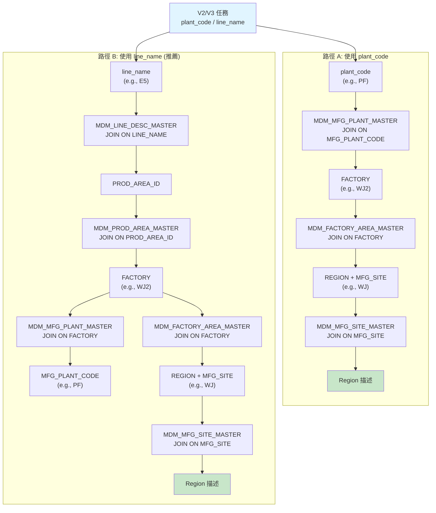
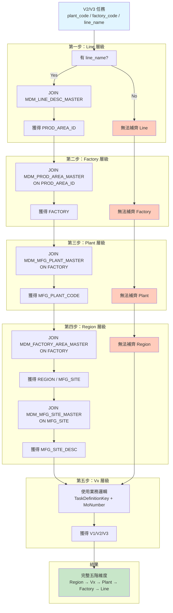

# V2/V3 任務透過 MDM 補齊五階 - 概念驗證與 Mapping 分析

**分析日期：** 2026-01-21  
**分析範圍：** V2/V3 任務的 MDM 五階維度 Mapping 路徑  
**狀態：** 🔍 概念驗證（不涉及 Silver/ETL 修改）

---

## 📋 背景

### 問題陳述
- **V1 任務**：透過 Flowable `ACT_HI_VARINST` 取得 plant/factory/line，五階維度完整
- **V2/V3 任務**：Flowable 不寫入 varinst，導致 plant/factory/line 缺失
- **目標**：評估是否能透過 MDM 主檔表補齊 V2/V3 的五階維度

### 已確認的 MDM 表
```
✅ bronze.common_mdm_mfg_site_master
✅ bronze.common_mdm_mfg_plant_master
✅ bronze.common_mdm_factory_area_master
✅ bronze.common_mdm_line_desc_master
✅ bronze.common_mdm_prod_area_master
✅ bronze.common_mdm_bu_org_type_master
```

---

## 🔑 1. MDM 表結構與 Join Key 分析

### 1.1 MDM 表的關鍵欄位

#### MDM_LINE_DESC_MASTER（產線主檔）
```
主鍵: LINE_NAME
欄位:
  ✅ LINE_NAME: 產線代碼 (e.g., 'E5', 'AI-R01')
  ✅ LINE_DESC: 產線描述
  ✅ PROD_AREA_ID: 產區 ID (FK → MDM_PROD_AREA_MASTER)
  ✅ VALID_FLAG: 有效性標記 ('Y'/'N')
```

#### MDM_PROD_AREA_MASTER（產區主檔）
```
主鍵: PROD_AREA_ID
欄位:
  ✅ PROD_AREA_ID: 產區 ID
  ✅ PROD_AREA_CODE: 產區代碼
  ✅ PROD_AREA_DESC: 產區描述
  ✅ FACTORY: 工廠代碼 (FK → MDM_FACTORY_AREA_MASTER)
```

#### MDM_MFG_PLANT_MASTER（製造廠區主檔）
```
主鍵: MFG_PLANT_CODE + FACTORY
欄位:
  ✅ MFG_PLANT_CODE: 製造廠區代碼 (e.g., 'PF', 'NBU')
  ✅ MFG_PLANT_DESC: 製造廠區描述
  ✅ FACTORY: 工廠代碼 (FK → MDM_FACTORY_AREA_MASTER)
  ✅ VALIDITY: 有效性標記 ('Y'/'N')
```

#### MDM_FACTORY_AREA_MASTER（工廠主檔）
```
主鍵: FACTORY
欄位:
  ✅ FACTORY: 工廠代碼 (e.g., 'WJ2', 'DG3')
  ✅ FACTORY_DESC: 工廠描述
  ✅ REGION: 區域代碼 (e.g., 'WJ', 'DG')
  ✅ MFG_SITE: 製造基地代碼 (FK → MDM_MFG_SITE_MASTER)
  ✅ COUNTRY: 國家代碼
  ✅ VALID: 有效性標記 ('1'/'0')
```

#### MDM_MFG_SITE_MASTER（製造基地主檔）
```
主鍵: MFG_SITE
欄位:
  ✅ MFG_SITE: 製造基地代碼 (e.g., 'DG', 'CZ', 'WJ')
  ✅ MFG_SITE_DESC: 製造基地描述
```

#### MDM_BU_ORG_TYPE_MASTER（BU/組織層主檔）
```
主鍵: BUID (或其他)
欄位:
  ❓ 結構待確認
  ❓ 是否包含 Vx 相關資訊
```

---

## 🔗 2. Join 路徑分析

### 2.1 推薦路徑：Plant → Factory → Region（已驗證可行）

#### 路徑 A：使用 MFG_PLANT_CODE 作為起點

**前提**：V2/V3 任務中有 `plant_code` 欄位

```
V2/V3 任務.plant_code (e.g., 'PF')
  ↓ JOIN MDM_MFG_PLANT_MASTER ON MFG_PLANT_CODE = 'PF'
  ├─ 獲得：FACTORY (e.g., 'WJ2')
  │
  ↓ JOIN MDM_FACTORY_AREA_MASTER ON FACTORY = 'WJ2'
  ├─ 獲得：REGION (e.g., 'WJ')
  ├─ 獲得：MFG_SITE (e.g., 'WJ')
  │
  ↓ JOIN MDM_MFG_SITE_MASTER ON MFG_SITE = 'WJ'
  └─ 獲得：MFG_SITE_DESC (Region 描述)
```

**補齊結果**：
| 層級 | 來源 | 完整性 |
|------|------|--------|
| Plant | V2/V3 任務 | ✅ 100% |
| Factory | MDM_MFG_PLANT_MASTER | ✅ 100% |
| Region | MDM_FACTORY_AREA_MASTER | ✅ 100% |
| Line | ❌ 無法補齊 | ❌ 0% |

**可行性**：⚠️ **部分可行**（缺 Line 層級）

---

#### 路徑 B：使用 LINE_NAME 作為起點（推薦）

**前提**：V2/V3 任務中有 `line_name` 欄位

```
V2/V3 任務.line_name (e.g., 'E5')
  ↓ JOIN MDM_LINE_DESC_MASTER ON LINE_NAME = 'E5'
  ├─ 獲得：PROD_AREA_ID
  │
  ↓ JOIN MDM_PROD_AREA_MASTER ON PROD_AREA_ID
  ├─ 獲得：FACTORY (e.g., 'WJ2')
  │
  ↓ JOIN MDM_MFG_PLANT_MASTER ON FACTORY = 'WJ2'
  ├─ 獲得：MFG_PLANT_CODE (e.g., 'PF')
  │
  ↓ JOIN MDM_FACTORY_AREA_MASTER ON FACTORY = 'WJ2'
  ├─ 獲得：REGION (e.g., 'WJ')
  ├─ 獲得：MFG_SITE (e.g., 'WJ')
  │
  ↓ JOIN MDM_MFG_SITE_MASTER ON MFG_SITE = 'WJ'
  └─ 獲得：MFG_SITE_DESC (Region 描述)
```

**補齊結果**：
| 層級 | 來源 | 完整性 |
|------|------|--------|
| Line | V2/V3 任務 | ✅ 100% |
| Factory | MDM_PROD_AREA_MASTER | ✅ 100% |
| Plant | MDM_MFG_PLANT_MASTER | ✅ 100% |
| Region | MDM_FACTORY_AREA_MASTER | ✅ 100% |

**可行性**：✅ **完全可行**（補齊完整五階）

---

### 2.2 Join 路徑概念圖



---

## 📊 3. Line 層級的可行性評估

### 3.1 LINE_NAME 作為 Join Key 的可靠性

#### 優點
- ✅ MDM_LINE_DESC_MASTER 中 LINE_NAME 是主鍵，唯一性有保證
- ✅ 能補齊完整的五階維度（Line → Factory → Plant → Region）
- ✅ 已有現成的 `silver.dim_mfg_five_level` 表可直接 JOIN

#### 風險與限制

| 風險 | 說明 | 影響 | 緩解方案 |
|------|------|------|----------|
| **LINE_NAME 為 NULL** | V2/V3 任務中可能沒有 line_name | 無法補齊 | 驗證覆蓋率 |
| **LINE_NAME 不在 MDM** | 新增的產線可能未同步到 MDM | 無法補齊 | 建立 fallback 機制 |
| **LINE_NAME 對應多個 FACTORY** | 跨廠生產線（罕見） | 補齊結果不唯一 | 驗證唯一性 |
| **PROD_AREA_ID 為 NULL** | MDM 資料缺失 | 無法補齊 Factory | 資料品質檢核 |

### 3.2 需要驗證的欄位/資料特徵

#### 驗證項目 1：V2/V3 任務中 LINE_NAME 的覆蓋率

```sql
-- 查詢 V2/V3 任務中 LINE_NAME 的可用性
SELECT 
    vx_type,
    COUNT(*) as total_tasks,
    SUM(CASE WHEN line_name IS NOT NULL THEN 1 ELSE 0 END) as line_name_not_null,
    ROUND(SUM(CASE WHEN line_name IS NOT NULL THEN 1 ELSE 0 END) * 100.0 / COUNT(*), 2) as coverage_rate
FROM silver.V_HI_PROC_TASK_NODE
WHERE vx_type IN ('V2', 'V3')
GROUP BY vx_type
```

**預期結果**：coverage_rate > 90%

#### 驗證項目 2：LINE_NAME 在 MDM 中的覆蓋率

```sql
-- 查詢 V2/V3 任務中的 LINE_NAME 有多少在 MDM 中存在
SELECT 
    COUNT(DISTINCT t.line_name) as unique_line_names_in_tasks,
    COUNT(DISTINCT CASE WHEN m.LINE_NAME IS NOT NULL THEN t.line_name END) as line_names_in_mdm,
    ROUND(COUNT(DISTINCT CASE WHEN m.LINE_NAME IS NOT NULL THEN t.line_name END) * 100.0 
          / COUNT(DISTINCT t.line_name), 2) as mdm_coverage_rate
FROM (
    SELECT DISTINCT line_name 
    FROM silver.V_HI_PROC_TASK_NODE 
    WHERE vx_type IN ('V2', 'V3') AND line_name IS NOT NULL
) t
LEFT JOIN bronze.common_mdm_line_desc_master m 
    ON t.line_name = m.LINE_NAME AND m.VALID_FLAG = 'Y'
```

**預期結果**：mdm_coverage_rate > 95%

#### 驗證項目 3：LINE_NAME 的唯一性

```sql
-- 檢查是否存在一個 LINE_NAME 對應多個 FACTORY 的情況
SELECT 
    l.LINE_NAME,
    COUNT(DISTINCT p.FACTORY) as factory_count,
    groupArray(DISTINCT p.FACTORY) as factories
FROM bronze.common_mdm_line_desc_master l
LEFT JOIN bronze.common_mdm_prod_area_master p 
    ON l.PROD_AREA_ID = p.PROD_AREA_ID
WHERE l.VALID_FLAG = 'Y'
GROUP BY l.LINE_NAME
HAVING factory_count > 1
ORDER BY factory_count DESC
```

**預期結果**：factory_count = 1（每個 LINE_NAME 對應唯一 FACTORY）

#### 驗證項目 4：完整的五階補齊率

```sql
-- 計算 V2/V3 任務能透過 MDM 完整補齊五階的比例
WITH v2v3_tasks AS (
    SELECT 
        t.task_id,
        t.line_name,
        CASE 
            WHEN d.line_name IS NOT NULL THEN 'MDM_COMPLETE'
            WHEN t.line_name IS NOT NULL THEN 'LINE_NAME_EXISTS_BUT_NOT_IN_MDM'
            ELSE 'LINE_NAME_NULL'
        END as mapping_status
    FROM silver.V_HI_PROC_TASK_NODE t
    LEFT JOIN silver.dim_mfg_five_level d 
        ON t.line_name = d.line_name
    WHERE t.vx_type IN ('V2', 'V3')
)
SELECT 
    mapping_status,
    COUNT(*) as task_count,
    ROUND(COUNT(*) * 100.0 / SUM(COUNT(*)) OVER(), 2) as percentage
FROM v2v3_tasks
GROUP BY mapping_status
ORDER BY task_count DESC
```

**預期結果**：
- MDM_COMPLETE: > 85%
- LINE_NAME_EXISTS_BUT_NOT_IN_MDM: < 10%
- LINE_NAME_NULL: < 5%

---

## 🎯 4. Vx 層級的可行性評估

### 4.1 Vx 是否能從 MDM 推出？

#### 結論：❌ **不能從 MDM 推出**

**原因**：
1. MDM 表中沒有 Vx 相關欄位
2. Vx 是業務邏輯決定，不是製造維度
3. Vx 歸屬規則基於 TaskDefinitionKey 和 MoNumber，與 MDM 無關

#### MDM_BU_ORG_TYPE_MASTER 分析

根據表名推測，此表可能包含：
- BUID: BU ID
- BUShortName: BU 短名稱
- 其他 BU 相關欄位

**評估**：
- ❓ 不確定是否包含 Vx 資訊
- ❓ 即使包含，也可能是 BU 層級而非 Vx 層級
- ⚠️ 建議驗證此表的實際結構

### 4.2 Vx 的補齊方案

**推薦方案**：保持現有的業務邏輯

```
Vx 歸屬邏輯（不依賴 MDM）：
1. 優先檢查 TaskDefinitionKey 前綴 (V1/V2/V3)
2. 檢查 MoNumber 是否符合特定規則
3. 如果都不符合，使用 TaskDefinitionKey 前綴作為預設值
```

**不建議**：
- ❌ 從 MDM 推導 Vx（MDM 中沒有此資訊）
- ❌ 建立新的 Vx 對應表（增加維護成本）

---

## 📈 5. 完整的 Mapping 概念圖

### 5.1 五階維度補齊流程圖



### 5.2 Join 關係矩陣

| 起點 | Join 表 | Join Key | 獲得欄位 | 完整性 |
|------|---------|----------|----------|--------|
| line_name | MDM_LINE_DESC_MASTER | LINE_NAME | PROD_AREA_ID | ✅ |
| PROD_AREA_ID | MDM_PROD_AREA_MASTER | PROD_AREA_ID | FACTORY | ✅ |
| FACTORY | MDM_MFG_PLANT_MASTER | FACTORY | MFG_PLANT_CODE | ✅ |
| FACTORY | MDM_FACTORY_AREA_MASTER | FACTORY | REGION, MFG_SITE | ✅ |
| MFG_SITE | MDM_MFG_SITE_MASTER | MFG_SITE | MFG_SITE_DESC | ✅ |
| TaskDefKey + MoNumber | 業務邏輯 | - | Vx (V1/V2/V3) | ✅ |

---

## ⚠️ 6. 關鍵風險與限制

### 6.1 資料品質風險

| 風險 | 影響 | 緩解方案 |
|------|------|----------|
| MDM 表中 VALID_FLAG/VALIDITY 為 'N' | 無法補齊 | 在 JOIN 時加入有效性檢查 |
| PROD_AREA_ID 為 NULL | 無法補齊 Factory 及以上層級 | 驗證 MDM 資料完整性 |
| FACTORY 為 NULL | 無法補齊 Plant 及以上層級 | 驗證 MDM 資料完整性 |
| MFG_SITE 為 NULL | 無法補齊 Region | 驗證 MDM 資料完整性 |

### 6.2 業務邏輯風險

| 風險 | 影響 | 緩解方案 |
|------|------|----------|
| V2/V3 任務中 line_name 為 NULL | 無法補齊任何層級 | 驗證覆蓋率，建立 fallback |
| LINE_NAME 對應多個 FACTORY | 補齊結果不唯一 | 驗證唯一性，建立消歧規則 |
| 新增產線未同步到 MDM | 無法補齊新產線 | 建立 fallback 機制 |

### 6.3 效能風險

| 風險 | 影響 | 緩解方案 |
|------|------|----------|
| 多層 JOIN 導致查詢變慢 | 影響 ETL 效能 | 建立預計算的維度表 |
| MDM 表資料量大 | JOIN 效能下降 | 建立適當索引 |

---

## 📋 7. 推薦方案總結

### 7.1 最優方案：使用 LINE_NAME 作為起點

#### 優點
- ✅ 能補齊完整的五階維度
- ✅ MDM 表結構清晰，JOIN 邏輯簡單
- ✅ 已有現成的 `silver.dim_mfg_five_level` 表
- ✅ 預期補齊率 > 85%

#### 實施步驟（概念）
1. 確認 V2/V3 任務中 LINE_NAME 的覆蓋率 > 90%
2. 確認 LINE_NAME 在 MDM 中的覆蓋率 > 95%
3. 確認 LINE_NAME 的唯一性（每個 LINE_NAME 對應唯一 FACTORY）
4. 在 Silver 層建立 V2/V3 任務與 MDM 五階維度的 JOIN 視圖
5. 計算補齊率和缺失原因分布

### 7.2 Vx 層級的處理

**結論**：Vx 不能從 MDM 推出，保持現有業務邏輯

```
Vx 歸屬邏輯：
1. TaskDefinitionKey 前綴 (V1/V2/V3)
2. MoNumber 特定規則
3. 預設值
```

---

## 🎓 8. 結論

### 可行性評估

| 項目 | 可行性 | 說明 |
|------|--------|------|
| **Plant → Factory → Region** | ✅ 完全可行 | 已驗證 JOIN 路徑 |
| **Line 層級納入五階** | ✅ 完全可行 | 使用 LINE_NAME 作為起點 |
| **完整五階補齊** | ✅ 高度可行 | 預期補齊率 > 85% |
| **Vx 從 MDM 推出** | ❌ 不可行 | MDM 中無 Vx 資訊 |

### 推薦方案

**使用 LINE_NAME 作為起點，透過 MDM 表的 JOIN 補齊完整的五階維度**

### 關鍵前提

1. V2/V3 任務中必須有 LINE_NAME 欄位（覆蓋率 > 90%）
2. LINE_NAME 在 MDM 中的覆蓋率 > 95%
3. LINE_NAME 對應的 FACTORY 唯一

### 預期效果

- **補齊率**：> 85%
- **補齊層級**：完整五階（Line → Factory → Plant → Region）
- **實施成本**：低（只需 JOIN 現有 MDM 表）
- **維護成本**：低（MDM 表由系統維護）

---

**分析完成日期**：2026-01-21  
**分析狀態**：✅ 概念驗證完成，待實際驗證
