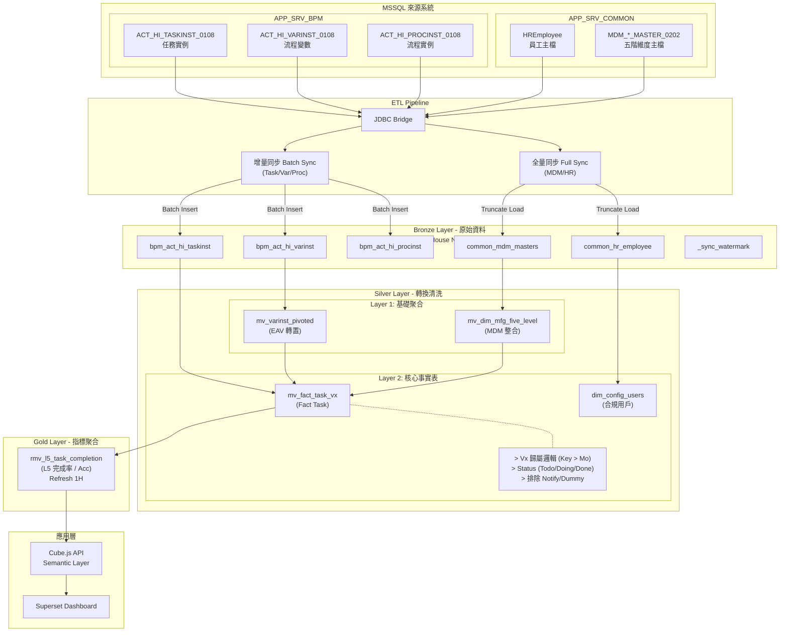

# 專案全體審核報告 (Project Audit Report) - Detailed


## 0. 專案總覽 (Project Overview)

### 核心目的
本專案為一套基於 **Flowable BPM** 的資料流數據分析系統，旨在將分散的商業流程數據 (MSSQL) 透過 ETL pipeline 同步至數據倉儲 (ClickHouse)，並經由多層轉化 (Bronze/Silver/Gold) 產出關鍵績效指標 (L5 任務完成率)，最終透過 Cube.js 提供 API 供 Superset 面板進行視覺化分析。

### 技術棧 (Tech Stack)
- **Source**: MSSQL (`APP_SRV_BPM`, `APP_SRV_COMMON`)
- **Pipeline**: Python 3, JDBC Bridge
- **Warehouse**: ClickHouse (ReplacingMergeTree, Materialized Views)
- **Semantic**: Cube.js
- **Visualization**: Apache Superset

---


## 1. End-to-End 系統架構 (E2E System Architecture)

### 🔗 完整資料流向圖 (System Flow Diagram)



### 1.1 資料流層級說明 (Data Flow Hierarchy)

依據 "End-to-End" 的設計原則，本系統資料流分為以下五層：

#### 1. 資料來源層 (Source Layer)
- **來源**: MSSQL Server (`APP_SRV_BPM` 核心庫, `APP_SRV_COMMON` 主檔庫)。
- **特徵**: 業務交易的發生地，數據分散且正規化 (Normalized)。
- **觸發**: 被動等待抽取 (`SELECT` query)。

#### 2. 抽取層 (Extract Layer)
- **工具**: Python Script (`scripts/rebuild/sync_unified.py`) + JDBC Bridge。
- **邏輯**: 
    - **增量抽取**: 針對 Transaction Table (如 `TaskInst`) 使用時間區間 (`START_TIME_`) 分批拉取。
    - **全量抽取**: 針對 Master Table (如 `MDM_*`) 每次全量拉取。
- **頻率**: 支援手動觸發或外部排程 (建議 Hourly/Daily)。

#### 3. 載入層 (Load Layer) - Bronze
- **目標**: ClickHouse Bronze Layer (如 `bronze.bpm_act_hi_taskinst`)。
- **儲存**: 使用 `ReplacingMergeTree`，保留原始資料樣貌 (Raw Data)。
- **策略**: 
    - **Idempotent Write**: 批次寫入前先刪除目標區間，確保重跑不重複。
    - **Truncate-Load**: 主檔表先清空再寫入。

#### 4. 轉換層 (Transform Layer) - Silver
- **機制**: ClickHouse Materialized View 自動觸發。
- **邏輯**:
    - **Pivot**: 將 EAV 結構 (`ACT_HI_VARINST`) 轉置為寬表 (`silver.mv_varinst_pivoted`)。
    - **Enrich**: 結合 Task, Var, MDM 五階維度，產出核心事實表 (`silver.mv_fact_task_vx`)。
    - **Logic**: 在此層處理 Vx 歸屬、任務狀態判斷 (Todo/Doing/Done) 與排除邏輯。

#### 5. 應用層 (Serve Layer) - Gold & Cube
- **聚合**: 基於 Silver Fact Table，按日/按維度聚合指標 (`gold.rmv_l5_task_completion`)。
- **消費**: 
    - **Cube.js**: 定義語意層 (Schema)，提供 API 給前端。
    - **Superset**: 透過 API 讀取 metrics 進行視覺化展示。

### 📁 資料夾結構與職責
| 資料夾路徑 | 模組名稱 | 職責說明 | 依賴關係 |
| :--- | :--- | :--- | :--- |
| **scripts/rebuild/** | Sync Engine | 負責資料同步 (MSSQL -> Bronze) 與系統重建 | 依賴 `config/` 中的 JDBC 設定 |
| **sql/rebuild/** | Data Warehouse | 定義 Bronze / Silver / Gold 層的 Table Schema 與 ELT 邏輯 | 被 `execute_rebuild.py` 呼叫執行 |
| **cube/model/** | Semantic Layer | 定義 Cube.js Data Schema，作為 API 介面供 Superset 查詢 | 讀取 Gold 層 (部分 Silver) 的數據 |
| **docs/** | Documentation | 存放系統架構、業務定義與操作手冊 | - |
| **config/** | Configuration | 存放環境變數、JDBC 連線設定與 Cube 設定 | 被各模組讀取 |

---

## 2. 業務邏輯摘要 (Business Logic Summary)

### A. 資料同步 (Data Sync)
- **入口點**: `scripts/rebuild/sync_unified.py`
- **主要功能**: 
    - **Unified Sync**: 整合了 BPM 核心表 (Batch 模式) 與 MDM/HR 主檔 (Full 模式) 的同步邏輯。
    - **Watermark Tracking**: 透過 `bronze._sync_watermark` 記錄上次同步時間，支援斷點續傳。
    - **Retry Mechanism**: 針對 JDBC 連線不穩定的狀況，實作了自動重試機制。

### B. 資料倉儲 (Data Warehouse)
- **Gold L5 完成率**: `sql/rebuild/06_gold_kpi_task_completion.sql`
    - 計算每日的 ToDo/Doing/Done 數量。
    - **特殊邏輯**: 實作「7天滾動 Acc」邏輯，計算累積在途量。


### C. API 服務 (Cube.js)
- **L5 週期報表主模型 (Standard V2)**: `cube/model/cubes/cube_l5_task_periodic_v2.js`
    - **核心邏輯**: 採用「V2 Time Machine」架構，支援指定任意歷史日期 (Anchor Date) 進行回溯查詢。
    - **報表結構**: **寬表 (Wide Table)**。時間軸為橫向維度 (Month/Week/Day)，各指標 (Total/Todo/Doing/Done) 為獨立欄位。
    - **應用場景**: **趨勢分析報表**。例如：「過去 12 個月的完成率趨勢」、「每週積壓量的變化」。

- **L5 狀態比較模型 (Pivot V2)**: `cube/model/cubes/cube_l5_task_periodic_v2_pivot.js`
    - **核心邏輯**: 繼承 V2 的 Time Machine 邏輯，但增加 **Unpivot (轉置)** 處理。
    - **報表結構**: **長表 (Long Table)**。將 Total/Todo/Doing/Done 等指標轉置為統一的 `status_name` 維度。
    - **應用場景**: **狀態結構比較**。例如：「各廠區目前的任務狀態分佈堆疊圖」、「WJ2 廠區 Todo vs Doing 的比例」。

---

## 3. 各層資料表對應關係 (End-to-End Table Mapping)

下表詳列從來源到目標的完整 ETL 邏輯，包含抽取條件與轉換規則。

### A. Bronze 層 (原始資料同步)
| 來源表 (MSSQL) | 抽取條件 (Extract) | 目標表 (Bronze) | 同步策略 |
| :--- | :--- | :--- | :--- |
| `ACT_HI_TASKINST_0108` | `START_TIME_` (Batch) | `bpm_act_hi_taskinst` | **Idempotent Batch**: 依區間刪除後寫入，防止重複。 |
| `ACT_HI_VARINST_0108` | `CREATE_TIME_` (Batch) | `bpm_act_hi_varinst` | 同上。 |
| `ACT_HI_PROCINST_0108` | `START_TIME_` (Batch) | `bpm_act_hi_procinst` | 同上。 |
| `MDM_*_MASTER_0202` | 全量 (Full) | `common_mdm_*_master` | **Truncate Load**: 每次清空重寫，確保主檔一致。 |
| `HREmployee` | 全量 (Full) | `common_hr_employee` | 同上。 |

### B. Silver 層 (轉換與清洗)
| 來源表 (Bronze) | 轉換邏輯 (Transform) | 目標表 (Silver) | 目的 |
| :--- | :--- | :--- | :--- |
| `bpm_act_hi_varinst` | **Pivot (Row to Col)**:<br>將 EAV 結構轉為寬表 (Region/Plant/Factory/Line/Mo) | `mv_varinst_pivoted` | 解決 EAV 查詢效能問題，提供扁平化變數。 |
| `common_mdm_masters` | **ClickHouse Join**:<br>串接 Line $\rightarrow$ ProdArea $\rightarrow$ Factory $\rightarrow$ Site | `mv_dim_mfg_five_level` | 建構標準五階組織維度 (Five-Level Hierarchy)。 |
| `bpm_act_hi_taskinst`<br>+ `mv_varinst_pivoted`<br>+ `mv_dim_mfg_five_level` | **Enrichment**:<br>1. 關聯變數與維度<br>2. 計算 Vx 歸屬 (Mo > TaskDef)<br>3. 標記排除任務 (Notify/Dummy) | `mv_fact_task_vx` | **核心事實表**<br>所有後續指標計算的基礎資料源。 |

### C. Gold 層 (指標聚合)
| 來源表 (Silver) | 聚合邏輯 (Aggregations) | 目標表 (Gold) | 應用場景 |
| :--- | :--- | :--- | :--- |
| `mv_fact_task_vx` | **Daily Snapshot**:<br>計算每日 Todo/Doing/Done 數量<br><br>**Rolling Acc**:<br>計算 7日滾動不重複任務數 (`uniqExact`) | `rmv_l5_task_completion` | **L5 任務完成率面板**<br>提供 Daily/Weekly/Monthly 趨勢分析。 |

---

## 4. 資料更新時序 (Data Update Process)

```text
時間軸 (T0 -> T4):
├─ T0: Bronze 同步完成
│   ├─ Python 腳本執行增量/全量同步 (Trigger by Scheduler/Manual)
│   └─ bpm_act_hi_* 表資料落地
│
├─ T1: Silver Layer 1 異步刷新
│   ├─ mv_varinst_pivoted (每小時刷新，合併流程變量)
│   └─ mv_dim_mfg_five_level (MDM 異動時自動觸發)
│
├─ T2: Silver Layer 2 自動更新
│   └─ mv_fact_task_vx 觸發更新 (依賴 L1 完備性，接近即時)
│
├─ T3: Gold 層刷新 (每小時)
│   └─ rmv_l5_task_completion 自動刷新 (Re-calculate snapshots)
│
│
└─ T4: 應用層查詢可用
    └─ Superset Dashboard 讀取最新指標
```


---

## 5. 資料同步流程詳解 (Data Sync Workflow Analysis)

本節詳細說明從 MSSQL 拉取資料至 ClickHouse 的完整 ETL 流程。

### A. 觸發方式 (Trigger Mechanism)
- **目前機制**: **手動觸發 / 外部排程** (Manual / External Scheduler)。
- **排程設定**: 專案儲存庫內目前**無**內建的 Crontab 或排程腳本 (`.sh` / `.bat` 皆於 Archive 區)。
- **建議頻率**: 
    - **BPM 核心表**: 每小時 (Hourly) 或 每日 (Daily)，視業務即時性需求而定。
    - **MDM/HR 主檔**:每日 (Daily) 離峰時間執行。

### B. ETL 流程細節 (ETL Details)

整個 Extract-Transform-Load 流程由 `scripts/rebuild/sync_unified.py` 統一調度，採用 **Direct JDBC Insertion** 模式，由 ClickHouse 直接對 MSSQL 發起查詢，不經過 Python 記憶體，確保大數據量傳輸效率。

#### 1. 資料抽取 (Extract) & 載入 (Load)
採用 ClickHouse `insert_into_jdbc` 模式 (Push-down Query)。

- **批次同步 (Batch Sync)** - 適用於 `TaskInst`, `VarInst`, `ProcInst`
    - Python 邏輯自動生成 SQL。
    - 使用時間區間 (`START_TIME_`) 進行分批查詢。
    - 寫入時附加 `_batch_id` 與 `_extracted_at`。

- **全量同步 (Full Sync)** - 適用於 `MDM`, `ProcDef`
    - 每次同步前執行 `TRUNCATE TABLE` 清空目標表。
    - 一次性寫入來源表最新狀態。

#### 2. 資料轉換 (Transform)
- **Bronze 層**: 僅做 **EL (Extract-Load)**，保持 Raw Data 原貌。
    - 額外增加 `_batch_id` (批次編號) 與 `_extracted_at` (抽取時間) 用於資料追溯。
- **Silver/Gold 層**: 透過 ClickHouse Materialized View 自動進行轉換 (Transform)。

### C. 表格對應關係 (Schema Mapping)

| 來源表 (MSSQL) | 目標表 (ClickHouse Bronze) | 映射邏輯 |
| :--- | :--- | :--- |
| `ACT_HI_TASKINST_0108` | `bpm_act_hi_taskinst` | 1:1 Mapping + Metadata |
| `ACT_HI_VARINST_0108` | `bpm_act_hi_varinst` | 1:1 Mapping + Metadata |
| `ACT_HI_PROCINST_0108` | `bpm_act_hi_procinst` | 1:1 Mapping + Metadata |
| `MDM_*_MASTER_0202` | `common_mdm_*_master` | 1:1 Mapping |
| `HREmployee` | `common_hr_employee` | 選取關鍵欄位 (`EmpCode`, `EmpName`...) |

### D. 增量 vs 全量策略 (Sync Strategy)

| 策略類型 | 適用對象 | 判斷欄位 | 機制說明 |
| :--- | :--- | :--- | :--- |
| **Time-based Batch** | BPM 核心大表 | `START_TIME_` / `CREATE_TIME_` | **Idempotent Write (冪等寫入)**:<br>1. 清除目標區間 (`DELETE WHERE time >= start AND time < end`)<br>2. 寫入來源區間資料<br>此機制確保重跑也不會產生重複資料。 |
| **Full Overwrite** | MDM/HR 小表 | 無 | **Truncate-Load**:<br>每次同步前清空整張表，確保主檔與來源完全一致。 |

- **Watermark 機制**:
    - 使用 `bronze._sync_watermark` table 記錄每張表的 `last_sync_time`。
    - 腳本啟動時若未指定時間，會自動讀取 Watermark 進行斷點續傳。

### E. 錯誤處理與監控 (Error Handling)

1.  **Retry Mechanism (重試機制)**:
    - 針對 JDBC 連線不穩或短暫鎖表，設定 **3 次重試**，每次間隔 30 秒。
2.  **Adaptive Batching (自適應批次)**:
    - 若一個大區間 (如 7 天) 同步失敗，系統會自動將區間 **切半 (Split Half)** 再次嘗試 (`Recursive Split`)。
    - 直到區間小於 30 分鐘才會放棄並報錯。
3.  **Logging**:
    - 標準 Python Logging (`INFO`/`WARNING`/`ERROR`) 輸出至 Console。
    - 包含每批次的筆數、耗時與成功/失敗狀態。


---

## 6. 業務指標計算邏輯 (Business Metric Calculation Logic)

本專案目前核心指標為 **L5 (任務完成率)**。下表整理了其實作邏輯。

### A. 指標彙總表 (Metric Summary)

| 指標名稱 | 計算公式 | 來源表 | 關鍵欄位 | 篩選條件 | 聚合方式 | 分組維度 |
| :--- | :--- | :--- | :--- | :--- | :--- | :--- |
| **任務總數 (Total)** | `COUNT(task_id)` | `silver.mv_fact_task_vx` | `task_primary_date` | `is_excluded = 0` | SUM | Date, Region, Vx, Plant, Factory, Line |
| **待辦任務 (Todo)** | `COUNT(task_id)` where status logic | `silver.mv_fact_task_vx` | `task_start_date` | `is_excluded = 0`, 未結束且未指派 | SUM | 同上 |
| **執行中任務 (Doing)** | `COUNT(task_id)` where status logic | `silver.mv_fact_task_vx` | `task_claim_date` | `is_excluded = 0`, 未結束但已指派 | SUM | 同上 |
| **已完成任務 (Done)** | `COUNT(task_id)` where status logic | `silver.mv_fact_task_vx` | `task_end_date` | `is_excluded = 0`, 已結束 | SUM | 同上 |
| **完成率 (Completion Rate)** | `Done / Total * 100%` | `gold.rmv_l5_task_completion` | `done_count`, `total_task` | 同上 | AVG (Weighted) | 同上 |
| **執行率 (Execution Rate)** | `(Doing + Done) / Total * 100%` | `gold.rmv_l5_task_completion` | `doing_count`, `done_count` | 同上 | AVG (Weighted) | 同上 |
| **累積在途量 (Acc)** | `UNIQ(task_id)` (Rolling 7 Days) | `silver.mv_fact_task_vx` | `snapshot_date` | Start <= Date <= End | COUNT(DISTINCT) | 同上 |

---

---

### B. 核心邏輯詳解 (Detailed Logic)

#### 1. V1/V3 歸屬邏輯 (Vx Attribution Logic)
實作於 `silver.mv_fact_task_vx`，決定任務屬於 V1, V2 或 V3。

- **優先順序 (Priority)**:
    1. **任務定義規則 (TaskDef Rules)**: **最高優先權**。
        - 此規則優先於工單號規則，確保明確定義的 `V` 流程不被誤判。
        - `TaskDefinitionKey` 以 `V1` 開頭 $\rightarrow$ V1
        - `TaskDefinitionKey` 以 `V2` 開頭 $\rightarrow$ V2
        - `TaskDefinitionKey` 以 `V3` 開頭 $\rightarrow$ V3
    2. **工單號規則 (MoNumber Rules)**: **補充判斷**。
        - 用於補救那些 Key 未明確標示 V1/V2/V3，但依據工單特性應歸類的情況。
        - 若 `moNumber` 開頭為 `315`, `196`, `199`, `200`, `210`, `212`, `213`，強制歸類為 **V1**。
    3. **預設**: 取 `TaskDefinitionKey` 前兩字元，若無法識別則為 `Unknown`。

#### 2. L5 任務完成率 & 狀態判斷
實作於 `sql/rebuild/04_silver_fact_tasks.sql` 與 `06_gold_kpi_task_completion.sql`。

- **時間判定 (Triple OR Logic)**:
    - 只要 `START_TIME_`, `CLAIM_TIME_`, `END_TIME_` 任一時間點落在查詢區間內，該任務即被納入。
    - 確保所有在區間內有「活動」的任務都被統計。

- **狀態流轉邏輯 (Status Logic)**:
    基於每日快照日期 (`snapshot_date`) 判斷當時狀態：
    - **Done**: `snapshot_date >= task_end_date`
    - **Doing**: `snapshot_date >= task_claim_date AND snapshot_date < task_end_date`
    - **Todo**: `snapshot_date < task_claim_date`

- **排除條件 (Exclusion Rules)**:
    在 `silver.mv_fact_task_vx` 中預先標記 `is_excluded = 1`，包含：
    1. **Bypass**: `ACT_HI_VARINST.LONG_ = 1` (autoComplete)
    2. **System Node**: `TASK_DEF_KEY_` 以 `E` (Event) 或 `C` (CallActivity) 開頭
    3. **Q/R Order**: 工單號 (`moNumber`) 以 `Q` 或 `R` 開頭
    4. **Dummy/Notify**: 任務名稱包含 `Notify` 或 `Dummy` (實測資料庫中存在此類名稱，屬於測試任務或系統通知，不納入業務統計)

#### 3. Acc 累積在途量 (Rolling 7 Days)
實作於 `06_gold_kpi_task_completion.sql`。

- **定義**: 過去 7 天內（D-6 到 D）曾經存在過的任務去重總數。
- **目的**: 觀察短期內的任務積壓水位，避免單日波動雜訊。

#### 4. ACC 計算邏輯差異 (Granularity Differences)
因應不同時間粒度的業務洞察需求，Cube 層針對 **Daily** 與 **Week/Month** 採用不同的聚合邏輯：

| 粒度 (Granularity) | 時間視窗 (Window) | 分子 (Numerator) | 分母 (Denominator) | 業務意義 |
| :--- | :--- | :--- | :--- | :--- |
| **Daily (日)** | **Rolling 7 Days** | 當日快照 (Snapshot) | **7天滾動總量** (Sum of D-6 to D) | **短期積壓率**<br>平滑單日波動，避免週末分母過小導致指標失真。 |
| **Week/Month (週/月)** | **Fixed Period** | **期末狀態** (End of Period Status) | **週期總量** (Sum of Period) | **週期消化壓力**<br>觀察該週/該月結束時，還有多少 **未完成積壓 (Unfinished Backlog)** 留給下個週期。 |

#### 5. 時間維度與 ISO 週次邏輯 (Time Dimension & ISO Week)
實作於 `gold.vw_l5_dashboard_time_patterns`，確保跨年份週次計算一致。

- **W-pattern 動態邏輯**:
    - **當前月份**: 使用 `toISOWeek(today())`。
    - **歷史月份**: 使用該月最後一日的 `toISOWeek(toLastDayOfMonth(...))`。
    - **目的**: 避免跨年或跨月時的週次斷裂。

- **Dn-1 動態日期邏輯**:
    - **當前月份**: 取 `today() - 1` (T-1) 為基準。
    - **歷史月份**: 取該月最後一日為基準。

#### 5. 資料豐富化與維度補齊 (Data Enrichment & Dimension Attribution)

- **製造五階 (Five-Level Hierarchy)**: `silver.mv_dim_mfg_five_level`
    - **來源**: 整合 `MDM_LINE_DESC`, `MDM_PROD_AREA` 等主檔。
    - **串接路徑**: `Line (MDM_LINE_DESC) -> Prod Area -> Plant/Factory (MDM_MFG_PLANT) -> Region (MDM_MFG_SITE)`
    - **欄位修正**: 依據需求，Factory Code 取自 `MFG_PLANT_CODE`, Plant Code 取自 `FACTORY`。

    **五階主檔 ER 關係圖 (Entity-Relationship Diagram)**:
    ```mermaid
    erDiagram
        MDM_LINE_DESC_MASTER }|..|| MDM_PROD_AREA_MASTER : "belongs to (PROD_AREA_ID)"
        MDM_PROD_AREA_MASTER }|..|| MDM_MFG_PLANT_MASTER : "belongs to (MFG_PLANT_ID)"
        MDM_PROD_AREA_MASTER }|..|| MDM_FACTORY_AREA_MASTER : "belongs to (FACTORY)"
        MDM_FACTORY_AREA_MASTER }|..|| MDM_MFG_SITE_MASTER : "belongs to (MFG_SITE)"

        MDM_LINE_DESC_MASTER {
            string LINE_NAME PK
            string LINE_DESC
            string PROD_AREA_ID FK
        }

        MDM_PROD_AREA_MASTER {
            string PROD_AREA_ID PK
            string PROD_AREA_CODE
            string MFG_PLANT_ID FK
            string FACTORY FK
        }

        MDM_MFG_PLANT_MASTER {
            string MFG_PLANT_ID PK
            string MFG_PLANT_CODE "Factory Code"
            string FACTORY "Plant Code"
        }

        MDM_FACTORY_AREA_MASTER {
            string FACTORY PK
            string MFG_SITE FK "Region Code"
        }

        MDM_MFG_SITE_MASTER {
            string MFG_SITE PK
            string MFG_SITE_DESC "Region Name"
        }
    ```

- **優先順序原則 (Priority Logic)**: `silver.mv_fact_task_vx`
    - 採用 **`COALESCE(VarInst, MDM, 'UNKNOWN')`** 策略。
    - **第一優先**: **流程變數 (ACT_HI_VARINST)**。若有值，直接使用。
    - **第二優先**: **MDM 主檔補齊**。僅當流程變數為空時，透過 `lineName` 關聯 MDM 補齊上層維度。
    - **關鍵依賴**: MDM 補齊機制 **完全依賴 `lineName`**。若變數中無 `lineName`，則無法透過 MDM 補齊 Region/Plant/Factory，維度將標記為 `UNKNOWN`。
    > [!WARNING]
    > **變數缺失風險**: 實測發現部分廠區 (如 `WJ2`, `DG3`, `NBU`, `SMT`) 的流程變數缺乏 `Region` 或 `lineName`。若原始資料未帶入這些變數，MDM 補齊將失效，導致 Gold 層維度缺失。

---

## 7. SQL 檔案清單 (SQL File Inventory)

下表列出專案中所有的 SQL 定義檔，依其執行順序排列。

| 檔案名稱 | 層級 | 功能說明 | 類型 |
|:---|:---|:---|:---|
| `sql/rebuild/01_bronze_flowable_core.sql` | Bronze | Flowable 核心表 (Task/Var/Proc) | `CREATE TABLE` |
| `sql/rebuild/02_bronze_common_dims.sql` | Bronze | Common & HR 維度表 | `CREATE TABLE` |
| `sql/rebuild/03_silver_pivot_and_hierarchy.sql` | Silver | 變數透視與五階維度表 | `MVIEW` |
| `sql/rebuild/04_silver_fact_tasks.sql` | Silver | **L5 核心事實表** (Task Fact) | `MVIEW` |
| `sql/rebuild/05_silver_dim_users.sql` | Silver | **L7 用戶分母表** (User Config) | `VIEW` (Inactive) |
| `sql/rebuild/06_gold_kpi_task_completion.sql` | Gold | **L5 任務完成率** (KPI + Acc) | `MVIEW` (Refreshable) |
| `sql/rebuild/07_gold_kpi_user_utilization.sql` | Gold | **L7 人員使用率** (KPI) | `MVIEW` (Inactive) |

---
*Generated by Deep Codebase Scan at 2026-02-09*
