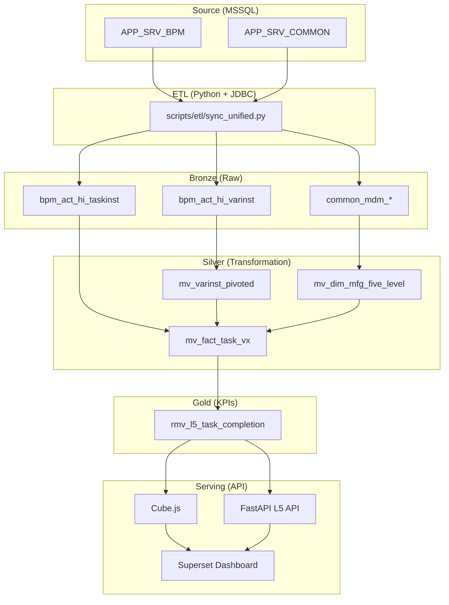

# DMP Flowable 系統架構總覽 (System Architecture Overview)

**版本**: 4.0 (基礎設施整合與服務拆分版)  
**最後更新**: 2026-03-10  
**架構核心**: Bronze/Silver/Gold 三層資料倉儲 + ClickHouse 原生自動化 + 服務拆分 (Split-Stack)

---

## 1. 系統架構圖 (Architecture Overview)

本系統採用現代化數據倉儲架構，將數據從來源端 (MSSQL) 經過多層轉換與聚合，最終提供高效能的 API 服務。

```text
┌─────────────────────────────────────────────────────────────────────┐
│                        MSSQL 來源系統                                │
│  ┌────────────────────────────┐  ┌────────────────────────────────┐ │
│  │ APP_SRV_BPM               │  │ APP_SRV_COMMON                 │ │
│  │ • ACT_HI_TASKINST_0108    │  │ • HR_Employee_0202             │ │
│  │ • ACT_HI_VARINST_0108     │  │ • MDM_*_0202 (五階維度主檔)    │ │
│  │ • ACT_HI_PROCINST_0108    │  │                                │ │
│  └────────────────────────────┘  └────────────────────────────────┘ │
└─────────────────────────────────────────────────────────────────────┘
                                  │
                                  ▼ Python 同步腳本 (增量 / 全量)
┌─────────────────────────────────────────────────────────────────────┐
│  Bronze 層 (原始資料)           ClickHouse (infra/docker-compose)     │
│  ┌─────────────────────────────────────────────────────────────────┐│
│  │ • bpm_act_hi_taskinst  (任務實例，增量同步)                      ││
│  │ • bpm_act_hi_varinst   (流程變數，增量同步)                      ││
│  │ • common_hr_employee   (員工，全量同步)                          ││
│  │ • common_mdm_*         (MDM 主檔，全量同步)                      ││
│  └─────────────────────────────────────────────────────────────────┘│
└─────────────────────────────────────────────────────────────────────┘
                                  │
                                  ▼ Materialized View (自動觸發 / 定期刷新)
┌─────────────────────────────────────────────────────────────────────┐
│  Silver 層 (清洗轉換)                                               │
│  ┌─────────────────────────────────────────────────────────────────┐│
│  │ Layer 1: 基礎聚合                                               ││
│  │ • mv_varinst_pivoted      (EAV 轉置，每 24-48 小時刷新)         ││
│  │ • mv_dim_mfg_five_level   (五階維度，MDM 整合版)                 ││
│  │                                                                 ││
│  │ Layer 2: 核心事實表                                             ││
│  │ • mv_fact_task_vx         (Fact Task，Vx 歸屬邏輯)              ││
│  └─────────────────────────────────────────────────────────────────┘│
└─────────────────────────────────────────────────────────────────────┘
                                  │
                                  ▼ Refreshable MView (每小時自動刷新)
┌─────────────────────────────────────────────────────────────────────┐
│  Gold 層 (指標聚合)                                                 │
│  ┌─────────────────────────────────────────────────────────────────┐│
│  │ • rmv_l5_task_completion  (L5 任務完成率)                       ││
│  │ • rmv_user_utilization    (人員使用率)                          ││
│  └─────────────────────────────────────────────────────────────────┘│
└─────────────────────────────────────────────────────────────────────┘
                                  │
                                  ▼
┌─────────────────────────────────────────────────────────────────────┐
│  應用服務層 (Split-Stack)                                            │
│  • Cube.js 語意層 API (與 Superset 整合)                            │
│  • FastAPI L5 Insight API (獨立容器部署，支援複雜報表)               │
└─────────────────────────────────────────────────────────────────────┘
```

---

## 2. 完整資料管道 (Data Pipeline Detail)

本圖詳述了數據從來源到呈現的完整技術細節。



---

## 3. 核心組件說明

### 3.1 關鍵資料表 (Key Tables)

| 層級 | 表名 / 視圖名 | 說明 | 更新機制 |
| :--- | :--- | :--- | :--- |
| **Bronze** | `bpm_act_hi_taskinst` | 原始任務實例數據 | Python 增量同步 |
| **Silver** | `mv_varinst_pivoted` | 將 EAV 變數結構轉置為寬表 | 每 24-48 小時刷新 (Refreshable) |
| **Silver** | `mv_dim_mfg_five_level` | 標準製造五階維度 (Region-Plant-Line) | MView 自動觸發 |
| **Silver** | `mv_fact_task_vx` | 核心事實表，處理 Vx 歸屬與排除邏輯 | MView 自動觸發 |
| **Gold** | rmv_l5_task_completion | mv_fact_task_vx | REFRESH EVERY 1 HOUR | L5 完成率 |

### 3.2 業務邏輯 (Business Logic)

*   **Vx 歸屬 (Vx Attribution)**: 
    *   **優先級 1**: 工單號 (moNumber) 前綴判定 (如 315%, 196%...)。
    *   **優先級 2**: 任務定義鍵 (TaskDefinitionKey) 前綴 (V1/V2/V3)。
*   **排除邏輯 (Exclusions)**: 自動排除 `Notify`、`Dummy` 字樣任務及系統節點 (Event/CallActivity)。
*   **時間維度 (Time Dimension)**: 採用 Triple-OR 邏輯，確保任務在 Start, Claim, End 任一時間點落在查詢區間內皆能被檢索。

---

## 4. 技術特色 (Technical Features)

### 4.1 服務拆分 (Split-Stack Architecture)
2026-03 版本將 **基礎設施 (ClickHouse)** 與 **應用服務 (FastAPI)** 拆分為獨立的 Docker 堆疊：
*   **ClickHouse 棧**: 位於 `infra/docker-compose.yml`，負責數據存儲與 JDBC 同步。
*   **API 棧**: 位於 `infra/docker-compose-api.yml`，負責報表產出。
這種架構提升了系統的可擴展性，並確保數據處理不干擾報表存取。

### 4.2 Cube.js SQL 注入機制 (SQL Injection)
為了達成動態日期判斷 (如自動判斷歷史月份或當前月)，利用 Cube.js 的 SQL 生成機制，將過濾器提前注入 CTE (Common Table Expressions) 中，使 ClickHouse 能夠根據篩選後的數據範圍動態切換計算邏輯（如月底快照或今天快照）。

---

## 5. SQL 檔案導航 (SQL File Inventory)

開發與維護時，請依據以下順序執行或修改腳本：

1.  `sql/etl/01_bronze_flowable_core.sql`: Bronze 層核心表定義。
2.  `sql/etl/02_bronze_common_dims.sql`: 維度表與主檔表。
3.  `sql/etl/03_silver_pivot_and_hierarchy.sql`: Silver L1 轉換。
4.  `sql/etl/04_silver_fact_tasks.sql`: Silver L2 核心事實表邏輯。
5.  `sql/etl/06_gold_kpi_task_completion.sql`: Gold 層指標聚合與自動刷新設定。

---

## 6. 故障排除 (Troubleshooting)

### 黃金層 (Gold) 數據延遲
若數據未更新，請檢查 Refreshable MView 狀態或手動觸發刷新：
```sql
-- 檢查刷新狀態
SELECT name, last_refresh_time, next_refresh_time FROM system.tables WHERE database = 'gold';

-- 手動強制刷新
SYSTEM REFRESH VIEW gold.rmv_l5_task_completion;
```

### 資料一致性校驗
在修改邏輯後，建議透過以下方式驗證：
```sql
-- 使用 FINAL 關鍵字比對去重後的數據
SELECT count() FROM silver.mv_fact_task_vx FINAL;
```

---

**文件負責人**: AI Antigravity  
**備註**: 本文件整合了原 Overview, Diagram, MViews Deep Dive 與 V2 Flow 之精華。
