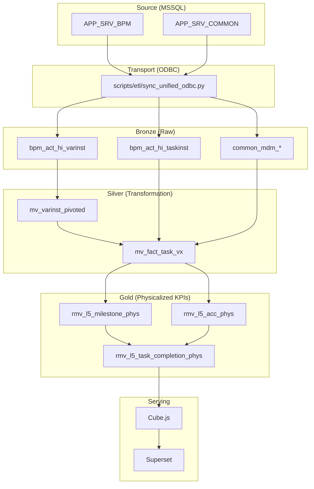

# DMP Flowable 系統架構總覽 (ODBC/Modern 版)

**版本**: 5.0 (原生 ODBC 與 物理化金層版)  
**最後更新**: 2026-04-07  
**架構核心**: Native ODBC 同步 + 物理金層 (Physical Gold) + 三層資料倉儲 (Bronze/Silver/Gold)

---

## 1. 系統架構圖 (Architecture Overview)

本系統採用現代化數據倉儲架構，強調「低延遲」與「高穩定性」。數據從 MSSQL 透過原生 ODBC 同步至 ClickHouse，並經過三層處理。

```text
┌─────────────────────────────────────────────────────────────────────┐
│                        MSSQL 來源系統 (Source)                        │
│  ┌────────────────────────────┐  ┌────────────────────────────────┐ │
│  │ APP_SRV_BPM (流程核心)      │  │ APP_SRV_COMMON (維度主檔)       │ │
│  │ • ACT_HI_TASKINST_0108    │  │ • HR_Employee_0202             │ │
│  │ • ACT_HI_VARINST_0108     │  │ • MDM_* (五階維度主檔)          │ │
│  └────────────────────────────┘  └────────────────────────────────┘ │
└─────────────────────────────────────────────────────────────────────┘
                                  │
                                  ▼ Native ODBC 同步 (Adaptive Batching)
┌─────────────────────────────────────────────────────────────────────┐
│  Bronze 層 (ODS 原始資料)        ClickHouse Server (Server 76)        │
│  ┌─────────────────────────────────────────────────────────────────┐│
│  │ • bpm_act_hi_taskinst  (增量/分批同步)                           ││
│  │ • bpm_act_hi_varinst   (增量/分批同步)                           ││
│  │ • common_hr_employee   (全量同步 + EmpName 補全)                ││
│  └─────────────────────────────────────────────────────────────────┘│
└─────────────────────────────────────────────────────────────────────┘
                                  │
                                  ▼ execute_etl.py (Stage 1: Dimension Pivot)
┌─────────────────────────────────────────────────────────────────────┐
│  Silver 層 (DWH 清洗轉換)                                             │
│  ┌─────────────────────────────────────────────────────────────────┐│
│  │ • mv_varinst_pivoted      (流程變數轉置：EAV 轉寬表)            ││
│  │ • mv_fact_task_vx         (核心事實表：Vx 歸屬邏輯與過濾條件)   ││
│  └─────────────────────────────────────────────────────────────────┘│
└─────────────────────────────────────────────────────────────────────┘
                                  │
                                  ▼ execute_etl.py (Stage 2: Metric Aggregation)
┌─────────────────────────────────────────────────────────────────────┐
│  Gold 層 (KPI 物理指標)                                               │
│  ┌─────────────────────────────────────────────────────────────────┐│
│  │ • rmv_l5_milestone_phys   (里程碑計數：Todo/Doing/Done)          ││
│  │ • rmv_l5_acc_phys         (累積在途量：7 日滾動 ACC)             ││
│  │ • rmv_l5_task_completion  (最終 BI 視圖：自動去重)               ││
│  └─────────────────────────────────────────────────────────────────┘│
└─────────────────────────────────────────────────────────────────────┘
```

---

## 2. 完整資料管道 (Data Pipeline Detail)



---

## 3. 各層處理邏輯 (Layer Logic Deep Dive)

### 3.1 Bronze 層 (原始資料層)
- **同步機制**: 採用 `Native ODBC Table Engine`。透過 `sync_unified_odbc.py` 定期從 MSSQL 提取資料。
- **優化設計**: 針對 `task_id` 與 `proc_inst_id` 建立跳數索引 (Skip Index)，提升 Silver 層 JOIN 效能。

### 3.2 Silver 層 (清洗轉換層)
- **Stage 1 (Pivoting)**: 將 `ACT_HI_VARINST` 的 EAV 結構轉置為寬表 (`mv_varinst_pivoted`)。
- **Stage 2 (Facts)**:
    - **Vx 歸屬 (Vx Attribution)**: 優先使用工單號 (`moNumber`) 前綴判定。
    - **過濾條件**: 自動排除 `Notify`、`Dummy` 任務。

### 3.3 Gold 層 (物理化架構)
Gold 層採用 **物理化儲存 (Physicalization)** 以穩定 Server 76 (6GB RAM) 的運算。
- **Milestone (里程碑)**: 紀錄 Todo/Doing/Done。
- **ACC (累積)**: 7 日滾動在途量計算。
- **窗口化計算 (Windowed ETL)**: 透過 `execute_etl.py --step-days 10` 拆解執行。

---

**文件負責人**: AI Antigravity  
**備註**: 本文件詳述 modern ODBC 架構；Legacy JDBC 內容請見 `01_Architecture_Overview.md`。
