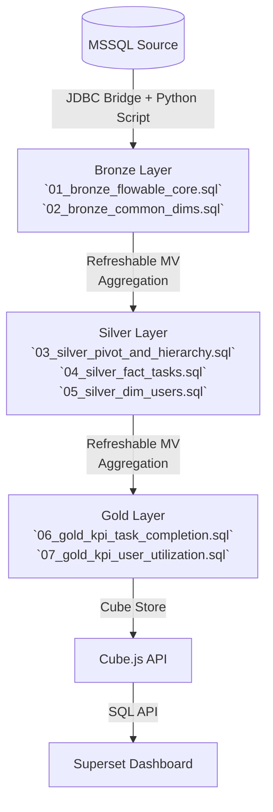

                                                                                                                                                                             
                                                                                                                                                                             # ClickHouse E2E 技術文件 (E2E Technical Guide)

> **版本**: 1.1 (L5 對齊與 Pivot 架構優化版)  
> **最後更新**: 2026-02-03 16:40  
> **核心原則**: MSSQL 為唯一真理 (Source of Truth)，ClickHouse 負責高效計算與聚合。


---

## 1. Overview (系統概覽)

### 專案目的
建構 Flowable BPM 流程與任務指標的數據倉儲，提供 L5 任務完成率、執行率、人員使用率等關鍵指標的即時分析與儀表板展示。

### 架構摘要
- **資料來源**: MSSQL (WJOAUATDB01S) - `APP_SRV_BPM`, `APP_SRV_COMMON`
- **目標平台**: ClickHouse (REDACTED_IP) - Bronze/Silver/Gold 分層架構
- **服務層**: Cube.js (Semantic Layer) → Apache Superset (Dashboard)
- **排程方式**: 
    - **Ingest**: Python Script (`sync_batches_consolidated.py`) 搭配 Windows Task Scheduler / Cron
    - **ETL**: ClickHouse 內部 Materialized Views (即時觸發 & 定時刷新)

---

## 2. End-to-End Data Flow (端到端資料流)



### 資料流細節

#### Source → Ingest
- **工具**: Python (`scripts/etl/sync_unified.py`) (整合 Flowable, HR, MDM)
- **機制**: 
    - 大表 (`ACT_HI_TASKINST`, `ACT_HI_VARINST`) 採 **增量同步 (Batch)**，依 `START_TIME_`/`CREATE_TIME_` 切分，支援中斷續傳 (Watermark)。
    - 小表 (`MDM_*`, `HR_Employee`, `ACT_RE_PROCDEF`) 採 **全量同步 (Full Sync/Truncate-Load)**。
- **頻率**: 依據排程器設定 (建議每 30 分鐘或 1 小時)。

#### Bronze → Silver (Transformation)
- **機制**: ClickHouse Materialized View (`TO` target table)
    - `mv_varinst_pivoted`: **Refreshable MView**，每小時重新聚合流程變數，解決非同步數據碎片化問題。
    - `mv_fact_task_vx`: 結合任務與變數，補齊五階維度 (MDM)，計算 Vx 歸屬。


#### Silver → Gold (Aggregation)
- **機制**: ClickHouse **Refreshable Materialized View**
- **觸發**: 設定為 `REFRESH EVERY 1 HOUR` (由 ClickHouse 背景排程)。
- **核心產物**: 
    - `gold.rmv_l5_task_completion`: L5 任務指標彙總。
    - `gold.rmv_user_utilization`: 人員使用率彙總。

---

## 3. Source of Truth (唯一口徑定義：MSSQL)

所有 ClickHouse 計算結果必須能追溯回 MSSQL 原生表，差異容忍度為 **0%**。


### 標準規範
* **查詢粒度**: 一列 = 一個任務實例 (Task Instance)
* **唯一主鍵**: `PROC_INST_ID_` + `ID_` (TaskId)
* **Join 邏輯**: 
    * 主表: `ACT_HI_TASKINST` (Alias: T)
    * 變數: `ACT_HI_VARINST` (Alias: V) on `PROC_INST_ID_`
    * 定義: `ACT_RE_PROCDEF` (Alias: D)
    * 人員: `HR_Employee` (Alias: E) on `ASSIGNEE_`
* **時間篩選口徑**: 
    * 任務 **START** / **CLAIM** / **END** 任一時間點落在查詢區間即納入 (OR 邏輯)。
    * SQL: `(START_TIME_ BETWEEN ? AND ? OR CLAIM_TIME_ BETWEEN ? AND ? OR END_TIME_ BETWEEN ? AND ?)`

### 欄位對照表 (Field Mapping)

| 業務欄位 | MSSQL 來源欄位 | Silver 層欄位 (`silver.mv_fact_task_vx`) | Gold 層欄位 (`gold.rmv_l5_task_completion`) |
|:---:|:---:|:---:|:---:|
| 任務ID | `ID_` | `TaskId` | (Aggregated Count) |
| 流程定義 | `PROC_DEF_ID_` | `ProcDefId` | `ProcDefName` |
| 負責人 | `ASSIGNEE_` | `Assignee` | (Aggregated by Dept) |
| 工單號 | `var_moNumber` | `MoNumber` | - |
| Vx歸屬 | (Case Logic) | `VxType` | `VxType` |
| 狀態 | `END_TIME_` IS NOT NULL | `TaskStatus` | `TaskStatus` |

---

## 4. ClickHouse Layer Design (分層設計)

### Bronze Layer (原始落地層)
* **命名規則**: `bronze.bpm_act_*`
* **表類型**: `ReplacingMergeTree` (使用 `_batch_id` 或 `_extracted_at` 去重)
* **保留策略**: 
    * 盡量保留原表結構，欄位名稱與來源一致 (Case Sensitive)。
    * 額外欄位: `_batch_id` (String), `_extracted_at` (DateTime64), `_sync_version` (UInt8).
* **Ingest Strategy**: Append-Only，依賴 ReplacingMergeTree 背景合併去重。

### Silver Layer (標準化層)
* **目的**: 清洗、關聯、轉置 (Pivot)、補齊五階 (Dim MDM)。
* **核心產物**:
    * `mv_varinst_pivoted`: 解決 Flowable 變數表 (Row-based) 難以查詢的問題。
    * `mv_dim_mfg_five_level`: 將 MDM 主檔整合成標準五階維度表。
    * `mv_fact_task_vx`: **最核心事實表**，包含所有明細資料，已處理 NPE/Unknown 邏輯。
* **歸屬規則**:
    * **Varinst vs MDM**: 優先使用流程變數 (`varinst.*`)，若缺失則回退查 MDM 主檔 (`mdm.*`)。
    * **Vx Logic**: 315 工單號優先 → TaskDefKey (V1/V2/V3)。

### Gold Layer (應用指標層)
* **目的**: 高效查詢、預計算指標、快照。
* **技術**: **Refreshable Materialized View**
    ```sql
    CREATE MATERIALIZED VIEW gold.rmv_l5_task_completion
    REFRESH EVERY 1 HOUR
    ENGINE = ReplacingMergeTree(_refresh_time)
    AS SELECT ...
    ```
* **重要提醒**: 
    * 避免在 Dashboard 直接使用 `FINAL` 關鍵字，應依賴後台 Merge 或 `argMax` 查詢。
    * Snapshot 邏輯由 RMV 自動處理，不需額外 Python Snapshot Script (除非有特殊歷史回補需求)。

---

## 5. Metrics & Definitions (指標定義)

詳見 [03_Business_Metric_Definitions.md](03_Business_Metric_Definitions.md)。

* **完成率 (Completion Rate)**: `DONE_AUTO + DONE_MANUAL` / `Total Assigned`
* **執行率 (Execution Rate)**: ... (請參照 Metric Doc)
* **維度一致性**: 所有比例欄位 (Rate) 應回傳 0.0 ~ 1.0 (Cube 設定 format: percent)。

---

## 6. Orchestration & Scheduling (排程與調度)

本專案採 **無 Airflow** (No-Airflow) 輕量化部署。

### 核心排程 (Windows Task Scheduler / Cron)

| 任務名稱 | 執行指令 | 頻率 | 失敗策略 | 重跑 |
|:---:|:---|:---:|:---:|:---:|
| **Main Sync** | `python scripts/etl/sync_batches_consolidated.py --table all` | 每 30 分 | Retry 3次 | Idempotent (可重入) |
| **Refresh Pivot**| (ClickHouse 內建) | 每 1 小時 | 自動重試 | `SYSTEM REFRESH VIEW ...` |
| **Refresh Gold** | (ClickHouse 內建) | 每 1 小時 | 自動重試 | `SYSTEM REFRESH VIEW ...` |
| **Validation** | `python scripts/validation/data_explore/quick_stats.py` | 每日 08:00 | 發送告警 | 手動觸發 |


### 歷史資料回補
若需重新同步特定日期區間：
```powershell
python scripts/etl/sync_batches_consolidated.py --start 2025-01-01 --end 2025-01-31 --step-days 7
```

---

## 7. Data Quality & Validation (品質驗收)

### 驗收清單 (Checklist)
1. **Row Count 對帳**:
    * 使用 `scripts/validation/` 下的驗證腳本檢查各層一致性。
    * 標準: MSSQL Count vs Bronze Count 差異 **應為 0** (針對已同步區間)。

2. **主鍵唯一性**:
    * 檢查 `silver.mv_fact_task_vx` 是否有重複 `TaskId`。
3. **時間篩選抽樣**:
    * 隨機抽取 3 天，比對 MSSQL SQL Result 與 Gold RMV 數據。
    * 驗證 OR 條件 (`START` / `CLAIM` / `END`) 是否一致。

### 擴充規範
* 驗證腳本統一放置於 `scripts/validation/` 下對應子目錄。
* 需擴充驗證時，在 `sql/etl/` 下新增標準 SQL 檔 (例如命名為 `07_validation_xxx.sql`)。

---

## 8. Operations (維運手冊)

### 連線資訊
* **ClickHouse Node**: `REDACTED_IP`
* **Ports**: `8123` (HTTP), `9000` (Native)
* **JDBC Bridge**: `REDACTED_IP:9019` (內網服務)

### 常見問題排查 (Troubleshooting)
* **維度遺失 (Empty Plant/Line)**:
    * **原因**: Flowable 變數異步同步，`ReplacingMergeTree` 導致後到的部分數據覆蓋了先到的數據。
    * **修復**: 將 `mv_varinst_pivoted` 改為 `Refreshable MView` 定時全量聚合。
* **Session Lock**: 資料表被鎖定時，檢查 `system.mutations` 是否有未完成的操作。

    * 處理: `KILL MUTATION WHERE mutation_id = '...'`
* **ODBC/JDBC Error**: 檢查 `mssql_master` 連線定義或 JDBC Bridge 服務狀態。
* **資料延遲**: 檢查 `sync_batches_consolidated.py` Log，確認最後同步時間 (`_sync_watermark`)。

### 日誌位置
* Python Script Logs: `logs/sync_*.log` (需於 script 中設定或導向)
* ClickHouse Server Logs: `/var/log/clickhouse-server/clickhouse-server.log` (Server端)

---

## 9. Ownership & Change Log (變更紀錄)

| 2026-02-03 | v1.1 | L5 指標對齊 192 筆，Pivot 改為 Refreshable 架構 | Antigravity |
| 2026-02-03 | v1.0 | 建立 E2E 技術文件，確立 Bronze/Silver/Gold 架構 | Antigravity |

| 2026-01-28 | v0.9 | 切換 MSSQL 來源至 WJOAUATDB01S (Port 65000) | User |
| 2026-01-20 | v0.8 | 實作 Refreshable MV 取代 Python Snapshot | User |
