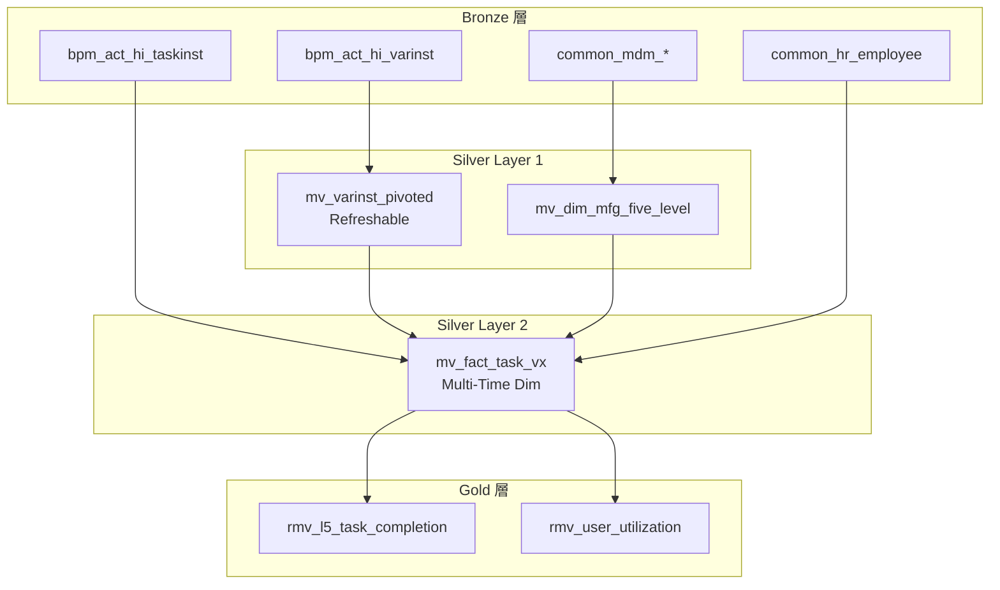

# Silver 層 Materialized Views 架構文件

> **版本**: v2.1 (架構優化版)  
> **最後更新**: 2026-02-03


## 概述

本文件說明 Silver 層 Materialized Views (MVIEW) 架構的設計。此架構使用 ClickHouse 原生 MView 實現自動化資料轉換。

## 架構設計

### 分層架構



---

## Silver Layer 1 - 基礎聚合

### mv_varinst_pivoted

**更新機制**: **REFRESH EVERY 48 HOUR** (解決非同步資料碎片化問題)

**SQL 位置**: `sql/etl/03_silver_pivot_and_hierarchy.sql`


---

### mv_dim_mfg_five_level

**用途**: 五階維度主檔 (Region → Plant → Factory → Line)

**來源**: `bronze.common_mdm_*` 系列表 JOIN

**輸出欄位**:
| 欄位 | 說明 |
|------|------|
| `line_name` | 產線名稱 (主鍵) |
| `factory_code` | 工廠代碼 |
| `plant_code` | 廠區代碼 |
| `region_code` | 地區代碼 |

**SQL 位置**: `sql/etl/03_silver_pivot_and_hierarchy.sql` (已修復 MDM Join 路徑)


---

## Silver Layer 2 - 核心事實表

### mv_fact_task_vx

**用途**: L5 任務核心事實表，包含 Vx 歸屬邏輯

**來源**: 
- `bronze.bpm_act_hi_taskinst`
- `silver.mv_varinst_pivoted`
- `silver.mv_dim_mfg_five_level`
- `bronze.common_hr_employee`

**關鍵邏輯**:

1. **Vx 歸屬** (工單號規則優先):
```sql
CASE 
    WHEN moNumber LIKE '315%' THEN 'V1'
    WHEN moNumber LIKE '196%' OR '199%' ... THEN 'V1'
    WHEN taskDefinitionKey LIKE 'V1%' THEN 'V1'
    ...
END AS vx_type
```

2. **Task Status**:
```sql
CASE 
    WHEN END_TIME_ IS NOT NULL THEN 'DONE'
    WHEN ASSIGNEE_ IS NOT NULL THEN 'DOING'
    ELSE 'TODO'
END AS task_status
```

3. **排除標記**:
```sql
CASE 
    WHEN autoComplete = 1 THEN 1  -- bypass
    WHEN taskDefinitionKey LIKE 'E%' OR 'C%' THEN 1
    WHEN moNumber LIKE 'Q%' OR 'R%' THEN 1
    ELSE 0
END AS is_excluded
```

**輸出欄位**:
| 欄位 | 說明 |
|------|------|
| `task_id` | 任務 ID (主鍵) |
| `task_start_date` | 任務建立日期 |
| `task_claim_date` | 任務認領日期 |
| `task_end_date` | 任務完成日期 |
| `task_status` | TODO/DOING/DONE |
| `vx_type` | V1/V2/V3 |
| `region` | 地區 |
| `plant` | 廠區 |
| `factory` | 工廠 |
| `line` | 產線 |
| `is_excluded` | 排除標記 |
| `mo_number` | 工單編號 |

**SQL 位置**: `sql/etl/04_silver_fact_tasks.sql` (核心事實表)


---

## 更新機制

### POPULATE (初始化填充)

Silver 層 MView 使用 `POPULATE` 關鍵字：
- 建立時自動從來源表填充資料
- Bronze 層 INSERT 時自動觸發更新
- **限制**: JOIN 表更新時不會觸發

```sql
CREATE MATERIALIZED VIEW silver.mv_fact_task_vx
ENGINE = ReplacingMergeTree(_mview_update_time)
POPULATE AS
SELECT ...
```

### Gold 層解決方案

由於 MView 在 JOIN 表更新時不觸發，Gold 層使用 **Refreshable MView**：

```sql
CREATE MATERIALIZED VIEW gold.rmv_l5_task_completion
REFRESH EVERY 48 HOUR  -- 每48小時全量刷新
AS
SELECT ...
FROM silver.mv_fact_task_vx FINAL
```

---

## 查詢範例

### 查詢 L5 任務完成率
```sql
SELECT 
    vx_type, plant, factory, line,
    count() AS total,
    countIf(task_status = 'DONE') AS done,
    round(countIf(task_status = 'DONE') * 100.0 / count(), 2) AS completion_rate
FROM silver.mv_fact_task_vx FINAL
WHERE task_start_date = '2025-12-25'
  AND is_excluded = 0
GROUP BY vx_type, plant, factory, line
```

### 查詢 Gold 層快照
```sql
SELECT * 
FROM gold.rmv_l5_task_completion FINAL
WHERE snapshot_date = '2025-12-25'
  AND plant = 'WJ2'
```

---

## 維護操作

### 手動刷新 Gold 層
```sql
SYSTEM REFRESH VIEW gold.rmv_l5_task_completion;
```

### 檢查 MView 狀態
```sql
SELECT database, name, engine
FROM system.tables 
WHERE database IN ('silver', 'gold') 
  AND name LIKE '%mv%' OR name LIKE '%rmv%';
```

### 強制資料合併
```sql
OPTIMIZE TABLE silver.mv_fact_task_vx FINAL;
```