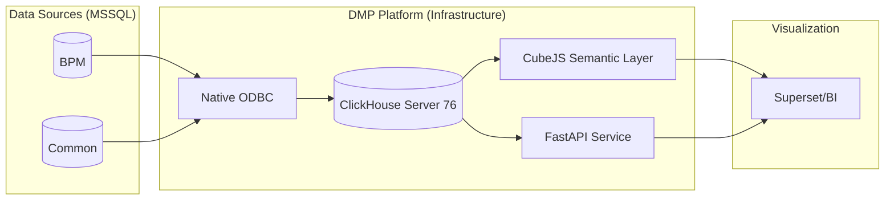
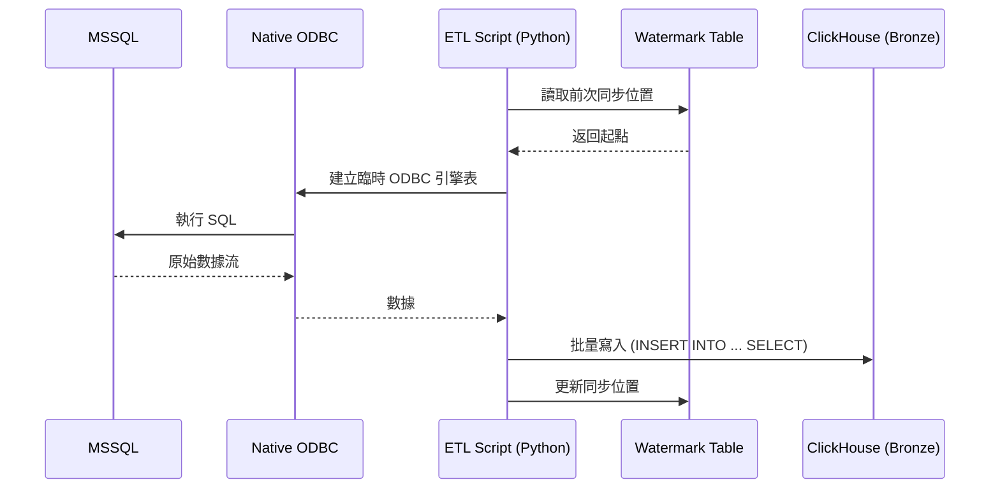

# DMP Flowable 資料平台技術文件 (ODBC 正式版)

本文件詳述 DMP Flowable 資料平台在 **Native ODBC** 與 **物理化金層** 架構下的設計與實作。系統核心基於 ClickHouse，實現從流程引擎數據到高分析品質數據的轉化。

---

## 第一部分：平台基礎與環境 (Foundation)

### 1. Project Overview
*   **設計目的**：為 Flowable 流程引擎提供高性能的分析能力，透過 Medallion 架構將數據逐步提煉為 KPI 指標。
*   **技術特點**：本版本採用原生 ODBC 桌子引擎 (ODBC Table Engine) 進行同步，並實施金層物理化以解決伺服器記憶體限制。

### 2. System Architecture
*   **全鏈路架構**：

*   **架構說明**：系統由數據倉儲 (ClickHouse)、語義層 (CubeJS)、與數據服務 (FastAPI) 組成。同步過程完全繞過 JDBC Bridge，直接透過內置 ODBC 驅動。
*   **資料流程**：
    1.  **Ingestion**: 透過 `sync_unified_odbc.py` 從 MSSQL 抓取數據 (Native ODBC)。
    2.  **Storage**: 數據落盤至 ClickHouse，按層級進行 SQL 轉化與物理化。
    3.  **Serving**: CubeJS 供語義查詢，FastAPI 供特定指標接口。

---

## 第二部分：數據工程與管線 (Data Engineering)

### 4. ETL Pipeline & Incremental Sync
*   **設計目的**：實現高效、穩定的跨庫數據同步，解決 LOB 欄位死鎖問題。
*   **數據流向流程圖**：

*   **核心工具**：
    *   `sync_unified_odbc.py`：核心同步引擎 (Adaptive Batching)。
    *   `execute_etl.py`：流程轉換與指標計算引擎 (Low-RAM 模式)。
    *   `setup_schema.py`：基礎架構部署。
*   **增量控制 (Watermark)**：透過 `bronze._sync_watermark` 表記錄各表進度。
*   **調度機制**：由 `execute_etl.py` 依據依賴關係有序觸發物理表刷新，取代外部調度器。

---

## 第三部分：核心邏輯與轉換規格 (Business Logic Specs)

### 5. Silver Layer: 數據清洗與五階對齊
*   **五階維度生成 (L5 Generation)**：優先級 1 為工單號前綴，優先級 2 為 `TASK_DEF_KEY_` 前綴。
*   **數據篩選規則**：自動排除系統自動節點、Notify、Dummy 任務及非生產工單。

### 6. Gold Layer: KPI 物理化規格
*   **1. 2-Tier 物理化架構**：
    *   **Milestone**: 紀錄每日 Todo/Doing/Done 快照。
    *   **ACC**: 計算 7 日滾動在途量，使用 `ARRAY JOIN` 優化。
*   **2. 指標定義**：
    *   **Acc (累積在途)**：`task_start_date <= snapshot_date` 且 `(end_date IS NULL OR end_date > snapshot_date)`。
*   **3. 窗口化執行**：為解決 Server 76 (6GB RAM) 限制，透過 `execute_etl.py --step-days 10` 將全量補分拆解執行。

---

## 第四部分：語義建模與數據服務 (Semantic & Serving)

### 7. CubeJS Semantic Layer (語義層建模)
*   **設計目的**：抽象 SQL 邏輯為業務語義，並針對 `snapshot_date` 進行查詢優化。
*   **物理表對接**：Cube.js 直接對應 `gold.rmv_l5_task_completion` 視圖（該視圖讀取物理表並執行 `FINAL` 去重）。

### 8. Data API Service (FastAPI)
*   **設計目的**：提供 L5 Insight 報表專用的 API。
*   **效能優化**：利用物理金層免除運算延遲，報表生成速度提升 10 倍以上。

---

## 第五部分：版本與維護資訊
*   **版本號**：v5.0.0 (ODBC 版)
*   **更新日期**：2026-04-07
*   **維護人員**：Antigravity
*   **備註**：本文件詳述基於 ODBC 之 modern 架構；Legacy JDBC 內容請見 `DMP_Flowable_Technical_Documentation.md`。
