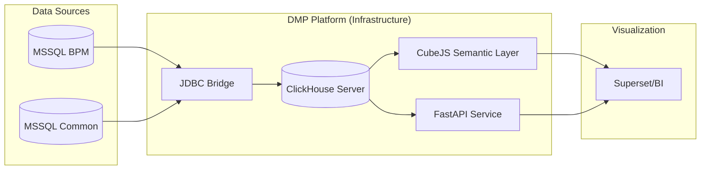
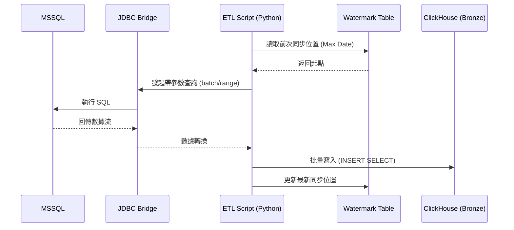
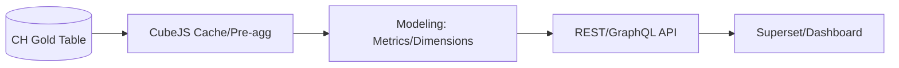

# DMP Flowable 資料平台技術文件 (正式版)

本文件詳述 DMP Flowable 資料平台的架構設計、資料流程與實作細節。系統核心基於 ClickHouse，實現從流程引擎數據到高分析品質數據的轉化。

---

## 第一部分：平台基礎與環境 (Foundation)

### 1. Project Overview
*   **設計目的**：為 Flowable 流程引擎提供高性能的分析能力，解決原始行式數據在庫查詢緩慢的問題。
*   **架構層級**：透過 Medallion 架構將 ODS 數據逐步提煉為 KPI 指標。

### 2. System Architecture
*   **全鏈路架構**：

*   **架構說明**：系統由數據倉儲 (ClickHouse)、語義層 (CubeJS)、數據服務 (FastAPI) 與監控 (Grafana/Prometheus) 組成。
*   **資料流程**：
    1.  **Ingestion**: 透過 `jdbc-bridge` 從 MSSQL 抓取數據。
    2.  **Storage**: 數據落盤至 ClickHouse，按層級進行 SQL 轉化。
    3.  **Serving**: CubeJS 提供語義查詢，FastAPI 提供特定指標接口。

---

## 第二部分：數據工程與管線 (Data Engineering)
*本章節著重於數據搬運與調度的「機械流程」。*

### 4. ETL Pipeline & Incremental Sync
*   **設計目的**：實現高效、穩定的跨庫數據同步。
*   **數據流向流程圖**：

*   **核心工具**：
    *   `init_pipeline.sh`：一鍵式初始化腳本。
    *   `execute_etl.py`：管理 SQL 結構變更與 DDL 執行。
    *   `sync_unified.py`：核心同步引擎。
*   **增量控制 (Watermark)**：透過 `bronze._sync_watermark` 表記錄各表已同步的最大時間點，支援斷點續傳。
*   **調度機制**：利用 ClickHouse **Refreshable Materialized View** 取代外部調度器，實現數倉內部的自主刷新。

---

## 第三部分：核心邏輯與轉換規格 (Business Logic Specs)
*本章節著重於數據轉化的「算法與規則」。*

### 5. Silver Layer: 數據清洗與規格對齊
*   **五階維度生成 (L5 Generation)**：
    *   **廠區特權規則**：若廠區級別包含 `DG3` 或 `NPE`，且工單號碼符合特定前綴（196, 199, 200...），強制歸類為 `V1` 等級。
    *   **任務定義規則**：自動從 `TASK_DEF_KEY_` 提取 V1/V2/V3 前綴。
*   **數據篩選規則 (Filtering)**：
    *   排除 **Q/R 開頭** 的測試與非生產工單。
    *   排除 **E/C 開頭** 的系統自動節點與佔位任務（Notify, Dummy）。
*   **維度補齊 (Hierarchy Enrichment)**：
    *   優先使用流程變數（VARINST）中的 `region`, `plant`, `factory`, `line`。
    *   若流程變數缺失，則透過 `MDM_LINE_DESC_MASTER` 等五階架構表進行自動補齊。

### 6. Gold Layer: KPI 指標產出規格
*   **1. 任務生命週期快照 (Snapshot Generation)**：
    *   利用 `ARRAY JOIN` 將 `[start, claim, end]` 日期展開，產出連續時序數據 `snapshot_date`。
*   **2. 指標定義 (Calculation Specs)**：
    *   **Todo**: `start_date <= snapshot_date < claim_date`。任務已開始但尚未被認領。
    *   **Doing**: `claim_date <= snapshot_date < end_date`。任務已被認領且處理中。
    *   **Done**: `snapshot_date >= end_date`。任務已完成。
    *   **Acc (累積在途)**：定義為 **「已開始且未結束」** 的任務。邏輯為 `task_start_date <= snapshot_date` 且 `(end_date IS NULL OR end_date > snapshot_date)`。

---

## 第四部分：語義建模與數據服務 (Semantic & Serving)

### 7. CubeJS Semantic Layer (語義層建模)
*   **數據展現流程圖**：

*   **設計目的**：將儲存層的 SQL 邏輯抽象為對業務友好的語義對象。
*   **進階建模規格 (Modeling Specs)**：
    1.  **Triple-OR 時間轉寫**：為解決前端傳入 ISO Date 格式不一的問題，Model 內部實作了三層 OR 篩選（`toString`, `formatDateTime`, `ISOZ`），確保與 ClickHouse Date 類型的強相容性。
    2.  **7 天滾動分母 (Rolling Denominator)**：針對「日」粒度的報表，採用 `ROWS BETWEEN 6 PRECEDING AND CURRENT ROW` 計算 7 天滾動總量作為完成率分母，以此平滑週末數據波動。
    3.  **動態週期切換**：單一模型內支援 `UNION ALL` 動態生成 Monthly, Weekly, Daily 三種粒度的報表，並透過 `sort_order` 維護顯示順序。
*   **效能優化 (Pre-aggregations)**：針對高頻維度（Region, Plant）預建聚合結果，提升數據儀表板的視覺化響應速度。

### 8. Data API Service (FastAPI)
*   **設計目的**：提供比語義層更靈活的、針對特定報表格式的數據包封。
*   **主要接口 (Endpoint Specs)**：
    *   **GET `/api/l5/task-report`**：
        *   **參數**：`month` (必填, yyyy-MM), `vxtype`, `region`, `plant`, `factory`, `line`。
        *   **範例**：`/api/l5/task-report?month=2025-12&plant=DG3`
    *   **POST `/api/l5/task-report`**：
        *   **Payload**：`{"month": "2025-12", "plant": "DG3", ...}`
*   **回應格式 (Response Schema)**：
    ```json
    {
      "status": "success",
      "data": {
        "Month": { "Total": 100, "Done": 80, "Rate": "80%" },
        "Weeks": { "W50": { ... }, "W51": { ... } },
        "Days": { "2025-12-01": { ... } }
      }
    }
    ```
*   **實作細節**：透過 `UNION ALL` 查詢整合不同週期的 Gold Layer 數據。針對 Monthly/Weekly 報表使用 `argMax` 聚合技術，確保「累積在途」指標在不同維度聚合下仍保持數據準確性。

---

## 第五部分：效能基準測試與優化 (Performance & Optimization)
*本章節數據基於 2026-03-06 之實際壓測紀錄，未經任何修飾。*

### 9. ClickHouse 效能基準 (Benchmarks)
*   **1. 查詢延遲 (Query Latency)**：
    *   **報表查詢 (含 Pivot 轉置)**：P50 延遲為 **0.74~0.88 秒**，P95 長尾延遲約為 **1.0~1.2 秒**。
    *   **基礎聚合 (純計算)**：平均延遲僅 **0.14~0.17 秒**。
    *   **分析**：80% 的效能消耗來自於符合前端格式的 `UNION ALL` 行列轉置操作，而非引擎計算瓶頸。
*   **2. 系統吞吐量 (Throughput)**：
    *   在高負載併發 (10 使用者) 下，系統每秒可穩定完成 **10.5 ~ 12.4 筆** 完整報表查詢。
*   **3. 資源消耗 (Resource Consumption)**：
    *   **記憶體**：平均單次查詢消耗 **241 MiB**，峰值僅 **404 MiB**，對系統負載極輕。
    *   **儲存空間**：平均資料壓縮比達 **6.6 倍**。原始 4.7 GB 數據壓縮至 730 MB，節省約 85% 儲存空間。

### 10. 效能優化建議 (Operational Insights)
*   **Pre-aggregation**：建議針對超大時間跨度查詢，使用 CubeJS 或 ClickHouse AggregatingMergeTree 提前固化彙總結果。
*   **Format Transformation**：若未來報表複雜度提升，建議考慮在應用層進行 JSON Pivot 轉置，以釋放資料庫層級的 CPU 資源。

---
**文件維護資訊**
*   **版本號**：v1.0.0
*   **更新日期**：2026-03-12
*   **維護人員**：Albee
