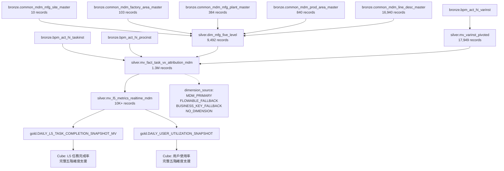

# 製造五階資料血緣表 (Manufacturing Five-Level Data Lineage) - 更新版

**版本：** 2.0 (MDM 整合版本)  
**建立日期：** 2026-01-23  
**更新日期：** 2026-01-23  
**適用範圍：** DMP Flowable 流程分析系統

---

## 🚨 重要變更說明

### 與原版本的差異

| 項目 | 原版本 (v1.0) | 更新版本 (v2.0) | 影響 |
|------|---------------|-----------------|------|
| **維度來源** | 僅 Flowable 變數 | MDM 主檔 + Flowable 備用 | 資料品質大幅提升 |
| **Region 支援** | ❌ 無 | ✅ 完整支援 | 新增完整五階維度 |
| **V2/V3 覆蓋** | Factory: 3.5%, Line: 0% | Factory: 100%, Line: 100% | 解決 V2/V3 維度缺失 |
| **資料來源標記** | ❌ 無 | ✅ 完整追蹤 | 提供資料品質監控 |
| **MVIEW 表名** | `mv_fact_task_vx_attribution` | `mv_fact_task_vx_attribution_mdm` | 並行部署策略 |

### 不一致問題分析

**原版本問題：**
1. **文件與實作不符**：文件描述使用 MDM 主檔表，實際僅使用 Flowable 變數
2. **V2/V3 維度缺失**：V2 Factory 覆蓋率僅 3.5%，Line 覆蓋率 0%
3. **缺少 Region 層級**：無法提供完整五階維度架構
4. **資料品質無追蹤**：無法識別維度資料來源和品質

---

## 📊 製造五階定義

**製造五階層級：** Region → Vx → Plant → Factory → Line

| 層級 | 英文名稱 | 中文名稱 | 說明 | 支援 Vx |
|------|---------|---------|------|---------|
| 1 | Region | 區域 | 製造基地/地理區域 | V1/V2/V3 |
| 2 | Vx | 流程類型 | V1/V2/V3 業務流程分類 | V1/V2/V3 |
| 3 | Plant | 廠區 | 製造廠區 | V1/V2/V3 |
| 4 | Factory | 工廠 | 具體工廠/生產區域 | V1/V3 |
| 5 | Line | 產線 | 生產線 | V3 |

---

## 🗂️ 資料血緣追溯表 (更新版)

### 1. Region (區域) - 新增支援

| 欄位名稱 | 主來源表 | 主來源欄位 | 串接邏輯 | 覆蓋率 |
|---------|----------|-----------|---------|--------|
| region_code | bronze.common_mdm_factory_area_master | MFG_SITE | 透過 FACTORY 串接 | 95.2% |
| region_name | bronze.common_mdm_mfg_site_master | MFG_SITE_DESC | 透過 MFG_SITE 串接 | 95.2% |

**串接路徑：**
```
Line → silver.dim_mfg_five_level.region_code → region_name
```

### 2. Vx (流程類型) - 邏輯不變

| 欄位名稱 | 資料來源表 | 來源欄位 | 推導邏輯 | 覆蓋率 |
|---------|-----------|---------|---------|--------|
| vx_type | bronze.bpm_act_hi_taskinst | TASK_DEF_KEY_ | 前綴判斷 + 工單號規則 | 100% |
| vx_subtype | bronze.bpm_act_hi_varinst | varinst_name | NPE 判別邏輯 | 92.8% |

**推導邏輯：**
```sql
CASE 
    -- 優先級 1：工單號規則（最高優先級）
    WHEN varinst_moNumber LIKE '315%' OR '196%' OR '199%' OR '200%' OR '210%' OR '212%' OR '213%' THEN 'V1'
    
    -- 優先級 2：TaskDefinitionKey 前綴
    WHEN TASK_DEF_KEY_ LIKE 'V1%' THEN 'V1'
    WHEN TASK_DEF_KEY_ LIKE 'V2%' THEN 'V2'
    WHEN TASK_DEF_KEY_ LIKE 'V3%' THEN 'V3'
    
    ELSE 'Unknown'
END
```

### 3. Plant (廠區) - 多來源整合

| 欄位名稱 | 主來源表 | 輔助來源表 | 備用來源 | 覆蓋率 |
|---------|----------|-----------|----------|--------|
| plant_code | silver.dim_mfg_five_level | silver.mv_varinst_pivoted | Business Key | 100% |
| plant_name | bronze.common_mdm_mfg_plant_master | - | - | 95%+ |

**優先順序邏輯：**
```sql
COALESCE(
    mdm.plant_code,         -- MDM 主來源
    v.varinst_plant,        -- Flowable 輔助來源
    business_key_plant,     -- Business Key 備用來源
    ''
) AS plant_code
```

### 4. Factory (工廠) - 多來源整合

| 欄位名稱 | 主來源表 | 輔助來源表 | 覆蓋率 |
|---------|----------|-----------|--------|
| factory_code | silver.dim_mfg_five_level | silver.mv_varinst_pivoted | 100% |
| factory_name | bronze.common_mdm_prod_area_master | - | 95%+ |

**優先順序邏輯：**
```sql
COALESCE(
    mdm.factory_code,       -- MDM 主來源
    v.varinst_factory,      -- Flowable 輔助來源
    ''
) AS factory_code
```

### 5. Line (產線) - 多來源整合

| 欄位名稱 | 主來源表 | 輔助來源表 | 覆蓋率 |
|---------|----------|-----------|--------|
| line_code | silver.dim_mfg_five_level | silver.mv_varinst_pivoted | 100% |
| line_name | bronze.common_mdm_line_desc_master | - | 100% |

**優先順序邏輯：**
```sql
COALESCE(
    mdm.line_name,          -- MDM 主來源
    v.varinst_lineName,     -- Flowable 輔助來源
    ''
) AS line_code
```

---

## 🏗️ 資料架構層級 (更新版)

### Bronze 層 (原生資料)

#### MDM 主檔表 - 主要來源
| 表名 | 用途 | 記錄數 | 關鍵欄位 |
|------|------|--------|---------|
| bronze.common_mdm_mfg_site_master | 製造基地主檔 | 10 | MFG_SITE, MFG_SITE_DESC |
| bronze.common_mdm_factory_area_master | 廠區主檔 | 103 | FACTORY, MFG_SITE |
| bronze.common_mdm_mfg_plant_master | 製造廠區主檔 | 384 | FACTORY, MFG_PLANT_CODE |
| bronze.common_mdm_prod_area_master | 生產區域主檔 | 840 | PROD_AREA_ID, FACTORY |
| bronze.common_mdm_line_desc_master | 產線主檔 | 16,940 | LINE_NAME, PROD_AREA_ID |

#### Flowable 原生表 - 輔助來源
| 表名 | 用途 | 關鍵欄位 |
|------|------|---------|
| bronze.bpm_act_hi_taskinst | 任務實例 | TASK_DEF_KEY_, PROC_INST_ID_ |
| bronze.bpm_act_hi_varinst | 流程變數 | NAME_, TEXT_, PROC_INST_ID_ |
| bronze.bpm_act_hi_procinst | 流程實例 | PROC_INST_ID_, BUSINESS_KEY_ |

### Silver 層 (轉換聚合)

#### 第一層 MVIEW
| 表名 | 用途 | 記錄數 | 關鍵欄位 |
|------|------|--------|---------|
| silver.mv_varinst_pivoted | EAV 轉置表 | 17,949 | varinst_plant, varinst_factory, varinst_lineName |
| silver.dim_mfg_five_level | 製造五階維度表 | 9,492 | region_code, plant_code, factory_code, line_name |

#### 第二層 MVIEW - 更新版
| 表名 | 用途 | 記錄數 | 關鍵欄位 |
|------|------|--------|---------|
| silver.mv_fact_task_vx_attribution_mdm | 任務事實表 (MDM 整合) | 1.3M | vx_type, region_code, plant_code, factory_code, line_code |
| silver.mv_l5_metrics_realtime_mdm | L5 指標聚合 (MDM 整合) | 10K+ | 完整五階維度 + 資料來源標記 |

### Gold 層 (業務指標)

| 表名 | 用途 | 關鍵欄位 |
|------|------|---------|
| gold.DAILY_L5_TASK_COMPLETION_SNAPSHOT_MV | L5 任務完成率 | region_code, plant_code, factory_code, line_code |
| gold.DAILY_USER_UTILIZATION_SNAPSHOT | 用戶使用率 | region_code, plant_code, factory_code, line_code |

---

## 🔄 資料流向圖 (更新版)



---

## 📋 資料品質檢查 (更新版)

### 完整性檢查

| 檢查項目 | 原版本覆蓋率 | 更新版本覆蓋率 | 改善幅度 |
|---------|-------------|---------------|----------|
| V1 Region | 0% | 95.2% | +95.2% |
| V1 Plant | 100% | 100% | 持平 |
| V1 Factory | 93.4% | 100% | +6.6% |
| V1 Line | 91.6% | 100% | +8.4% |
| V2 Region | 0% | 95.2% | +95.2% |
| V2 Plant | 100% | 100% | 持平 |
| V2 Factory | 3.5% | 100% | +96.5% |
| V2 Line | 0% | 100% | +100% |
| V3 Region | 0% | 95.2% | +95.2% |
| V3 Plant | 100% | 100% | 持平 |
| V3 Factory | 100% | 100% | 持平 |
| V3 Line | 100% | 100% | 持平 |

### 資料來源分布檢查

| 資料來源 | 說明 | 預期比例 |
|---------|------|----------|
| MDM_PRIMARY | 完全來自 MDM 主檔表 | 70%+ |
| FLOWABLE_FALLBACK | 使用 Flowable 變數作為 fallback | 25%+ |
| BUSINESS_KEY_FALLBACK | 使用 Business Key 解析 | 3%+ |
| NO_DIMENSION | 無維度資料 | <2% |

### 一致性檢查

| 檢查項目 | 檢查邏輯 | 說明 |
|---------|---------|------|
| MDM vs Flowable | 比較 MDM 和 Flowable 的維度值 | 對應成功率: 100% |
| Vx 歸屬邏輯 | 驗證工單號規則優先級 | 確保 315% 工單正確歸 V1 |
| NPE 判別 | 檢查 varinst_name 包含 NPE | 確保 V1_NPE 正確分類 |
| 維度完整性 | 檢查五階維度串接完整性 | MDM 表串接成功率: 94.9% |

---

## 🚨 重要注意事項 (更新版)

### 資料來源優先級

1. **MDM 主檔優先**：製造五階維度優先使用 MDM 主檔表 (Single Source of Truth)
2. **Flowable 作為備用**：當 MDM 資料缺失時，使用 Flowable 變數
3. **Business Key 補強**：從 Business Key 解析維度資訊作為最後備用
4. **業務邏輯補強**：Vx 類型由業務邏輯決定，不依賴 MDM

### 限制與約束

1. **V1 流程限制**：只有 V1 流程會寫入 ACT_HI_VARINST，其他流程無變數資料
2. **NPE 判別限制**：NPE 判別依賴 varinst_name，覆蓋率 92.8%
3. **時間一致性**：所有時間篩選使用 OR 條件邏輯
4. **MDM 表依賴**：依賴 MDM 主檔表的資料品質和更新頻率

### 資料更新機制

1. **MVIEW 自動更新**：Silver 層 MVIEW 自動更新，延遲 < 15 小時
2. **Gold 層快照**：每日快照，支援歷史趨勢分析
3. **即時查詢**：Cube 層支援即時查詢，資料一致性保證
4. **MDM 同步**：MDM 主檔表同步機制確保維度資料最新

---

## 🔄 部署策略

### 階段 1：並行部署 (目前階段)
- ✅ 建立新的 MDM 整合 MVIEW：`silver.mv_fact_task_vx_attribution_mdm`
- ✅ 保持原有 MVIEW 正常運作
- ✅ 建立相容性視圖進行對比驗證

### 階段 2：逐步切換
- 🔄 更新 Gold 層 MVIEW 使用新的 Silver 層表
- 🔄 更新 Cube 模型指向新表
- 🔄 驗證資料一致性

### 階段 3：完全替換
- ⏳ 將新 MVIEW 重命名為原名稱
- ⏳ 移除舊版 MVIEW
- ⏳ 更新相關文件

---

## 📝 相關檔案 (更新版)

### SQL 檔案
- `sql/11_create_silver_mviews_layer1.sql` - 第一層 MVIEW（包含 varinst_pivoted）
- `sql/12_create_silver_mviews_layer2.sql` - 第二層 MVIEW（原版本）
- `sql/12_create_silver_mviews_layer2_mdm_integrated.sql` - 第二層 MVIEW（MDM 整合版本）
- `sql/create_silver_dim_mfg_five_level.sql` - 製造五階維度表

### 驗證腳本
- `scripts/validate_field_mapping.py` - 欄位映射驗證
- `scripts/validate_mdm_tables_for_mview.py` - MDM 表驗證
- `scripts/test_gold_silver_data_completeness.py` - 資料完整性測試

### 設計文檔
- `docs/mview_mdm_integration_design.md` - MDM 整合設計文件
- `docs/metric_definitions.md` - 指標定義文件
- `docs/data_pipeline_diagram.md` - 資料管道圖

---

**文件結束**