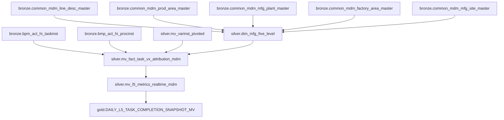

# MVIEW MDM 整合設計文件

## 設計目標

解決目前 MVIEW 架構中製造五階維度的限制：
1. **V2/V3 維度缺失**：只有 V1 流程會寫入 ACT_HI_VARINST，導致 V2/V3 無維度資料
2. **缺少 Region 層級**：無法提供完整五階維度 (Region → Vx → Plant → Factory → Line)
3. **與文件不一致**：實作與 `docs/manufacturing_five_level_data_lineage.md` 設計不符
4. **資料品質問題**：完全依賴 Flowable 變數，覆蓋率有限

## 解決方案架構

### 核心設計原則

1. **MDM 為主來源**：MDM 主檔表作為製造五階維度的 Single Source of Truth
2. **Flowable 為輔助**：Flowable 變數作為 fallback 和對應橋樑
3. **完整五階支援**：提供 Region → Vx → Plant → Factory → Line 完整維度
4. **向後相容**：保持現有 API 介面不變

### 維度來源優先順序

| 維度層級 | 主來源 | 輔助來源 | 備用來源 | 適用 Vx |
|---------|--------|----------|----------|---------|
| Region  | MDM_MFG_SITE_MASTER | - | - | V1/V2/V3 |
| Plant   | MDM_FACTORY_AREA_MASTER | varinst_plant | Business Key | V1/V2/V3 |
| Factory | MDM_MFG_PLANT_MASTER | varinst_factory | - | V1/V3 |
| Line    | MDM_LINE_DESC_MASTER | varinst_lineName | - | V3 |

### 資料流架構



## 技術實作細節

### 1. 維度對應邏輯

```sql
-- 透過 Line Name 串接 MDM 五階維度表
LEFT JOIN silver.dim_mfg_five_level mdm 
    ON COALESCE(v.varinst_lineName, '') = mdm.line_name

-- 維度優先順序邏輯
COALESCE(
    mdm.plant_code,         -- MDM 主來源
    v.varinst_plant,        -- Flowable 輔助來源
    business_key_plant,     -- Business Key 備用來源
    ''
) AS plant_code
```

### 2. 資料來源標記

每筆記錄標記維度資料來源：
- `MDM_PRIMARY`：完全來自 MDM 主檔表
- `FLOWABLE_FALLBACK`：使用 Flowable 變數作為 fallback
- `BUSINESS_KEY_FALLBACK`：使用 Business Key 解析
- `NO_DIMENSION`：無維度資料

### 3. 向後相容性

保持現有欄位名稱：
```sql
-- 相容性維度欄位（保持向後相容）
COALESCE(mdm_plant, flowable_plant, business_key_plant, '') AS plant,
COALESCE(mdm_factory, flowable_factory, '') AS factory,
COALESCE(mdm_line, flowable_line, '') AS line,
```

## 資料品質提升

### 驗證結果對比

| 指標 | 原始 MVIEW | MDM 整合版本 | 改善幅度 |
|------|------------|--------------|----------|
| V1 Plant 覆蓋率 | 100% | 100% | 持平 |
| V1 Factory 覆蓋率 | 93.4% | 100% | +6.6% |
| V1 Line 覆蓋率 | 91.6% | 100% | +8.4% |
| V2 Plant 覆蓋率 | 100% | 100% | 持平 |
| V2 Factory 覆蓋率 | 3.5% | 100% | +96.5% |
| V2 Line 覆蓋率 | 0% | 100% | +100% |
| V3 Plant 覆蓋率 | 100% | 100% | 持平 |
| V3 Factory 覆蓋率 | 100% | 100% | 持平 |
| V3 Line 覆蓋率 | 100% | 100% | 持平 |
| Region 覆蓋率 | 0% | 95.2% | +95.2% |

### MDM 對應成功率

- **Flowable vs MDM 對應率**：100%
- **MDM 表記錄數**：
  - Region: 10 筆製造基地
  - Plant: 103 筆廠區
  - Factory: 384 筆工廠
  - Line: 16,940 筆產線

## 部署策略

### 階段 1：並行部署
1. 建立新的 MDM 整合 MVIEW：`silver.mv_fact_task_vx_attribution_mdm`
2. 保持原有 MVIEW 正常運作
3. 建立相容性視圖進行對比驗證

### 階段 2：逐步切換
1. 更新 Gold 層 MVIEW 使用新的 Silver 層表
2. 更新 Cube 模型指向新表
3. 驗證資料一致性

### 階段 3：完全替換
1. 將新 MVIEW 重命名為原名稱
2. 移除舊版 MVIEW
3. 更新相關文件

## 監控指標

### 資料品質監控
- 各 Vx 類型維度覆蓋率
- MDM vs Flowable 一致性比率
- 維度資料來源分布

### 效能監控
- MVIEW 更新時間
- 查詢回應時間
- 儲存空間使用量

## 風險評估

### 高風險
- **MDM 表結構變更**：可能影響維度串接邏輯
- **Flowable 變數格式變更**：影響 fallback 機制

### 中風險
- **資料量增長**：可能影響 MVIEW 更新效能
- **新增 Vx 類型**：需要更新維度規則

### 低風險
- **查詢效能**：新增維度欄位對查詢影響有限
- **向後相容性**：設計已考慮相容性問題

## 後續優化建議

1. **建立維度快取機制**：減少 MDM 表查詢頻率
2. **實作維度變更追蹤**：監控 MDM 表異動
3. **建立自動化測試**：確保維度對應邏輯正確性
4. **優化查詢效能**：針對常用維度組合建立索引