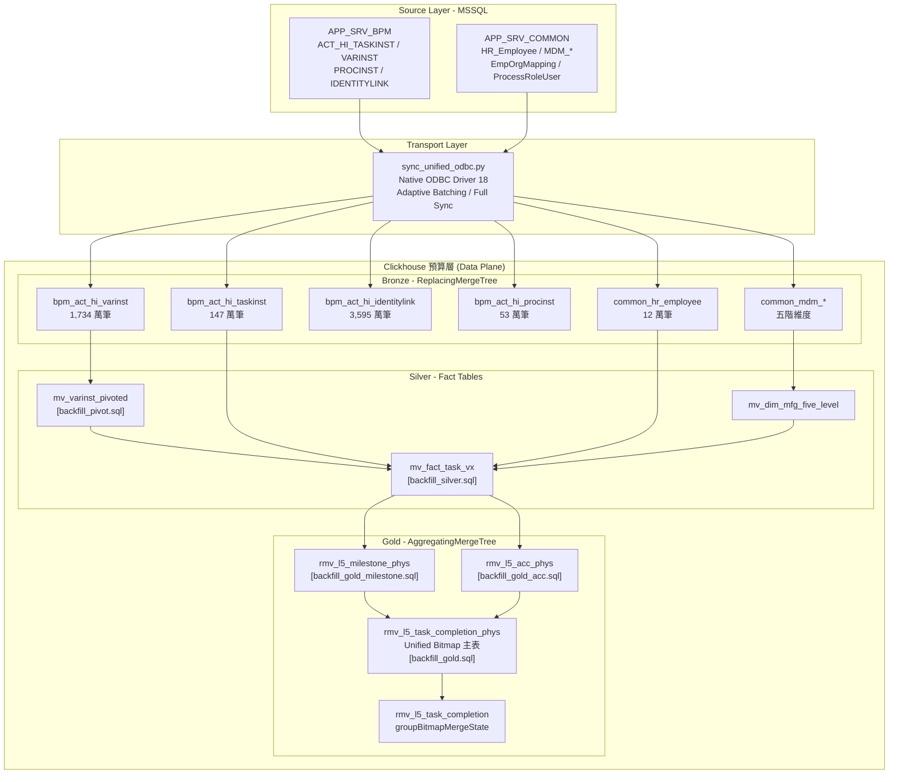
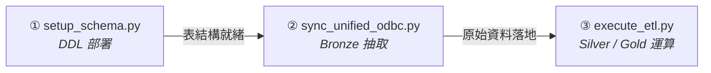
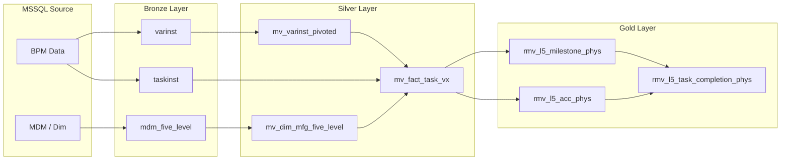
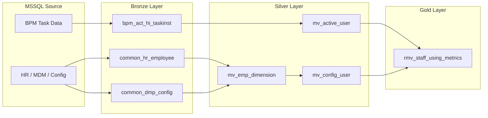

# DMP Flowable 數據分析平台技術設計規格書 (Technical Design Document)

> **文件版本**: 5.0 (Data Flow Structure Refactored)  
> **更新日期**: 2026-04-22  
> **專案定位**: 製造業數據中台 (Data Middle Platform) — 高性能流程分析引擎  
> **維護團隊**: AIT / Data Engineering  

---

## 目錄

| # | 章節 | 說明 |
|---|------|------|
| 1 | [系統概覽 (System Overview)](#1-系統概覽與業務邏輯-system-overview) | 設計背景、Medallion 分層架構與核心組件定位 |
| 2 | [管線驅動層：三腳本架構](#2-管線驅動層三腳本架構-pipeline-orchestration) | Python 調度腳本職責、執行順序與指揮傳輸分離設計 |
| 3 | [Bronze Layer：資料落地](#3-bronze-layer資料落地) | ODBC 直傳架構、增量同步機制與浮水印追蹤 |
| 4 | [Silver Layer：清洗與事實表](#4-silver-layer清洗轉置與事實表) | EAV 轉置、五階維度對齊、Vx 分類與排除旗標 |
| 5 | [Gold Layer：指標物理化](#5-gold-layer指標物理化與聚合) | Bitmap 預計算、狀態展開與 AggregatingMergeTree 聚合 |
| 6 | [Serving Layer：查詢路由](#6-serving-layer應用存取與查詢路由) | Cube.js 語義層封裝、查詢分流策略、自動調度與稽核 |
| 7 | [效能與運維 (Performance & Ops)](#7-效能工程與運作監控-performance--ops) | 效能基準與壓測結果 |
| 8 | [附錄 (Appendices)](#8-目錄結構與附錄-appendices) | 資料血緣圖、部署指令、專案目錄與新增指標 SOP |

---

## 1. 系統概覽與業務邏輯 (System Overview)

### 1.1 設計背景與技術瓶頸 (Design Context)
本專案旨在重構既有流程分析架構，解決 RDBMS 在大規模聚合情境下的性能極限：

*   **遺留架構限制**：初期分析過度依賴 MSSQL Stored Procedures 執行業務聚合，引發嚴重的資源競爭。
*   **技術瓶頸**：
    1.  **資源爭寫 (Contention)**：高強度 I/O 運算導致生產端主機連線逾時 (Timeout)。
    2.  **架構耦合**：OLTP 與 OLAP 資源共用，分析任務直接干擾線上交易效能。
    3.  **計算複雜度**：MSSQL 處理海量數據去重與累積在途量 (ACC) 運算效率極低。

核心目標為：將分析負載遷移至列式儲存引擎 ClickHouse，透過 Medallion 架構實現 L5 任務指標之多維度、毫秒級聚合響應。

### 1.2 系統物理架構拓撲 (Physical Architecture)
展開端到端的資料流動路徑，涵蓋來源系統、傳輸層、ClickHouse 三層資料庫物件與筆數規模：



### 1.3 高階分層協作機制 (Layer Collaboration Flow)
系統導入 Medallion 分層原則，實現資料從「粗糙」到「精煉」的轉化。架構遵循明確的資料生命週期：

**Medallion 三層角色定義**

| 層級 | 角色定位 | 核心職責 |
| :--- | :--- | :--- |
| **Bronze** | 原始資料倉 (Raw Vault) | 從 MSSQL 1:1 落地，隔離生產環境，不做任何業務轉換 |
| **Silver** | 清洗加工層 (Refined Layer) | EAV 轉置、維度對齊、Vx 分類與排除旗標，產出可分析的事實表 |
| **Gold** | 指標服務層 (Serving Layer) | Bitmap 預計算與物理化聚合，產出毫秒級可查詢的 KPI 指標表 |

**(A) 管線排程與資料轉化流 (Pipeline & Data Transformation Flow)**
本系統堅持「控制流 (Python)」與「資料流 (ClickHouse)」解耦，由調度腳本驅動底層的資料轉換：

```text
           [MSSQL] (Source / OLTP)
              │
              ├─▶ 調度腳本: python sync_unified_odbc.py
              ▼   直傳語法: INSERT INTO [Table] SELECT ... FROM odbc(...)
     ┌─────────────────┐
     │  Bronze Layer   │ Raw Landing
     └─────────────────┘ 隔離生產系統，原始資料 1:1 落地
              │
              ├─▶ 調度腳本: python execute_etl.py
              ▼   底層技術: 時間視窗切分防禦機制 + 寬表建構
     ┌─────────────────┐
     │  Silver Layer   │ Pivot / Mapping / Cleansing
     └─────────────────┘ Row-based 轉 Column-based 寬表
              │
              ├─▶ 調度腳本: python execute_etl.py
              ▼   底層技術: 狀態轉換展開與位圖函數 (Bitmap)
     ┌─────────────────┐
     │   Gold Layer    │ Precompute / Bitmap
     └─────────────────┘ 物理化聚合結果，極限降維
              │
              ▼   模型技術: Cube.js 語義層與權限
     ┌─────────────────┐
     │  BI / Cube.js   │ Dashboarding
     └─────────────────┘ 單一數據出口與權限收斂
```


### 1.4 核心組件角色對比表
傳統行式資料庫在執行大規模分析時，受限於無效 I/O 損耗與快取命中率。本系統引入 ClickHouse，利用其 **列式儲存屬性** 與 **SIMD 向量化執行並行運算** 突破瓶頸：

| 特性 | MSSQL (Source) | ClickHouse (Engine) | Cube.js (Semantic) |
| :--- | :--- | :--- | :--- |
| **角色定位** | 數據源頭 / 交易儲存 | 數據轉化 / 聚合運算中心 | 指標語義化 / 快取服務 |
| **擅長領域** | 處理單筆 CRUD、事務一致性 | **海量 Count Distinct、跨維度聚合** | 指標口徑封裝、API 權限管理 |
| **數據格式** | 行式 (Row-based) | **列式 (Column-based)** | 語義模型 / 結果快取 |
| **在本系統職責** | 存放原始 BPM 流程數據 | 執行 Medallion 三層轉置與實體化 | 提供前端標準指標 API |

---

## 2. 管線驅動層：三腳本架構 (Pipeline Orchestration)

### 2.1 設計理念：指揮與傳輸分離

本系統管線採用**「調度指揮 (Python) ／ 資料傳輸 (ClickHouse C++)」**嚴格解耦的設計。  
Python 腳本僅負責時間視窗切分、浮水印追蹤與容錯重試等控制邏輯；  
大量資料的實際搬運完全交由 ClickHouse 內建 ODBC 引擎透過 C++ 底層對 MSSQL 執行高速直傳。  
資料全程不流經 Python 記憶體，因此得以突破 **90,000+ 筆/秒**的極限吞吐。

### 2.2 三腳本執行順序

```
scripts/etl/
├── setup_schema.py         ← [Step 1] 一次性 DDL 部署
├── sync_unified_odbc.py    ← [Step 2] Bronze 層資料抽取（每日/補跑）
├── execute_etl.py          ← [Step 3] Silver + Gold 層運算（每日/補跑）
└── config/
    ├── infra_config.yaml       ← setup_schema 使用：DB / 表結構定義
    ├── sync_tables.yaml        ← sync_unified_odbc 使用：同步策略與欄位
    └── pipeline_config.yaml    ← execute_etl 使用：DML 執行順序
```



### 2.3 各腳本職責說明

| 腳本 | 觸發時機 | 核心職責 | 關鍵機制 |
| :--- | :--- | :--- | :--- |
| `setup_schema.py` | 初次部署 / Schema 變更時 | 讀取 `infra_config.yaml`，對 ClickHouse 執行完整 DDL（Bronze / Silver / Gold 全層建表） | 冪等設計，`CREATE TABLE IF NOT EXISTS`，可安全重跑 |
| `sync_unified_odbc.py` | 每日排程 / 手動補跑 | 讀取 `sync_tables.yaml`，依策略（批次增量 / 全量）透過 ODBC 將 MSSQL 資料直傳至 Bronze 層 | 浮水印追蹤、自適應視窗切分、OOM 自動對折 |
| `execute_etl.py` | Bronze 落地完成後 | 讀取 `pipeline_config.yaml`，依序執行各 DML（Pivot → Silver → Gold），驅動完整 ETL 轉換鏈 | Checkpoint 記錄、視窗重試、`--backfill` / `--daily` 模式切換 |

---

## 3. Bronze Layer：資料落地

Bronze 層的主要職責為 **原始資料落地，隔離生產與分析環境**。所有表均採 `ReplacingMergeTree` 引擎，背景 Merge 時依 `_sync_version` 自動保留最新版本，無需 Upsert 邏輯，且可安全重傳。

**相關目錄**

```
sql/etl/schema/
├── 01_bronze_flowable_core.sql   ← BPM 引擎核心表（taskinst / varinst / procinst 等）
└── 02_bronze_common_dims.sql     ← 共用維度與 HR 主檔（MDM / 人員 / 組織 / 角色）
```

### 3.1 ODBC 直傳機制 (ODBC Ingestion)

ClickHouse 透過 `ENGINE = ODBC(...)` 建立指向 MSSQL 的虛擬代理表，再以 `INSERT INTO ... SELECT FROM` 讓 C++ 引擎直接對 MSSQL 執行高速拉取，資料不經過任何中間層落地。

```sql
INSERT INTO bronze.bpm_act_hi_taskinst
SELECT *,
       '2025-12-25 00:00:00_2026-01-01 00:00:00' AS _batch_id,
       now()                                      AS _extracted_at,
       1                                          AS _sync_version
FROM odbc_temp_taskinst
WHERE LAST_UPDATED_TIME_ >= '2025-12-25 00:00:00'
  AND LAST_UPDATED_TIME_ <  '2026-01-01 00:00:00'
SETTINGS max_execution_time = 3600, odbc_bridge_use_connection_pooling = 1
```

| 同步策略 | 適用表 | 行為 |
| :--- | :--- | :--- |
| `full` | MDM 主檔、HR 等小型維度表 | TRUNCATE 後全量 INSERT，確保 1:1 一致 |
| `batch` | `taskinst`、`varinst` 等大型流水表 | 按時間視窗分批拉取，支援浮水印續跑 |

### 3.2 浮水印機制 (Watermark)

Bronze 層內有一張 `_sync_watermark` 追蹤表，記錄每張表最後同步到的資料時間戳，下次同步從此時間點繼續，確保不遺漏、不重複：

```sql
CREATE TABLE bronze._sync_watermark (
    table_name     String,
    last_sync_time DateTime64(3),   -- 上次同步到的資料時間戳
    sync_time      DateTime64(3),   -- 本次執行時間（去重鍵）
    row_count      UInt64,
    duration_ms    Float64
) ENGINE = ReplacingMergeTree(sync_time)
ORDER BY (table_name)
```

---

## 4. Silver Layer：清洗轉置與事實表

Silver 層的產出為三張表，構成 Gold 層計算的唯一輸入來源：

| # | 表名 | 建構腳本 | 角色 |
| :- | :--- | :--- | :--- |
| ① | `mv_varinst_pivoted` | `backfill_pivot.sql` | EAV 多列轉單列寬表（每流程實例一列） |
| ② | `mv_dim_mfg_five_level` | Schema 初始化，非週期作業 | 五階維度主檔（線體 → 廠區 → 地區） |
| ③ | `mv_fact_task_vx` | `backfill_silver.sql` | 核心事實表，整合任務 + 維度 + Vx 分類 + 排除旗標 |

**相關目錄**

```
sql/etl/
├── schema/
│   ├── 03_silver_pivot_and_hierarchy.sql  ← mv_varinst_pivoted + mv_dim_mfg_five_level DDL & 初始載入
│   └── 04_silver_fact_tasks.sql           ← mv_fact_task_vx Schema
└── dml/
    ├── backfill_pivot.sql                 ← Phase 1: EAV → Pivot 寬表
    ├── backfill_silver.sql                ← Phase 3: 事實表建構
    └── backfill_exclusion.sql             ← Phase 3b: autoComplete 排除旗標補標
```

### 4.1 ① mv_varinst_pivoted：EAV 轉置 (Phase 1)

Flowable BPM 將流程變數（廠區、線體、工單號等）以 **EAV 結構**垂直儲存，同一流程實例產生多列。Phase 1 以 `argMaxIf(TEXT_, REV_)` 取各變數的最新修訂值，將多列壓縮為**每流程實例一列**的寬表，供後續 JOIN 使用。

```
bronze.bpm_act_hi_varinst（EAV 原始，每個變數一列）

PROC_INST_ID_   NAME_       TEXT_     REV_
─────────────   ─────────   ───────   ────
P-5001          plant       WJ2       1
P-5001          lineName    WF_SA_1   1
P-5001          plant       DG3       2    ← 同一變數有修訂版本，取最新 REV_
P-5001          moNumber    1960001   1
                                          ↓  argMaxIf(TEXT_, REV_)
silver.mv_varinst_pivoted（Pivot 寬表，每個流程實例一列）

PROC_INST_ID_   varinst_plant   varinst_lineName   varinst_moNumber
─────────────   ─────────────   ────────────────   ────────────────
P-5001          DG3             WF_SA_1            1960001
```

### 4.2 ② mv_dim_mfg_five_level：五階維度主檔

由四張 Bronze MDM 表連鎖 JOIN 建立，建立完整的五階對應關係：

```
線體 (MDM_Line) → 產線區 → 工廠 → 廠區 → 地區 (Region)
```

此表屬**一次性 Schema 初始化**，不納入週期性 ETL；MDM 主檔異動時才需手動重建。

### 4.3 ③ mv_fact_task_vx：核心事實表 (Phase 3)

整合四個來源，產出 Gold 層的輸入：

```
bronze.bpm_act_hi_taskinst   (任務基本資訊)
  + silver.mv_varinst_pivoted  (流程維度變數)
  + silver.mv_dim_mfg_five_level (五階維度對齊)
  + bronze.common_hr_employee  (人員資訊)
      └──► silver.mv_fact_task_vx
```

事實表寫入時同步完成三項標記：

*   **Vx 分類**：依工單號前綴（V1 特權工單優先）→ `TASK_DEF_KEY_` 前綴判斷，標記為 V1 / V2 / V3
*   **維度回退**：`VARINST` → `MDM` → `'UNKNOWN'`，附 `*_source` 欄位記錄來源供稽核
*   **排除旗標**：`is_excluded = 1` 的任務（autoComplete、工程節點、非生產工單等）不計入任何 KPI

Phase 3b（`backfill_exclusion.sql`）補充更新 `autoComplete = 1` 的排除旗標。

### 4.4 ETL 執行順序與 Checkpoint

```
[一次性初始化]
  ② mv_dim_mfg_five_level ← bronze.common_mdm_* (四張 MDM)

[週期性回補，由 execute_etl.py 驅動]
  Phase 1  → ① mv_varinst_pivoted     ✓ Checkpoint 記錄
  Phase 3  → ③ mv_fact_task_vx        ✓ Checkpoint 記錄
  Phase 3b → ③ 補標 is_excluded       ✓ Checkpoint 記錄
```

Checkpoint 冪等機制與 OOM 自動對半切割詳見 **[5.5 ETL 執行機制](#55-etl-執行機制checkpoint-驅動的冪等回補)**，Silver 與 Gold 層共用相同邏輯。

---

## 5. Gold Layer：指標物理化與聚合

### 5.1 職責與核心引擎 (Engine & Duty)
Gold 層的職責為：**物理化預計算，產出極速查詢指標**。其設計核心是將所有耗時的去重計算在 ETL 階段預先完成，讓前端查詢只需讀取已聚合的 Bitmap 狀態，而非在每次請求時重新掃描千萬筆原始記錄。

**相關目錄**
```
dmp_flowable/
├── sql/etl/
│   ├── schema/
│   │   └── 06_gold_kpi_task_completion.sql   ← Gold 層 Schema（三張實體表 + 一張 View）
│   └── dml/
│       ├── backfill_gold_milestone.sql        ← Phase 4a：Milestone 狀態位圖寫入
│       ├── backfill_gold_acc.sql              ← Phase 4b：7 天滾動 ACC 位圖寫入
│       └── backfill_gold.sql                  ← Phase 4c：Milestone + ACC 合併主表
├── scripts/etl/
│   └── execute_etl.py                         ← ETL 執行入口，驅動上述三個 DML
└── cube/model/cubes/
    ├── cube_l5_task_periodic.js               ← Cube.js 標準週期報表模型
    └── cube_l5_task_periodic_pivot.js         ← Cube.js Pivot 長表報表模型
```

*   **表層引擎：AggregatingMergeTree**
    Gold 層採用 ClickHouse 的 `AggregatingMergeTree` 引擎，專為「分批寫入、合併時聚合」設計。每筆寫入存的不是一個數字，而是一個位圖狀態物件；ClickHouse 在背景合併時，會自動將相同主鍵的位圖做 OR 聯集，因此不管分幾批寫入，最終結果都不會重複計數。主鍵包含日期、Vx 版本與五階維度，查詢時可依廠區直接定位資料區塊，不需全表掃描。

### 5.2 四物件 Bitmap 架構 (Gold Schema)

Gold 層採用「兩張中間表 → 一張主表 → 一張 View」的分層設計，定義於 `sql/etl/schema/06_gold_kpi_task_completion.sql`：

```
┌────────────────────────────────────────────────────────────────┐
│  ETL Write (DML)          Gold Layer Objects                   │
│                                                                │
│  backfill_gold_           ┌──────────────────────────────┐    │
│  milestone.sql  ────────► │ rmv_l5_milestone_phys        │    │
│                           │ (todo_bm / doing_bm / done_bm)│   │
│                           └──────────────┬───────────────┘    │
│                                          │ LEFT JOIN           │
│  backfill_gold_           ┌──────────────┴───────────────┐    │
│  acc.sql        ────────► │ rmv_l5_acc_phys              │    │
│                           │ (acc_bm, 7D Rolling)          │   │
│                           └──────────────┬───────────────┘    │
│                                          │                     │
│  backfill_gold.sql ─────────────────────►│                     │
│                           ┌──────────────▼───────────────┐    │
│                           │ rmv_l5_task_completion_phys  │    │
│                           │ ★ 主表 (Unified Bitmap)      │    │
│                           └──────────────┬───────────────┘    │
│                                          │ View                │
│                           ┌──────────────▼───────────────┐    │
│                           │ rmv_l5_task_completion       │    │
│                           │ (BI 對接 View → Cube.js)     │    │
│                           └──────────────────────────────┘    │
└────────────────────────────────────────────────────────────────┘
```

| 物件 | 引擎 | 職責 | TTL |
| :--- | :--- | :--- | :--- |
| `rmv_l5_milestone_phys` | AggregatingMergeTree | Todo / Doing / Done 三態每日快照 | 1 年 |
| `rmv_l5_acc_phys` | AggregatingMergeTree | 7 天滾動在途量 (ACC) | 1 年 |
| `rmv_l5_task_completion_phys` | AggregatingMergeTree | 合併主表，BI 查詢直接對象 | 1 年 |
| `rmv_l5_task_completion` | View | BI 對接視窗，供 Cube.js 使用 | — |

### 5.3 Milestone 狀態展開原理 (Phase 4a)

**檔案**：`sql/etl/dml/backfill_gold_milestone.sql`

以 `ARRAY JOIN` 將單筆任務的三個關鍵時間點（啟動日、認領日、結案日）水平展開為多列快照，再以條件式 `groupBitmapStateIf` 判斷當日應落入哪個狀態桶。

```
任務 T-1001  start=01/01  claim=01/03  end=01/05
                  │            │           │
ARRAY JOIN ───────┼────────────┼───────────┤
                  ▼            ▼           ▼
snapshot_date  2025-01-01  2025-01-03  2025-01-05
               ─────────   ─────────   ─────────
todo_bm          ✓ T-1001
doing_bm                     ✓ T-1001
done_bm                                  ✓ T-1001
```

三態之間以「當日時間點」互斥判斷，同一任務在不同快照日自動落入正確位圖，無需多次 JOIN。

### 5.4 7 天滾動 ACC 展開原理 (Phase 4b)

**檔案**：`sql/etl/dml/backfill_gold_acc.sql`

ACC（累積在途量）代表「基準日 D 的過去 7 天內曾活動且尚未結案的任務數」。以 `ARRAY JOIN range()` 將任務的活動區間展開為每日一列，最多延伸 7 天。

以 2025-12-25 ～ 2025-12-31 區間為例，假設兩筆任務的生命週期如下：

```
任務         start        end          展開範圍（最多 7 天）
─────────────────────────────────────────────────────────────
T-A001    2025-12-25   2025-12-29   12/25, 12/26, 12/27, 12/28  (end 當日排除)
T-B002    2025-12-27   尚未結案     12/27, 12/28, 12/29, 12/30, 12/31, 01/01 (限7天)

ARRAY JOIN range() 展開後 ──► 每任務每天一列寫入 acc_bm：

active_date  12/25  12/26  12/27  12/28  12/29  12/30  12/31
             ─────  ─────  ─────  ─────  ─────  ─────  ─────
T-A001         ✓      ✓      ✓      ✓
T-B002                        ✓      ✓      ✓      ✓      ✓
             ─────  ─────  ─────  ─────  ─────  ─────  ─────
acc_bm 基數    1      1      2      2      1      1      1
```

查詢 12/28 的 ACC 時，位圖中已包含 T-A001 與 T-B002，`bitmapCardinality = 2`，不需任何視窗函式。

此設計令 **7 天滾動計算在 ETL 寫入時即已完成**，查詢時只需一次讀取，不再需要窗口函式：

```sql
-- Cube.js 查詢層（cube_l5_task_periodic.js）
bitmapCardinality(groupBitmapMergeState(acc_bm))  -- Day 粒度直接讀取預計算結果
```

### 5.5 ETL 執行機制：Checkpoint 驅動的冪等回補

**檔案**：`scripts/etl/execute_etl.py` + `config/pipeline_config.yaml`

`execute_etl.py` 是 **Silver 與 Gold 的共用腳本**，在同一次執行中按 `pipeline_config.yaml` 定義的順序依序跑完所有階段。Bronze 的落地（`sync_unified_odbc.py`）須先獨立完成，`execute_etl.py` 假設 Bronze 資料已就緒。

**執行順序（程式碼順序保證，非狀態查詢）**

```
Stage 1（全部時間視窗跑完後，才進入 Stage 2）
  silver_varinst_pivoted   ← backfill_pivot.sql

Stage 2（每個時間視窗內，以下 5 個 step 依序執行）
  silver_facts             ← backfill_silver.sql
  silver_exclusion         ← backfill_exclusion.sql
  gold_milestone           ← backfill_gold_milestone.sql
  gold_acc                 ← backfill_gold_acc.sql
  gold_unified             ← backfill_gold.sql
```

Silver 不需要「完成訊號」——Python `for` 迴圈的執行順序本身就確保 Silver step 成功後才繼續執行 Gold step；任何一個 step 拋出例外即中止並記錄 `FAILED`。

**容錯機制**

| 機制 | 說明 |
| :--- | :--- |
| **Checkpoint 冪等** | 每個 `(phase, window_start, window_end)` 成功後記錄 `SUCCESS`，重跑時自動跳過，可安全中斷續跑 |
| **OOM 自動對半** | 遇到 Code 241，視窗自動遞迴對半切割（10 天 → 5 天 → 2.5 天）直至成功 |
| **低記憶體模式** | `--low-ram` 限制執行緒與記憶體用量，啟用磁碟溢出 |

---

## 6. Serving Layer：應用存取與查詢路由

### 6.1 Cube.js 語義層與 API 定義 (Semantic Layer)
本系統強制透過 Cube.js 作為 **語義層 (Semantic Layer)**，嚴禁前端直連資料庫。對應代碼結構如下：

```text
dmp_flowable/
├── cube/
│   └── model/
│       └── cubes/
│           ├── cube_l5_task_periodic.js        # L5 週期報表模型
│           └── cube_l5_task_periodic_pivot.js  # L5 Pivot 指標模型
└── api/
    ├── main.py                                 # FastAPI 報表服務
    └── requirements.txt                        # Python 依賴
```

*   **邏輯封裝**：將 ACC 7日滾動等複雜位圖合併邏輯封裝於模型中，對外僅暴露 API，前端無須理解 ClickHouse 複雜引擎。
*   **安全性 (Row-Level Security)**：實作資安權限隔離，根據不同廠區權限過濾資料。

### 6.2 查詢路由、調度與稽核 (Query Routing & Ops)

#### 查詢分流策略

為取得效能與查詢彈性的最佳平衡點，應用層路由設計嚴格遵循以下界線：
*   **打向 Gold 層的查詢**：所有的 Dashboard 概覽 (Overview)、關鍵績效指標 (KPIs)、高頻率調用的歷史趨勢長條圖/折線圖，以及任何對運算效能極端苛求的大數據去重 (Distinct) 彙總。
*   **打向 Silver 層的查詢**：高精細度的下鑽分析 (Drill-down)、異常明細追蹤清單 (Raw Records Tracker)、以及各種業務端突然丟出的特定自定義關聯條件，這類未有指標前置運算的 Ad-hoc 分析。

#### 自動化作業調度

常態更新由 `daily_etl_wrapper.sh` 封裝。每日先調用 `sync_unified_odbc.py` 水印刷新 Bronze，再觸發 `execute_etl.py --daily` 校準近 7 日滾動狀態。

#### 任務明細稽核

當 Dashboard 數值與預期不符，或需要追蹤特定日期的結案任務時，可透過以下兩種方式查詢 Silver 層明細（詳細操作見 `docs/03_metrics/Detailed_Audit_Guide.md`）：

**方法一：直接執行 SQL**（需 ClickHouse 存取權限）

> **重要說明**：Silver 層透過 `NULLIF(toDate(...), toDate('1970-01-01'))` 將未發生的 `task_claim_date` / `task_end_date` 儲存為 **`NULL`**（非 epoch）。查詢條件須使用 `IS NULL` / `IS NOT NULL`。SQL 條件與 Gold 層 `backfill_gold_milestone.sql` 的 ARRAY JOIN 邏輯完全對齊：Gold 僅在任務的三個生命週期時間點（start / claim / end）建立快照，因此這裡的條件也以「快照日是否有時間點落在該日」為基準。

**查詢 Done（結案）任務**：快照日當天結案的任務。

```sql
SELECT
    task_id, task_start_time, task_claim_time, task_end_time,
    task_start_date, task_claim_date, task_end_date, task_primary_date,
    task_create_date, task_status, vx_type,
    region, plant, factory, line,
    region_source, plant_source, factory_source, line_source,
    is_excluded, exclude_reason,
    assignee_code, assignee_name,
    task_definition_key, task_name, mo_number, proc_inst_id,
    _mview_update_time
FROM silver.mv_fact_task_vx FINAL
WHERE is_excluded = 0
  AND region = 'CNE' AND plant = 'WJ2' AND factory = 'NBU' AND line = 'E5' AND vx_type = 'V3'
  -- 對應 Gold: task_end_date IS NOT NULL AND snapshot_date >= task_end_date
  -- 任務結案在快照日之前的不會觸及該日期，因此等同 task_end_date = snapshot_date
  AND task_end_date IS NOT NULL
  AND task_end_date = '2025-12-25'
ORDER BY task_end_time DESC;
```

**查詢 Todo（待認領）任務**：快照日當天啟動、尚未認領的任務。

```sql
SELECT
    task_id, task_start_time, task_claim_time, task_end_time,
    task_start_date, task_claim_date, task_end_date, task_primary_date,
    task_create_date, task_status, vx_type,
    region, plant, factory, line,
    region_source, plant_source, factory_source, line_source,
    is_excluded, exclude_reason,
    assignee_code, assignee_name,
    task_definition_key, task_name, mo_number, proc_inst_id,
    _mview_update_time
FROM silver.mv_fact_task_vx FINAL
WHERE is_excluded = 0
  AND region = 'CNE' AND plant = 'WJ2' AND factory = 'NBU' AND line = 'E5' AND vx_type = 'V3'
  -- 對應 Gold: snapshot_date < COALESCE(task_claim_date, task_end_date, today() + 1)
  -- 任務在快照日啟動，且 claim/end 均尚未發生（Gold 僅在 start_date 建立 Todo 快照列）
  AND task_start_date = '2025-12-25'
  AND COALESCE(task_claim_date, task_end_date, toDate('9999-12-31')) > '2025-12-25'
ORDER BY task_start_time DESC;
```

**查詢 Doing（進行中）任務**：快照日當天已認領、尚未結案的任務。

```sql
SELECT
    task_id, task_start_time, task_claim_time, task_end_time,
    task_start_date, task_claim_date, task_end_date, task_primary_date,
    task_create_date, task_status, vx_type,
    region, plant, factory, line,
    region_source, plant_source, factory_source, line_source,
    is_excluded, exclude_reason,
    assignee_code, assignee_name,
    task_definition_key, task_name, mo_number, proc_inst_id,
    _mview_update_time
FROM silver.mv_fact_task_vx FINAL
WHERE is_excluded = 0
  AND region = 'CNE' AND plant = 'WJ2' AND factory = 'NBU' AND line = 'E5' AND vx_type = 'V3'
  -- 對應 Gold: claim IS NOT NULL AND snapshot >= claim AND (end IS NULL OR snapshot < end)
  -- 任務的 start 或 claim 落在快照日（Gold ARRAY JOIN 僅在這兩個時間點建立 Doing 快照列）
  AND (task_start_date = '2025-12-25' OR task_claim_date = '2025-12-25')
  AND task_claim_date IS NOT NULL AND task_claim_date <= '2025-12-25'
  AND (task_end_date IS NULL OR task_end_date > '2025-12-25')
ORDER BY task_claim_time DESC;
```

**方法二：稽核腳本輸出 CSV**

```bash
# Done（預設）：快照日結案任務
python scripts/etl/audit_done_details.py \
  --date "2025-12-25" --region "CNE" --plant "WJ2" --factory "NBU" --line "E5" --vx "V3"

# Todo：快照日待認領任務
python scripts/etl/audit_done_details.py \
  --date "2025-12-25" --region "CNE" --plant "WJ2" --factory "NBU" --line "E5" --vx "V3" --status todo

# Doing：快照日進行中任務
python scripts/etl/audit_done_details.py \
  --date "2025-12-25" --region "CNE" --plant "WJ2" --factory "NBU" --line "E5" --vx "V3" --status doing

# All：快照日所有在途任務
python scripts/etl/audit_done_details.py \
  --date "2025-12-25" --region "CNE" --plant "WJ2" --factory "NBU" --line "E5" --vx "V3" --status all
```

輸出的 CSV 包含以下完整欄位：

| 欄位群組 | 欄位名稱 |
| :--- | :--- |
| **任務識別** | `task_id`, `proc_inst_id` |
| **時間軸（DateTime）** | `task_start_time`, `task_claim_time`, `task_end_time`, `task_create_date` |
| **時間軸（Date）** | `task_start_date`, `task_claim_date`, `task_end_date`, `task_primary_date` |
| **狀態與版本** | `task_status`, `vx_type`, `is_excluded`, `exclude_reason` |
| **五階維度（對齊後）** | `region`, `plant`, `factory`, `line` |
| **五階維度（原始來源）** | `region_source`, `plant_source`, `factory_source`, `line_source` |
| **人員** | `assignee_code`, `assignee_name` |
| **任務定義** | `task_definition_key`, `task_name`, `mo_number` |
| **系統欄位** | `_mview_update_time` |

> **稽核邏輯說明**：上述 SQL 條件與 Gold 層 `backfill_gold_milestone.sql` 的 ARRAY JOIN 快照邏輯完全對齊。Gold 對每筆任務僅在其三個非 NULL 時間點（start / claim / end）建立快照列，因此 Todo 快照僅出現在 `task_start_date`、Doing 快照出現在 `task_start_date` 或 `task_claim_date`、Done 快照出現在 `task_end_date`。Silver 透過 `NULLIF` 將未發生的 claim / end 轉為 `NULL`，查詢時須以 `IS NULL` / `IS NOT NULL` 判斷，而非 epoch 字串。

---

## 7. 效能工程與運作監控 (Performance & Ops)

### 7.1 端到端綜合效能指標驗收 (End-to-End Benchmarks)
依據 2026-04-02 正式環境全量回補驗收結果，確保本專案設計之擴展性：
*   **端到端吞吐能力**：以極端 **10.17 分鐘** 內完成 MSSQL → Bronze → Silver → Gold 全鏈路超過 5,290 萬筆數據提取，並成功轉出 51,730 筆黃金層指標。整體資料管線均速達 **128,032 筆/秒** (代理表優化後)。
*   **存儲壓縮率**：ClickHouse 列存大幅提升 I/O：如 `bpm_act_hi_identitylink` 由 4.14 GiB 壓至 132.71 MiB，壓縮比達 **31.93x**。
*   **高壓回應指標**：針對 L5 核心與人員使用率進行多維度壓力測試：

| 測試維度       | 測試項目 / 情境      | L5任務執行完成率 | 人員使用率     |
|----------------|----------------------|------------------|----------------|
| 查詢響應速度   | 低負載 (1-10人並行)  | 0.09 ~ 0.16 秒   | 0.45 ~ 0.86 秒 |
| 查詢響應速度   | 中負載 (20人並行)    | 0.19 ~ 0.30 秒   | 0.5 ~ 2 秒     |
| 查詢響應速度   | 高負載 (100人並行)   | 0.26 ~ 0.39 秒   | 0.4 ~ 4 秒     |
| 資料準確性     | 資料核對              | (無偏差)       | (無偏差)       |

---

## 8. 目錄結構與附錄 (Appendices)

### 8.1 Data Lineage 任務與人員指標血緣分析
為清楚交代複雜聯集狀態與維度映射之源由，下圖展示指標血緣：

**任務指標血緣 (Task Lineage)**


**人員使用率指標血緣 (Staff Lineage)**


### 8.2 關鍵運作指令參考 (Operations Guide)
*(詳細部署指令請參閱 [Deployment_Guide.md](02_deployment/Deployment_Guide.md))*

| 項目 | 終端指令範例 | 說明 |
| :--- | :--- | :--- |
| **1. 初始化** | `python scripts/etl/setup_schema.py` | 部署全庫 Schema |
| **2. 同步** | `python scripts/etl/sync_unified_odbc.py` | 執行 Bronze 增量同步 |
| **3. 運算** | `python scripts/etl/execute_etl.py --backfill --start 2025-01-01` | 歷史數據回補 |
| **4. 維運** | `python scripts/etl/execute_etl.py --daily` | 每日例行增量更新 |
| **5. 稽核** | `python scripts/etl/audit_done_details.py --date "..." --status done` | 手動數據對帳稽核（支援 todo/doing/done/all） |
| **可選** | `python scripts/etl/execute_etl.py --reset` | 清空指定層級並重做 |

### 8.3 專案目錄結構 (Directory Tree)

```text
dmp_flowable/
├── scripts/
│   ├── etl/                                    # ETL 核心引擎 (同步/轉換/部署)
│   │   ├── execute_etl.py
│   │   ├── sync_unified_odbc.py
│   │   ├── setup_schema.py
│   │   ├── init_pipeline.sh
│   │   ├── daily_etl_wrapper.sh
│   │   └── config/                             # ETL 參數設定 (核對 infra/sync/pipeline)
│   └── performance/                            # 效能壓測工具與 SOP
│
├── sql/
│   └── etl/
│       ├── schema/                             # ── DDL 定義 (建表順序 00~07) ──
│       │   ├── 00_meta_checkpoint.sql          # ops_metrics Checkpoint 表
│       │   ├── 01_bronze_flowable_core.sql     # Bronze 流程引擎核心表
│       │   ├── 02_bronze_common_dims.sql       # Bronze 共用維度與 HR 主檔
│       │   ├── 03_silver_pivot_and_hierarchy.sql # Silver EAV 透視與五階維度
│       │   ├── 04_silver_fact_tasks.sql        # Silver 核心事實表
│       │   └── 05_gold_kpi_task_completion.sql # Gold L5 任務完成率指標
│       └── dml/                                # ── DML 回填模板 ──
│           ├── backfill_pivot.sql              # Stage 1: EAV → 寬表透視
│           ├── backfill_silver.sql             # Stage 2: 核心事實表建構
│           ├── backfill_exclusion.sql          # Stage 2b: 排除規則標記
│           ├── backfill_gold_milestone.sql     # Stage 4: Milestone 狀態聚合
│           ├── backfill_gold_acc.sql           # Stage 5: ACC 7日滾動去重
│           └── backfill_gold.sql               # Stage 6: FULL OUTER JOIN 合併
│
├── infra/
│   └── clickhouse/
│       ├── config.d/
│       │   └── max_queries.xml                 # Server-level 併發上限 
│       ├── users.d/
│       │   └── max_queries_profile.xml         # User Profile 佇列等候設定 (queue_max_wait_ms)
│       └── odbc/
│           ├── Dockerfile                      # ODBC Driver 18 容器建置
│           ├── docker-compose-odbc.yml         # ODBC 環境編排
│           ├── odbc.ini                        # ODBC DSN 連線設定
│           └── .env                            # 連線密鑰環境變數
│
├── cube/
│   └── model/
│       └── cubes/
│           ├── cube_l5_task_periodic.js        # L5 週期性報表 Cube 模型
│           └── cube_l5_task_periodic_pivot.js  # L5 Pivot 進階模型
│
├── api/
│   ├── main.py                                 # FastAPI 報表服務主程式
│   ├── Dockerfile                              # API 容器建置
│   └── requirements.txt                        # Python 依賴清單
```

### 8.4 如何新增指標 (Add a New KPI) 標準 SOP

若需新增一項業務指標（如「逾時維修任務統計」），請依循以下 6 步驟操作：

1.  **數據源註冊**：於 `sync_tables.yaml` 註冊新的來源 MSSQL 表。
2.  **基礎建設 DDL**：於 `sql/etl/schema/` 建立對應的 Silver/Gold 實體表（需遵循 00~07 之順序編號）。
3.  **轉換邏輯 DML**：於 `sql/etl/dml/` 編寫對應的 SQL 模板，並必須包含 `{start_ts}` 與 `{end_ts}` 變數。
4.  **管線註冊 (Pipeline Config)**：在 `pipeline_config.yaml` 定義新增的 Phase ID 與 SQL 模板對應關係。
5.  **測試回補 (Execution Test)**：執行 `python scripts/etl/execute_etl.py --backfill --start <Date> --step-days 10`。
6.  **語義層對接**：於 Cube.js 設定檔中新增 Measure 並進行 Dashboard 數據校對。

---
*END OF DOCUMENT (v5.0 Data Flow Refactored)*
