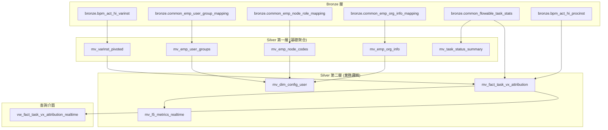

# Silver 層 Materialized Views 架構文件

## 概述

本文件說明 Silver 層分層 Materialized Views (MVIEW) 架構的設計、實現和使用方式。此架構提供即時的 L5 指標計算能力，同時保持與現有批次處理系統的相容性。

## 架構設計

### 分層架構



### 命名原則

| 類型 | 前綴 | 範例 | 說明 |
|------|------|------|------|
| Materialized View | `mv_` | `mv_varinst_pivoted` | 實體化視圖 |
| Query View | `vw_` | `vw_fact_task_vx_attribution_realtime` | 查詢視圖 |
| 第一層 MVIEW | `mv_` | `mv_emp_user_groups` | 基礎聚合層 |
| 第二層 MVIEW | `mv_` | `mv_fact_task_vx_attribution` | 業務邏輯層 |

## 第一層 MVIEW (基礎聚合層)

### 1. mv_varinst_pivoted
**用途**: EAV 結構轉置，將流程變數轉為寬表格式

**來源**: `bronze.bpm_act_hi_varinst`

**關鍵欄位**:
- `PROC_INST_ID_`: 流程實例 ID (主鍵)
- `varinst_moNumber`: 工單編號
- `varinst_plant`: 廠區
- `varinst_factory`: 工廠
- `varinst_lineName`: 產線

**更新觸發**: Bronze 層 `bpm_act_hi_varinst` 表有新增/更新時

### 2. mv_emp_user_groups
**用途**: 員工用戶群組聚合，預計算白名單/排除標記

**來源**: `bronze.common_emp_user_group_mapping` + `bronze.common_user_group`

**關鍵欄位**:
- `EmpCode`: 員工代碼 (主鍵)
- `user_group_names`: 所有群組名稱陣列
- `has_whitelist_group`: 是否有白名單群組
- `has_exclude_group`: 是否有排除群組

**更新觸發**: 員工群組對應關係變更時

### 3. mv_emp_node_codes
**用途**: 員工節點代碼聚合，預計算 Vx 歸屬標記

**來源**: `bronze.common_emp_node_role_mapping`

**關鍵欄位**:
- `EmpCode`: 員工代碼 (主鍵)
- `node_codes`: 所有節點代碼陣列
- `has_v1_node`, `has_v2_node`, `has_v3_node`: Vx 節點標記

**更新觸發**: 員工節點角色對應關係變更時

### 4. mv_emp_org_info
**用途**: 員工組織資訊整合，包含 Plant/Factory 標準化

**來源**: `bronze.common_emp_org_info_mapping` + `bronze.common_mdm_mfg_plant_master`

**關鍵欄位**:
- `EmpCode`: 員工代碼 (主鍵)
- `Plant`: 廠區
- `factory_code`: 標準化工廠代碼
- `is_npe_factory`: 是否為 NPE 工廠

**更新觸發**: 員工組織資訊或 MDM 主檔變更時

### 5. mv_task_status_summary
**用途**: 任務狀態統計聚合，用於效能優化

**來源**: `bronze.common_flowable_task_stats`

**關鍵欄位**:
- 聚合維度: `task_create_date`, `plant`, `factory`, `line`, `task_status`, `task_bypass`
- 統計指標: `task_count`, `todo_count`, `doing_count`, `done_count`

**更新觸發**: 任務狀態變更時

## 第二層 MVIEW (業務邏輯層)

### 1. mv_fact_task_vx_attribution
**用途**: 任務 Vx 歸屬事實表，與現有 `FACT_TASK_VX_ATTRIBUTION` 邏輯相同

**來源**: `bronze.common_flowable_task_stats` + 第一層 MVIEW

**關鍵邏輯**:
- **Vx 歸屬**: 工單號特殊規則 > TaskDefinitionKey 規則
- **V1 子類型**: V1 + NPE 判斷
- **排除邏輯**: bypass + E/C 前綴 + Q/R 工單

**更新觸發**: 任務資料或第一層 MVIEW 變更時

### 2. mv_dim_config_user
**用途**: 用戶配置維度表，與現有 `DIM_CONFIG_USER` 邏輯相同

**來源**: 第一層 MVIEW + `bronze.common_hr_employee`

**關鍵邏輯**:
- **V1 成員**: 白名單群組 + 非排除群組
- **V2/V3 成員**: 只有 User 群組
- **V3 NPE → V1**: 特殊歸屬規則

**更新觸發**: 員工資料或第一層 MVIEW 變更時

### 3. mv_l5_metrics_realtime
**用途**: L5 指標即時聚合，提供儀表板查詢

**來源**: `mv_fact_task_vx_attribution`

**關鍵指標**:
- `total_task_qty`: 總任務數
- `todo_qty`, `doing_qty`, `done_qty`: 各狀態任務數
- `excluded_qty`: 排除任務數

**更新觸發**: 任務 Vx 歸屬事實表變更時

## 查詢介面

### vw_fact_task_vx_attribution_realtime
**用途**: 提供與現有 `FACT_TASK_VX_ATTRIBUTION` 相同介面的即時查詢視圖

**來源**: `mv_fact_task_vx_attribution FINAL`

**使用場景**:
- 即時儀表板查詢
- 與現有查詢邏輯相容
- 不需修改應用程式代碼

## 部署與使用

### 建立步驟

1. **檢查依賴**:
```bash
python scripts/create_silver_mviews.py --check-only
```

2. **建立所有 MVIEW**:
```bash
python scripts/create_silver_mviews.py
```

3. **只建立第一層**:
```bash
python scripts/create_silver_mviews.py --layer 1
```

4. **重新建立**:
```bash
python scripts/create_silver_mviews.py --drop-first
```

### 查詢方式

#### 即時查詢 (MVIEW)
```sql
-- 即時任務 Vx 歸屬查詢
SELECT * FROM silver.vw_fact_task_vx_attribution_realtime
WHERE task_create_date = today()
  AND is_excluded = 0;

-- 即時 L5 指標查詢
SELECT vx_type, plant, factory, 
       sum(total_task_qty) AS total_tasks,
       sum(done_qty) AS done_tasks,
       round(sum(done_qty) * 100.0 / sum(total_task_qty), 2) AS completion_rate
FROM silver.mv_l5_metrics_realtime
WHERE snapshot_date = today()
GROUP BY vx_type, plant, factory;
```

#### 批次查詢 (現有表)
```sql
-- 現有批次處理結果查詢
SELECT * FROM silver.FACT_TASK_VX_ATTRIBUTION
WHERE task_create_date = today()
  AND is_excluded = 0;
```

## 效能與監控

### 效能特點

| 方案 | 查詢延遲 | 資料新鮮度 | 資源消耗 | 維護複雜度 |
|------|----------|------------|----------|------------|
| 現有批次 | 低 | 每日 | 低 | 低 |
| MVIEW 即時 | 低 | 即時 | 中 | 中 |

### 監控指標

1. **MVIEW 更新頻率**:
```sql
SELECT table, max(_mview_update_time) AS last_update
FROM (
    SELECT 'mv_varinst_pivoted' AS table, max(_mview_update_time) AS _mview_update_time FROM silver.mv_varinst_pivoted
    UNION ALL
    SELECT 'mv_fact_task_vx_attribution', max(_mview_update_time) FROM silver.mv_fact_task_vx_attribution
) GROUP BY table;
```

2. **資料一致性檢查**:
```sql
-- 比較 MVIEW 與批次處理結果
SELECT 
    'MVIEW' AS source, count() AS task_count 
FROM silver.mv_fact_task_vx_attribution
WHERE task_create_date = today()
UNION ALL
SELECT 
    'Batch' AS source, count() AS task_count 
FROM silver.FACT_TASK_VX_ATTRIBUTION
WHERE task_create_date = today();
```

### 故障排除

#### 常見問題

1. **MVIEW 未更新**:
   - 檢查 Bronze 層資料是否正常同步
   - 檢查 MVIEW 依賴關係是否正確

2. **查詢效能問題**:
   - 檢查 ORDER BY 欄位是否有適當索引
   - 考慮調整 MVIEW 的 ENGINE 參數

3. **資料不一致**:
   - 執行 `OPTIMIZE TABLE` 強制合併資料
   - 檢查 ReplacingMergeTree 的版本欄位

#### 維護操作

```sql
-- 強制重新整理 MVIEW
SYSTEM RELOAD DICTIONARY silver.mv_varinst_pivoted;

-- 優化表結構
OPTIMIZE TABLE silver.mv_fact_task_vx_attribution FINAL;

-- 檢查表大小
SELECT 
    table,
    formatReadableSize(sum(bytes)) AS size,
    sum(rows) AS rows
FROM system.parts 
WHERE database = 'silver' AND table LIKE 'mv_%'
GROUP BY table;
```

## 遷移策略

### 階段性遷移

1. **階段 1**: 建立 MVIEW，與現有系統並行運行
2. **階段 2**: 驗證 MVIEW 資料一致性
3. **階段 3**: 部分查詢切換到 MVIEW
4. **階段 4**: 全面切換到 MVIEW（可選）

### 回滾計畫

如需回滾到批次處理模式：
```bash
# 停用 MVIEW 查詢
# 恢復使用現有的 FACT_TASK_VX_ATTRIBUTION 表
# 保留 MVIEW 作為備用方案
```

## 總結

分層 MVIEW 架構提供了以下優勢：

1. **即時性**: 資料變更後立即可查詢
2. **效能**: 預聚合減少查詢時間
3. **相容性**: 不影響現有系統
4. **可擴展**: 易於新增新指標
5. **可維護**: 分層設計便於調試

此架構為 L5 指標系統提供了即時化的技術基礎，同時保持了系統的穩定性和可維護性。